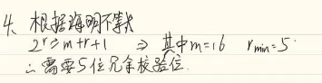

# 作业一 物理层课后作业

## 1、写出下列缩略语的英文全称和中文含义

> IMP(Interface Message Processor)接口信息处理机
>
> OSI/RM（Open Systems Interconnection Reference Model）开放系统互连基本参考模型
>
> MODEM(Modulator Demodulator)调制解调器
>
> LAN(Local Area Network)局域网
>
> FDM(Frequency Division Multiplexing)频分复用
>
> TDM(Time Division Multiplexing)时分复用
>
> STDM(Statistic Time Division Multiplexing) 统计时分复用
>
> WDM(Wavelength Division Multiplexing)波分复用
>
> DWDM(Dense WavelengthDivision Multiplexer)密集波分复用
>
> CDMA (Code Division Multiple Access)码分多址
>
> PCM (Pulse Code Modulation)脉冲编码调制 
>
> SONET (Synchronous Optical Network)同步光纤网
>
> SDH (Synchronous Digital Hierarchy)同步数字系列
>
> STM-1(Synchronous Transfer Module)为第 1 级同步传递模块
>
> OC48(Optical Carrier 48)光学载波48
>
> DTE (Data Terminal Equipment)数据终端设备
>
> DCEData (Circuit-terminal Equipment)数据通信设备
>
> QAM(Quadrature Amplitude Modulation)正交振幅调制

## 2、什么叫码元速率？什么叫信息速率？两者的关系如何？

码元速率（波特率）：每秒传输几个码元
信息速率（比特率）：每秒传送几个比特
若一个码元携带n比特的信息量，则波特率M Baud对应的比特率为Mn b/s

## 3、电视信道的带宽为6MHZ，如果全使用4个电平的数字信号，每秒种能发送多少比特

每个码元携带log~2~4=2bit数据
该信道最大传输速率= 2 x 6M x log~2~4 =24（Mps奈奎斯特定理（奈氏准则））

> 对于一个有噪声、带宽有限的通道。
> 极限比特率=Wlog~2~（1+S/N）（单位：b/s）
> W是信道的频率带宽（单位：Hz）

## 4、一个二进制信号经过信噪比为30dB的3kHz信道传送，问最大可达到的数据传输率是多少？

信噪比=10log~10~S/N=30dB       S/N=10^3^=1000

> 对于一个有噪声、带宽有限的通道。极限比特率=Wlog~2~（1+S/N）（单位：b/s）

极限比特率=3k log~2~(1+1000)=29.9kbps 即最大可达的数据传输率为29.9kbps

## 5、若要在一条50KHZ的信道上传输1.544Mbps的T1载波，信噪比至少要多大? 

极限比特率=Wlog~2~（1+S/N）
1.544 x 1024 kbps =50 KHZ log~2~（1+S/N）
解得 S/N=3302977508
信噪比=10log~10~S/N=95.18dB

## 6、画出传输10110010时，采用AM、FM、绝对PM、相对PM不同的调制方式时的信号波形图(二元制)。

## 7、试画出比特流000111010110的不归零编码（NRZ）、不归零码反转（NRZI）、曼彻斯特编码、差分曼彻斯特编码的波形？

## 8、收发两端之间的传输距离为1000km，信号在媒体上的传播速率为2.0*10 m/s。试计算以下两种情况的发送时延和传播时延：

### （1） 数据长度为10 bit，数据发送速率为100kb/s；

> 发送时延=数据长度（bit）/发送速率（bit/s）
> 传播时延=信道长度（m）/电磁波在信道中的传播速度

发送时延=10b / 100 x 1024 b/s=9.765625 x 10^-5^
传播时延=1000km/2.0x10=50000s

### （2） 数据长度为10 bit，数据发送速率为1Gb/s；

发送时延=10b / 1024 x 1024 b/s=9.536743164x 10^-6^
传播时延=1000km/2.0x10=50000s

### 从以上计算结果可得出什么结论？

在通信的过程中，最耗时的是传播时延

## 9、共有4个站进行码分多址CDMA通信。4个站的码片序列为：

A：(-1 -1 -1 +1 +1 -1 +1 +1) 

B：(-1 -1 +1 -1 +1 +1 +1 -1) 

C：(-1 +1 -1 +1 +1 +1 -1 -1) 

D：(-1 +1 -1 -1 -1 -1 +1 -1)

现在收到这样的码片序列：(-1 +1 -3 +1 -1 -3 +1 +1)。问哪个站发送了数据？发送数据的站发送的是 1 还是 0？

## 10、长度为100字节的应用层数据交给运输层传送，需加上20字节的TCP首部。再交给网络层传送，需加上20字节的ip首部。最后交给数据链路层的以太网传送。加上首部和尾部共18字节。求数据的传输效率。数据的传输效率是指发送的应用层数据除以所发送的总数据（即应用数据加上各种首部和尾部的额外开销）若应用层数据长度为1000字节，数据的传输效率是多少？

1000/1000+20+20+18=94.5%

## 11、假定某信道收奈氏准则限制的最高码元速率为2000码元/秒。如果采用振幅调制，把码元的振幅划分为16个不同等级来传送，那么可以获得多高的数据率（bit/s）

> 若一个码元携带n比特的信息量，则波特率M Baud对应的比特率为Mn b/s

每个码元携带log~2~16=4bit数据
最高数据率=每个码元携带的数据 x 最高码元速率 =4 x 2000 =8000bit/s

# 作业二 数据链路层及局域网

### 1、写出下列缩略语的英文全称和中文含义

> CRC: 循环冗余检验(Cyclic Redundancy Check)
>
> FEC: 转发等价类(Forwarding Equivalence Class) 
>
> ARQ: 自动重传请求(Automatic Repeat-reQuest)
>
> HDLC: 高级数据链路控制(High-level Data Link Control) 
>
> SLIP: 串行线路国际协议(Serial Line Internet Protocol) 
>
> PPP: 点对点协议(Point-to-Point Protocol) 
>
> LCP: 链路控制协议(Link Control Protocol) 
>
> NCP: 网络控制协议(Network Control Protocol) 
>
> CSMA/CD: 载波监听多点接入/碰撞检测(Carrier Sense Multiple Access with Collision  Detection) 
>
> MAC: 媒体接入控制(Medium Access Control) 
>
> LLC: 逻辑链路控制(Logical Link Control) 
>
> NIC: 网络接口卡(Network Interface Card),简称网卡 
>
> VLAN: 虚拟局域网(Virtual LAN) 
>
> 10BASE5: 基于曼彻斯特信号编码传输 10Mbps 以太网系统，通过编码传输的粗同轴电缆 
>
> 10BASE2: 基于曼彻斯特信号编码传输 10Mbps 以太网系统，通过编码传输的细同轴电缆 
>
> 10BASE-T: 基于曼彻斯特信号编码传输 10Mbps 以太网系统，通过编码传输的光缆 
>
> 1BASE5: 基于曼彻斯特信号编码传输 1Mbps 以太网系统，通过编码传输的粗同轴电缆

### 2、若生成多项式为X~3~+1信息位多项式X~6~+X~4~+1，则CRC冗余多项式是什么？传输帧多项式是什么？（要求写出详细的计算过程）

### 3、若生成多项式P(X)=X~5~+X~4~+X+1，若接收方收到码字为1010110001101问传输中是否有错？

### 4、设计一个对16比特信息串的单比特纠错海明码需多少冗余校验位？

### 5、 海明码计算题目：设所发送的比特序列为1001011，求其单比特纠错海明码。（要求写出详细的计算过程）

#### 订正：注意：比特序列需要顺序

### 6、数据率为10Mb/s的以太网在物理媒体上的码元传输速率是多少码元每秒？

码元传输率即为波特率，以太网使用曼彻斯特编码，这就意味着发送的每一位都有两个信号周期。因此是20M波特

### 7、以太网交换机有何特点？它和集线器有何区别？

> ### 1）在OSI中的工作层次不同
>
> 集线器：工作在第一层（物理层）
>
> 交换机：至少是工作在第二层，更高级的交换机可以工作在第三层（网络层）和第四层（传输层）。
>
> ### 2）交换机的数据传输方式不同
>
> 集线器：广播方式
>
> 交换机：有目的发送的，数据支队目的节点发送，只是在自己的MAC地址表中找不到的情况下第一次使用广播方式发送。
>
> ### 3）带宽占用方式不同
>
> 集线器：所有端口是共享集线器的总带宽
>
> 交换机：每个端口专用自己的带宽，这样交换机每个端口带宽，这样交换机每个端口的带宽比集线器端口可用带宽要高许多，也就决定了交换机的传输速度比集线器要快许多。
>
> ### 4）传输模式不同
>
> 集线器：半双工方式
>
> 交换机：全双工方式

### 8、一个PPP帧的数据部分（用十六进制写出）是7D 5E FE 27 7D 5D 7D 5D 7D 5D 65 7D 5E。试问真正的数据是什么（用十六进制写出）？

### 9、PPP协议使用同步传输技术传送比特串0110111111111100。试问经过零比特填充后变成怎样的比特串？若接收端收到的PPP帧的数据部分是0001110111110111110110，试问删除发送端加入的零比特后会变成怎样的字符串？

### 10、假定1km长的CSMA/CD网络的数据率为1Gbit/s。设信号在网络上的传播速率为200000km/s。求能够使用此协议的最短帧长

### 11、假定在使用CSMA/CD协议的10Mbit/s以太网中某个站在发送数据时检测到碰撞，执行退避算法选择了随机数r =100 .试问这个站需要等待多长时间后才能再次发送数据？如果是100Mbit/s的以太网呢？

# 作业三 ：网络层作业

### 1、写出下列缩略语的英文全称和中文含义

> **CIDR(Classless Inter-Domain Routing):无分类域间路由选择**
>
> **IP(Internet Protocol):网际协议**
>
> **ICMP(Internet Control Message Protocol):网际控制报文协议**
>
> **IGMP(Internet Group Management Protocol):网际组管理协**
>
> **ARP(Address Resolution Protocol):地址解析协议**
>
> RARP(Reverse Address Resolution Protocol):反向地址转换协议
>
> **RIP(Routing Information Protocol):路由信息协议**
>
> **OSPF(Open Shortest Path First):开放最短路径优先**
>
> **IGP(External Gateway Protocol):内部网关协议**
>
> **BGP(Border Gateway Protocol):外部网关协议(或者边界网关协议)**
>
> **NAT(Network Address Translation):网络地址转换**
>
> **TTL(Time To live): 生存时间**

### 2、找出不能分配给主机的 IP 地址，并说明原因：

（A）131.107.256.80 （B）231.222.0.11 （C）126.0.0.0

（D）198.121.254.255 （E）202.117.34.32

> 订正
>
> A：第三个字段为256大于了255数据非法
>
> B：是组播地址
>
> C：全零结尾的IP地址表示本网络，不能用于主机地址
>
> D：以255结尾的IP地址是用来广播的地址，不能用于主机地址fs

### 3、网络 193.1.1.0，子网掩码是 255. 255. 255. 224。问：这个子网掩码可划分几个子网，每个子网的子网地址和主机 IP 地址范围是什么？

> 
>
> 

### 4-18 设某路由建立了如下转发表

现收到共5个分组，其目的地址分别为：

（1）128.96.39.10
（2）128.96.40.12
（3）128.96.40.151
（4）192.4.153.17
（5）192.4.153.90

> 

### 4-19 某单位分配到一个地址块129.250/16。该单位有4000台机器，平均分布在16个不同的地点。试给每一个地点分配一个地址块，并算出每个地址块中IP地址的最小值和最大值

地址块包含全零和全一，不能全零和全一是主机地址

> 

### 4-20 一个数据报长度为4000字节（固定首部长度）。现在经过一个网络传送，但此网络能够传送的最大数据长度为1500字节。试问应当划分为几个短些的数据报片？各数据报片的数据字段长度、片偏移字段和MF标志应为何数值？

> 
>
> 订正：首部字节是以4字节为单位的o。所以首部长度为20/4=5
>
> 

### 4-26 一个大公司有一个总部和三个下属部门。公司分配到的网络前缀是192.77.33/24。公司的网络布局如图4-78所示。总部共有5个局域网，其中的LAN~1~~LAN~4~都连接到路由器R~1~上，R~1~再通过LAN~5~与路由器R~2~相连。R~2~和远地的三个部分的局域网LAN~6~~LAN~8~通过局域网相连。每一个局域网旁边标明的数字是局域网上的主机数。试给每一个局域网分配一个合适的网络前缀。

网络前缀的话，全零全一可以

> 

### 4-33 某单位分配到一个地址块136.23.12.64/26。现在需要进一步划分为4个一样大的子网。试问：

#### （1）每个子网的网络前缀有多长？

#### （2）每一个子网中有多少个地址？

#### （3）每一个子网的地址块是什么？

#### （4）每一个子网可分配给主机使用的最小地址和最大地址是什么？

> 
>
> 

### 4-37 假定网络中的路由器B的路由表有如下的项目（这三列分别表示“目的网络”“距离”和“下一跳路由器”）

### 现在B收到从C发来的路由信息（这两列分别表示“目的网络”和“距离”）

> 

# 作业四 运输层作业

### 1、写出下列缩略语的英文全称和中文解释 

> **TCP(Transmission Control Protocol):传输控制协议**
>
> **UDP(User Datagram Protocol):用户数据报协议**
>
> MSS(Maximum Segment Size):最大报文段长度
>
> ARQ(Automatic Repeat reQuest):自动重传请求
>
> RTT(Round-Trip Time):往返时间
>
> RTO(Retransmission Time-Out):超时重传时间

### 2、写出下列应用程序的熟知端口号 

FTP、TELNET、SMTP、DNS、TFTP、HTTP、SNMP   

> **FTP: 21**  
>
> **TELNET: 23** 
>
> **SMTP: 25** 
>
> **DNS: 53** 
>
> **TFTP: 69** 
>
> **HTTP: 80** 
>
> **SNMP: 161** 

### 5-13 一个UDP用户数据报的数据字段为8192字节。在链路层要使用以太网来传送。试问应当划分为几个IP数据报片？说明每一个IP数据报片的数据字段长度和片偏移字段的值。

### 5-23 主机A向主机B连续发送了两个TCP报文段，其序号分别是70和100.试问：

（1）第一报文段携带了多少字节的数据？

（2）主机B收到第一个报文段后发回的确认中的确认号应当是多少？

（3）如果B收到第二个报文段后发回的确认中的确认号是180，试问A发送的第二报文段中的数据有多少字节？

（4）如果A发送的第一个报文段丢失了，但第二个报文段到达了B。B在第二个报文段到达后向A发送确认。试问这个确认号应为多少？

### 5-30 设TCP使用的最大窗口为65535字节，而传输信道不产生差错，带宽也不受限制。若报文段的平均往返时间为20ms，问所得到的最大吞吐量是多少

### 5-31 通信信道带宽1Git/s，端到端传播时延为10ms。TCP的发送窗口为65535字节。试问：可能达到的最大吞吐量是多少？信道的利用率是多少？

### 5-38 设TCP的ssthresh的初始值为8（单位为报文段）当拥塞窗口上升到12时网络发生了超市，TCP开始使用慢开始和拥塞避免算法。试分别求出RTT=1和RTT=15的各拥塞窗口的大小。你能说明拥塞窗口每一次变化的原因吗？

### 5-39TCP的拥塞窗口cwnd大小与RTT的关系如下所示：

（1）试画出如图5-25所示的拥塞窗口与RTT的关系曲线。

（2）指明TCP工作在慢开始阶段的时间间隔

（3）指明TCP工作在拥塞避免阶段的时间间隔

（4）在RTT=16和RTT=22之后发送方是通过收到三个重复的确认还是通过超时检测到丢失了报文段？

（5）在RTT=1和RTT=18和RTT=24时，门限ssthresh分别被设置为多大？

（6）在RTT等于多少时发送出第70个报文段

（7）假定在RTT=26之后收到了三个重复的确认，因而检测出了报文段的丢失，那么拥塞窗口cwnd和门限应设置为多大？

### 5-41用TCP传送512字节的数据。设窗口为100字节，而TCP报文段每次也是传送100字节的数据。再设发送方和接收方的起始序号分别选为100和200（各自的序号没关系），试画出类似与图5-28的工作示意图。从连接建立阶段到连接释放都要画上（可以考虑传播时延）

