# 操作系统

## 一、操作系统概述

### 1、操作系统的概念（定义）功能和目标

#### 操作系统的概念（定义）

**操作系统**(Operating System，OS），是指**控制**和**管理**整个计算机系统和硬件和软件资源，并合理地组织调度计算机的工作和资源分配；以**提供给用户和其他软件方便的接口和环境**；它是计算机系统中最基本的**系统软件**。

##### （1）作为系统资源的管理者

> **提供的功能：**
>
> + 处理机管理
> + 存储器管理
> + 文件管理
> + 设备管理
>
> **目标：**安全有效
>
> **补充知识：**执行一个程序前需要将该程序放到内存当中，才能被CPU出处理

##### （2）向上层提供方便易用的服务

> 封装思想：操作系统把一些丑陋的硬件功能封装成简单易用的服务，使得用户能更方便地使用计算机，用户无需关心底层硬件原理，只需要对操作系统底层发出命令即可。
>
> **GUI：图形化用户接口（Graphical User Interface）**
>
> 用户可以使用形象的图形化界面进行操作，而不再需要记忆复杂的命令、参数。
>
> **联机命令接口**
>
> 实例（windows系统） 联机命令接口=交互式命令接口
>
> **特点：**用户说一句，系统跟着做一句
>
> **脱机命令接口**
>
> 实例（Windows系统） 脱机命令接口=批处理命令接口
>
> **特点**：用户说一堆，系统跟着做一堆
>
> **程序接口**
>
> 可以在程序中进行系统调用来使用程序接口，普通用户不能直接使用程序接口，只能通过程序代码间接使用。
>
> **如：**写C语言“Hello world”时，在printf函数底层就使用到了操作系统提供的显式相关的“系统调用”
>
> 在有的教材当中：系统调用=广义指令

##### （3）作为最接近硬件的层次

> 没有任何软件支持的计算机称作裸机。在裸机上安装的操作系统，可以提供资源管理功能和方便用户的服务功能，将裸机改造成功能更强、使用更加方便的机器。
>
> 操作系统对硬件机器的拓展：将CPU、内存、磁盘、显示器、键盘等硬件合理地组织起来，让各种硬件能够互相协调配合，实现更多更复杂的功能。

### 2、操作系统的四个特征

并发、共享、虚拟、异步（并发和共享是最基本的特征，二者互为存在条件）

#### 并发

> **概念：**指两个或多个事件在同一时间间隔内发生。这些事件宏观上是同时发生的，但微观上是交替发生的。
>
> 常考易混淆的概念----并行：指两个或多个事件在同一时刻同时发生。
>
> **并发vs并行**
>
> **操作系统的并发性**指计算机系统中“同时”运行着多个程序，这些程序宏观上看是同时运行的，而微观上看是交替运行的。
>
> 操作系统就是伴随着“多道程序技术”而出现的。因此，**操作系统和程序并发是一起诞生的。**
>
> **重要考点**：
>
> **单核CPU**同一时刻只能执行一个程序，各个程序只能并发地执行
>
> **多核CPU**同一时刻可以同时执行多个程序，多个程序可以并行地执行
>
> 比如Intel的第八代i3处理器就是**4核CPU**，意味着可以**并行地执行4个程序**

#### 共享

> **概念：**共享即资源共享，是指系统中的资源可供内存中多个并发执行的进程共同使用
>
> **互斥共享方式：**系统中的某些资源，虽然可以提供给多个进程使用，但一个时间段内只允许一个进程访问该资源
>
> + 例：使用QQ和微信视频，同一时间段内摄像头只能分配给其中一个进程
>
> **同时共享方式：**系统中的某些资源，允许一个时间段内由多个进程“同时”对它们进行访问
>
> + 使用QQ发送文件A，同时使用微信发送文件B。宏观上看，两边都在同时读取并发送文件，说明两个进程都在访问硬盘资源，从中读取数据。微观上看，两个进程是交替着访问硬盘的。
>
> **注意：**
>
> + 如果失去并发性，则系统中只有一个程序正在运行，则共享性失去存在的意义
> + 如果失去共享性，则微信不能同时访问硬盘资源，就无法实现同时发送文件，也就无法并发

#### 虚拟

> **概念：**虚拟是指把一个物理上的实体变为若干个逻辑上的对应物。物理实体（前者）是实际存在的，而逻辑上对应物（后者）是用户感受到的。
>
> **空分复用技术**----虚拟存储器
>
> **时分复用技术**----虚拟处理器技术：虽然只有一个CPU，但是能同时运行多个程序，微观上处理机在各个微小的时间段内交替着为各个进程服务。
>
> 注意：
>
> + 如果失去了并发性，则一个时间段内系统中只需运行一道程序，那么就失去了实现虚拟性的意义了。因此，没有并发性，就谈不上虚拟性

#### 异步

> **概念：**异步是指在多少程序环境下，允许多个程序并发执行，但由于资源有限，进程的执行不是一贯到底的，而是走走停停，以不可预知的速度向前推进，这就是程序的异步性。
>
> 由于并发运行的程序会争抢着使用系统资源，而系统中的资源有限，因此进程的执行不是一贯到底地，而是走走停停的，以不可预知的速度向前推进。
>
> **注意：**
>
> + 如果失去了并发性，即系统只能串行地运行各个程序，那么每个程序的执行会一贯到底。**只有系统拥有并发性，才有可能导致异步性。**

### 3、操作系统的发展与分类

####  （1）手工操作阶段 

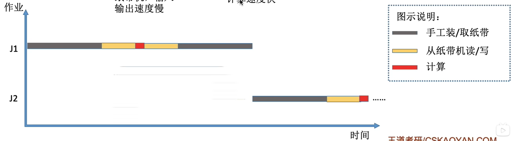

**主要缺点：**用户独占全机、人机速度矛盾导致资源利用率极低

#### （2）批处理阶段----单道批处理系统

引入脱机输入/输出技术，并由监督程序负责控制作业的输入输出

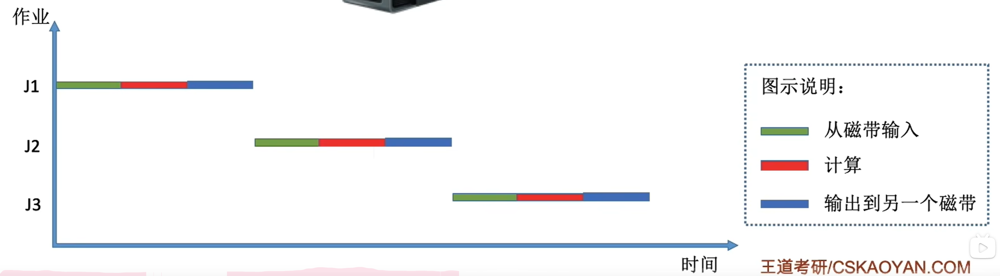

**主要优点：**缓解了一定程度的人机速度矛盾，资源利用率有所提升。

**主要缺点：**内存中仅能有一道程序运行，只有该程序运行结束之后才能调入下一道程序。CPU有大量的时间是在空闲等待I/O完成。资源利用率依然很低。

### 4、操作系统的运行机制

预备知识：程序是如何运行的？

由高级语言翻译为机器指令，程序运行的过程其实就是CPU执行一条一条的机器指令的过程

#### （1）内核程序和应用程序

> 我们普通程序员写的程序就是”**应用程序**“
>
> 微软、苹果由一帮人负责实现操作系统，他们写的就是”**内核程序**“

#### （2）特权指令和非特权指令

> 应用程序只能使用“**非特权指令**”如：加法指令、减法指令等
>
> 操作系统内核作为”管理者“有时候会让CPU执行一些”**特权指令**“，如：内存清零指令。这些指令影响重大，只允许”管理者”-----即操作系统内核来使用

#### （3）内核态和用户态

> CPU有两种状态，“内核态”和“用户态”
>
> 处于**内核态**时，说明此时正在运行的是**内核程序**，此时可以执行**特权指令**。
>
> 处于**用户态**时，说明此时正在运行的是**应用程序**，此时只能执行**非特权指令**。

#### （4）内核

> 内核是操作系统最重要的核心部分。
>
> 很多内核程序组成操作系统内核

#### （5）内核态、用户态的切换

> **内核态-->用户态**：执行一条特权指令----修改PSW的标志位为“用户态”。这个动作意味着操作系统将主动让出CPU使用权
>
> **用户态-->内核态**：由“中断”引发，硬件中断信号意味着操作系统将强行夺回CPU的使用权

### 5、中断和异常

#### （1）中断的作用

> CPU上会运行两种程序，一种是操作系统内核程序，一种是应用程序。
>
> “中断”是**让操作系统内核夺回CPU使用权**的唯一途径
>
> 如果没有“中断”机制，那么一旦应用程序上CPU运行，CPU就会一直运行这个应用程序(既然如此，何来“并发”)。

#### （2）中断的类型

> **内中断(也称异常、例外)**
>
> 例1：试图在用户态下执行特权指令
>
> 例2：执行除法指令时发现除数为0
>
> 例3：有时候应用程序想要请求操作系统内核的服务，此时会执行一条特殊的指令--陷入指令，该指令会引发一个内部中断信号
>
> 注：
>
> + 执行“陷入指令”，意味着应用程序主动地将CPU控制权还给操作系统内核。“系统调用”就是通过陷入指令完成地。
> + 与当前执行的指令有关，中断信号来自CPU内部
>
> **外中断（也称“中断”）**
>
> 例1：时钟中断----由时钟部件发来的中断信号（使得多个程序并发运行）
>
> 例2：I/O中断----由输入/输出设备发来的中断信号（当输入输出任务完成时，向CPU发出中断信号）
>
> 注：
>
> + 每一条指令执行结束，CPU都会例行检查是否有外中断信号
> + 与当前执行的指令无关，中断信号来源于CPU外部

#### （3）中断机制的基本原理

> 不同的中断信号，需要不同的中断处理程序来处理。当CPU检测到中断信号后，会根据中断信号的类型去查询“**中断向量表**”，以此来找到相应的中断处理程序在内存中的存放位置。
>
> 显然，中断程序一定是内核程序，需要运行在“内核态”

### 6、系统调用

#### 1）系统调用的定义

> “系统调用”是操作系统提供给应用程序（程序员/编程人员）使用的接口，可以理解为一种可供应用程序调用的特殊函数，==应用程序可以通过系统调用来请求获得操作系统内核的服务==。

#### 2）系统调用与库函数的区别

> 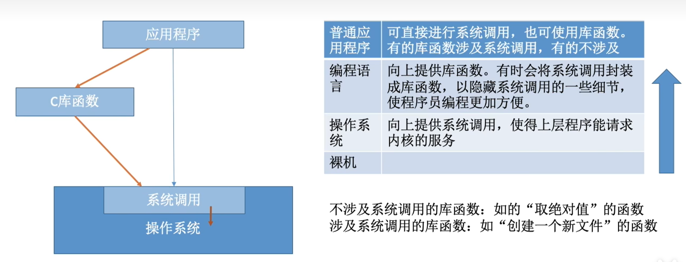

#### 3）为什么操作系统是必须的

> 由操作系统内核对共享资源进行统一管理，并向上提供“系统调用”，用户进程想要使用打印机这种共享资源，只能通过系统调用向操作系统内核发出请求。内核会对各个请求进行协调处理。

#### 4）什么功能要用到系统掉用

> 应用程序通过==系统调用==请求操作系统的服务。而系统中的各种共享资源都由操作系统内核统一掌管，因此==凡是与共享资源有关的操作（如存储分配、I/O操作、文件管理等），都必须通过系统调用的方式向操作系统内核提出服务请求==，由操作系统内核代为完成。这样==可以保证系统的稳定性和安全性==，防止用户进行非法操作。

#### 5）系统调用的过程

> 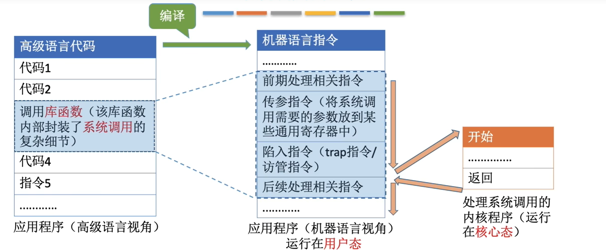
>
> 传递系统调用参数—>执行陷入指令（==用户态==）—>执行相应的内请求核程序处理系统调用（==核心态==）—>返回应用程序
>
> 注意：
>
> + ==陷入指令==是在==用户态==执行的，执行陷入指令之后立即引发一个==内中断==，使CPU==进入核心态==
> + 发出系统调用请求是在用户态，而对系统调用的相应处理在核心态下进行
>
> 注意别名：陷入指令=trap指令=访管指令

### 7、操作系统体系结构

> 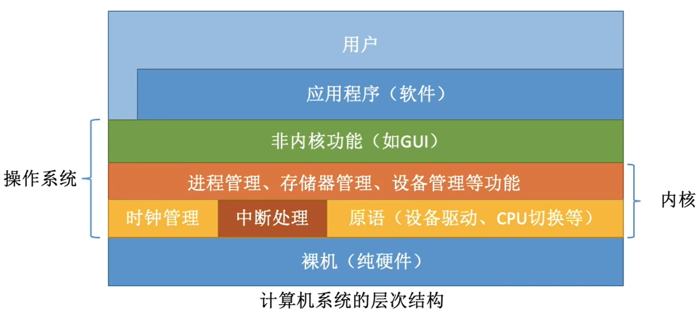
>
> + 原语是一种特殊的程序，具有原子性。也就是说，这段程序的运行必须一气呵成，不可被中断
> + Ubuntu、CentOS的开发团队主要工作是实现非内核功能，而内核都是用了Linux内核

#### 1）操作系统内核

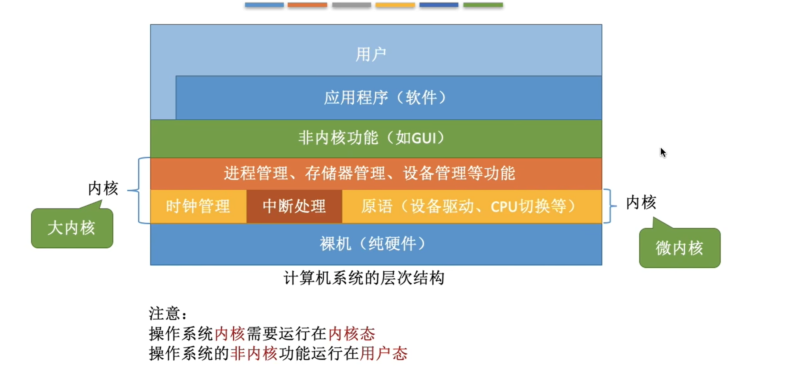

#### 2）大内核和微内核性能对比

> 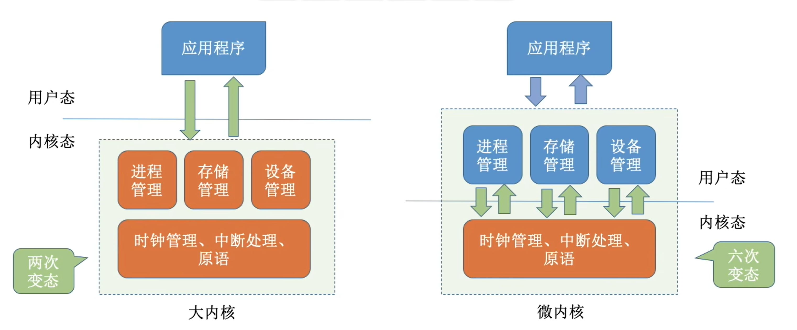
>
> 注意：==变态(CPU状态的转换)的过程是有成本的==，要消耗不少时间，==频繁地变态会降低系统性能==

#### 3）大内核

> 将操作系统的主要功能模块都作为系统内核，运行在核心态
> 优点：高性能
> 缺点：内核代码庞大，结构混乱，难以维护
>
> 典型的 ==大内核/宏内核/单内核== 操作系统：Linux、UNIX

#### 4）微内核

> 只把最基本的功能保留在内核
> 优点：内核功能少，结构清晰，方便维护
> 缺点：需要频繁地在核心态和用户态之间切换，性能低
>
> 典型的 ==微内核== 操作系统：Windows NT

### 8、操作系统引导

> 安装操作系统后
>
> 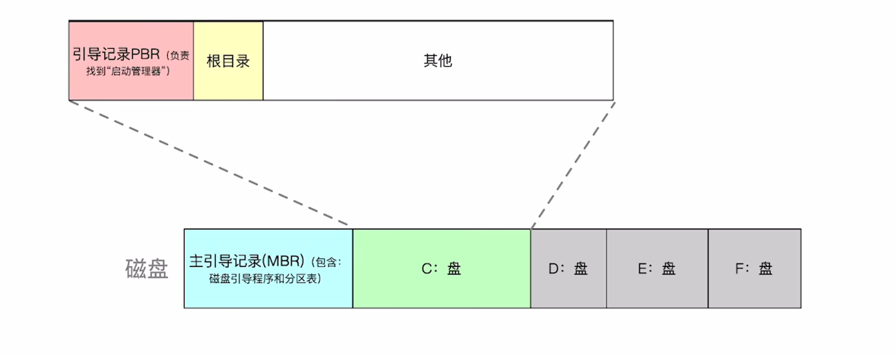

#### 1）操作系统引导（开机过程）

> 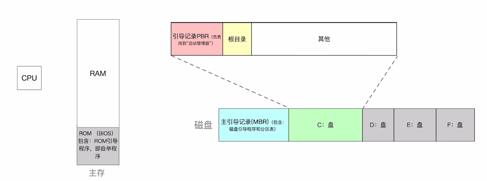
>
> 注：
>
> + BIOS：Basic Input/Output System
>
> ==操作系统引导==：
>
> 1. CPU从一个特定的主存地址开始，取指令，执行ROM中的引导程序（先进行硬件自检，再开机）
> 2. 将磁盘的第一块——主引导记录读入内存，执行磁盘引导程序，扫描分区表
> 3. 从活动分区（又称主分区，即安装了操作系统的分区）读入分区引导记录，执行其中的程序
> 4. 从根目录下找到完整的操作系统初始化程序（即启动管理器）并执行，完成“开机”的一系列工作

### 9、虚拟机

#### 1）传统计算机

> 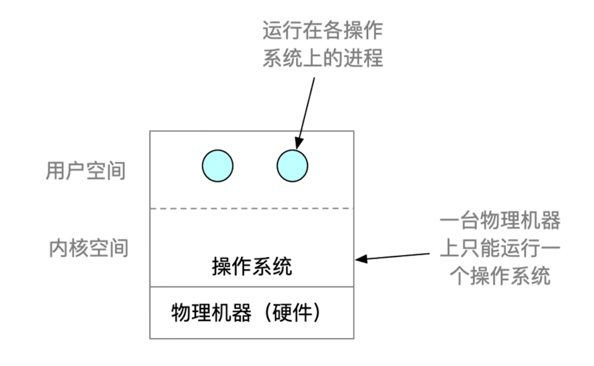
>
> 一个机器上只能安装一个操作系统的局限性

#### 2）虚拟机

> 虚拟机：使用虚拟化技术，将一台物理机器虚拟化为多态虚拟机器（Virtual Machine，VM）每个虚拟机器都可以独立运行一个操作系统
>
> 同义术语：虚拟机管理程序/虚拟机监控程序/Virtual Machine Monitor/Hypervisor
>
> 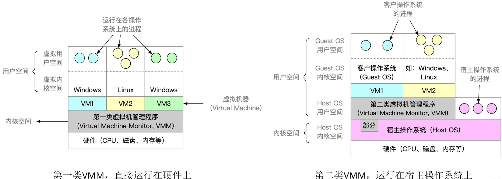

#### 3）两类虚拟机管理程序（VMM）的对比

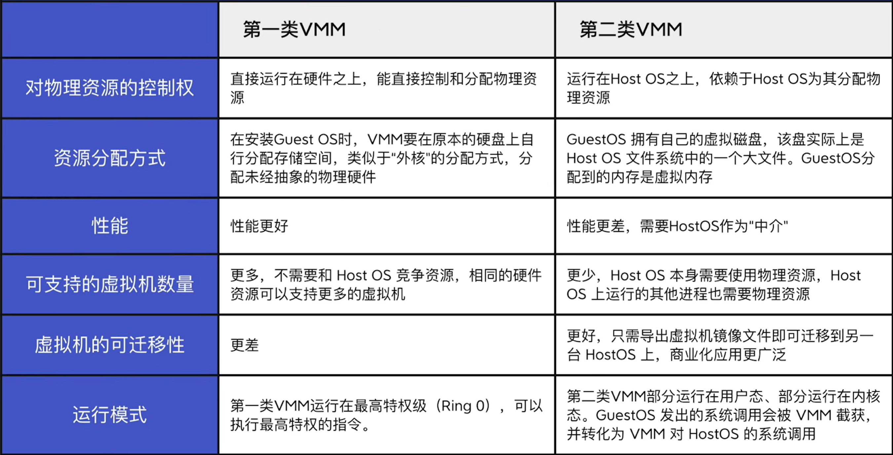

## 二、进程管理

### 1、进程的概念、组成、特征

#### （1）进程的概念

> **程序：**是静态的，就是个存放在磁盘里的可执行文件，就是一系列的指令集合
>
> **进程：**是动态的，是程序的一次执行过程（同一个程序多次执行会对应多个进程）
>
> ##### 思考：操作系统是这些进程的管理者，它要怎么区分各个进程？
>
> 当程序被创建时，操作系统会为该进程分配一个唯一的、不重复的“身份证号”——PID (Process ID,进程ID)

#### （2）进程的组成

> 更加确切的说，应该是”进程实体(进程映像)“由PCB、程序段、数据段组成。
>
> ##### 1）进程的组成——PCB
>
> 操作系统给要记录的**PID**、进程所属**用户ID（UID）**
>
> 还要记录给进程**分配了哪些资源**（如：分配了多少内存、正在使用哪些I/O设备、正在使用哪些文件）
>
> 还要记录进程的**运行情况**（如：CPU使用时间、磁盘使用情况、网络流量使用情况等等）
>
> 这些信息都被保存在一个数据结构PCB（Process Control Block）中，即进程加快
>
> 操作系统需要对各个并发运行的进程进行管理，但凡管理时所需要的信息，都会被放进PCB中
>
> PCB是进程存在的唯一标志，当进程被创建时，操作系统为其创建PCB，当进程结束时，会回收其PCB。
>
> **PCB是给操作系统使用的。**
>
> ##### 2）进程的组成——程序段、数据段
>
> **程序段：**程序的代码（指令序列）
>
> **数据段：**运行过程中产生的各种数据（如：程序中定义的变量）
>
> **程序段、数据段是给进程自己用的。**
>
> #### 知识滚雪球：程序是如何运行的？
>
> 一个进程实体（进程映像）由PCB、程序段、数据段组成。
>
> 进程是动态的，进程实体（进程映像）是静态的。
>
> 进程实体反应了进程在某一时刻的状态（如：x++后，x=2）
>
> **进程**是进程实体的**运行过程**，是系统进行**资源分配**和**调度**的一个独立单位。
>
> **注意：**PCB是进程存在的唯一标志

#### （3）进程的特征

> 程序是静态的，进程是动态的，相比于程序，进程拥有一下特征：
>
> 1. **动态性：**进程是程序的一次执行过程，是动态地产生、变化和消亡的
> 2. **并发性：**内存中有多个进程实体，各进程可并发执行
> 3. **独立性：**进程是能独立运行、独立获得资源、独立接受调度地基本单位
> 4. **异步性：**各进程按各自独立、不可预知的速度向前推进，操作系统要提供给”进程同步机制“来解决异步问题
> 5. **结构性：**每个进程都会配置一个PCB。结构上看进程由程序段、数据段、PCB组成

### 2、进程的状态与转换

#### （1）进程的状态

> 1. **创建态：**创建态进程正被创建时，它的状态是”创建态”，在这个阶段操作系统会为进程分配资源、初始化PCB
> 2. **就绪态：**当进程创建完成后，便进入”就绪态“处于就绪态的进程已具备运行条件，但由于没有空闲CPU，就暂时不能运行
> 3. **运行态：**如果一个进程此时在CPU上运行，那么这个进程处于”运行态“，CPU会执行该进程对应的程序（执行指令序列）
> 4. **阻塞态：**在程序运行的过程中，可能会请求等待某个事件的发生（如等待某种系统资源的分配，或者等待其他进程的相应）。在这个事件发生之前，进程无法继续往下执行，此操作系统会让这个进程下CPU，并让它进入“阻塞态”，当CPU空闲时，又会选择另一个“就绪态”进程上CPU运行。
> 5. **终止态：**一个进程可以执行exit系统调用，请求操作系统终止该进程。此时该进程会进入“终止态”，操作系统会让该进程下CPU，并回收内存空间等资源，最后还要回收该进程的PCB。当终止进程的工作完成之后，这个进程就彻底消失了。

#### （2）进程状态的转换

> 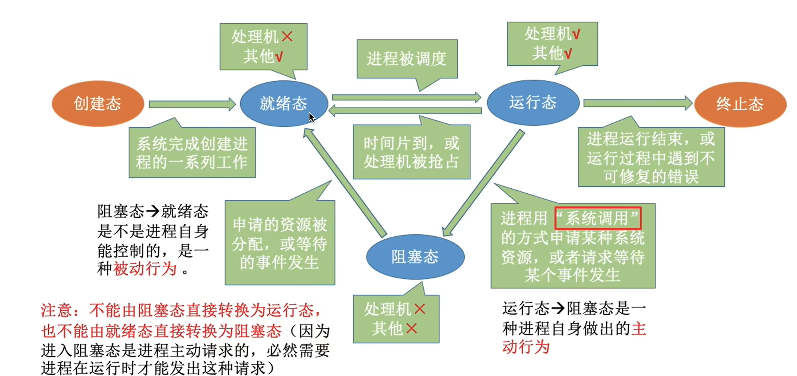

#### （3）进程的组织——链接方式

> 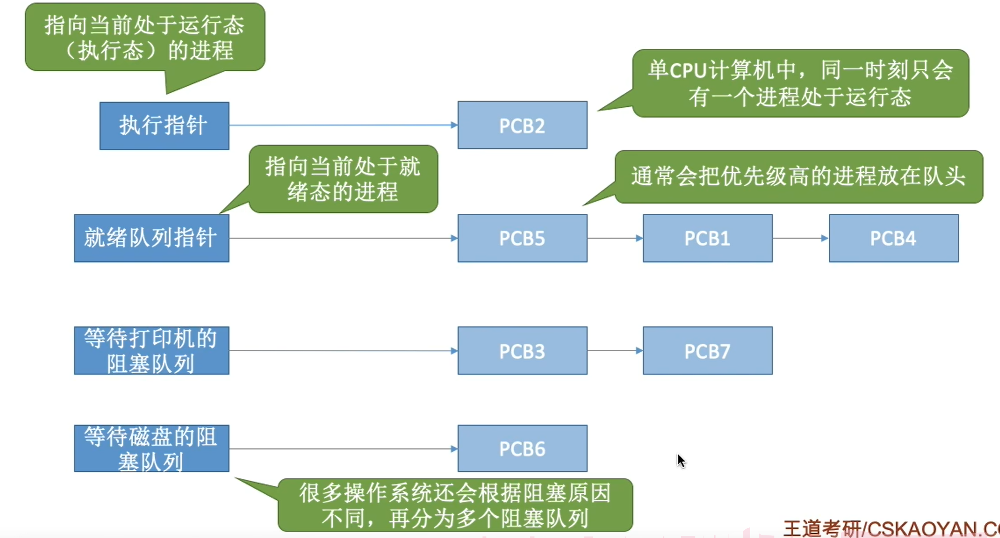
>
> 以队列的形式

#### （4）进程的组织——索引方式

>  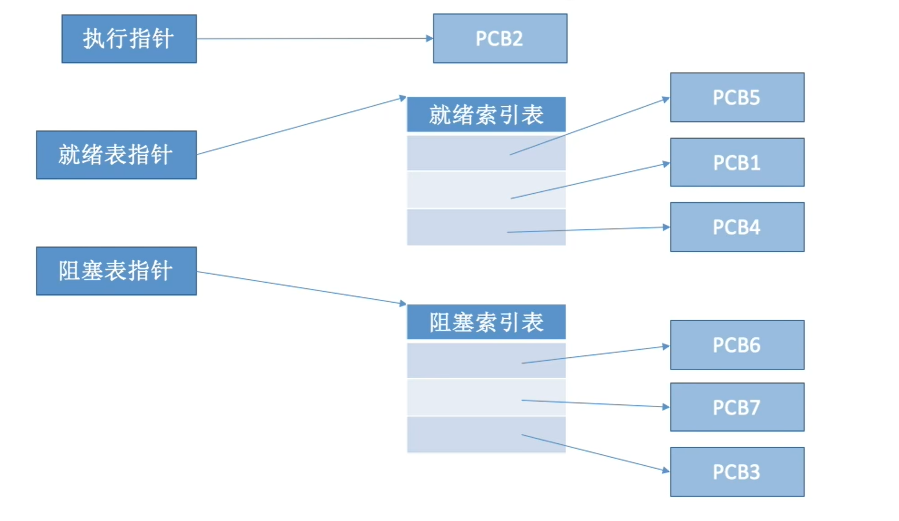
>
> 大多数的操作系统都是链接方式

### 3、进程控制

#### 1）基本概念

> ### 什么是进程控制
>
> **进程控制**的主要功能是对系统中的所有进程实施有效的管理，它具有创建新进程、撤销已有进程、实现进程状态转换等功能。
>
> ==简化理解==:反正进程控制就是要实现进程状态转换
>
> 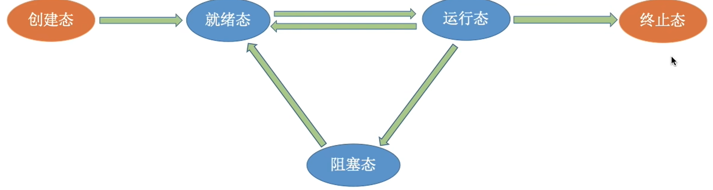
>
> ### 如何实现进程控制
>
> 使用==”原语“==实现，原语的执行具有==”原子性“==，一气呵成，如果不能一气呵成，就有可能导致操作系统中的某些关键数据结构信息==不统一==的情况，这会影响操作系统进行别的管理工作
>
> 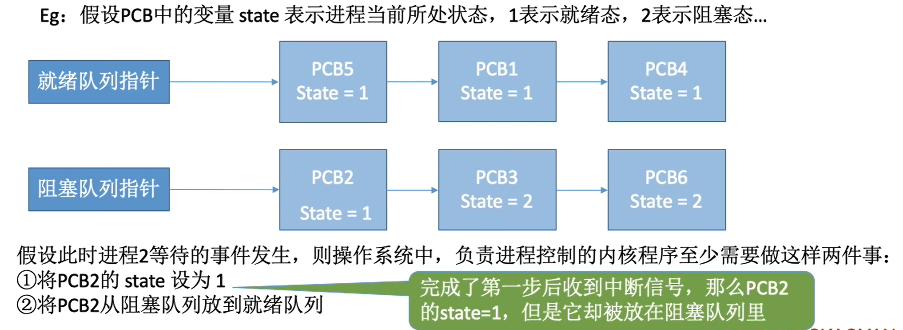

#### 2）如何实现原语的”原子性“

> **原语**的执行具有原子性，即执行过程中只能一气呵成，期间不允许被中断。可以用==”关中断指令“==和==“开中断指令”==这两个特权指令实现原子性。
>
> 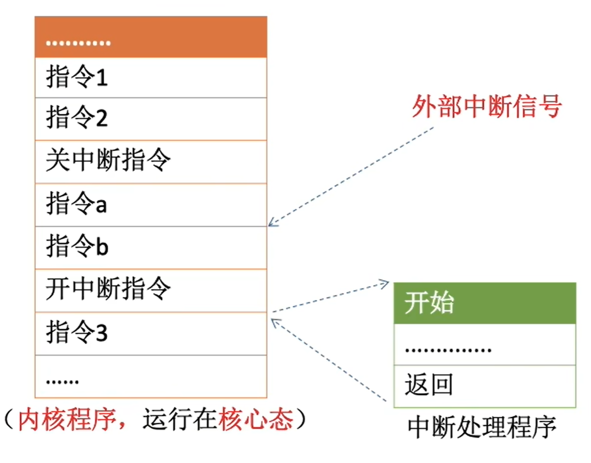
>
> CPU执行了==关中断指令==之后，就不能再例行检查中断信号，直到执行==开中断指令==之后才会恢复检查。
>
> 这样，关中断、开中断之间的这些指令序列就是不可中断的，这就实现了“原子性”

#### 3）进程控制相关的原语

> ### 进程的创建
>
> 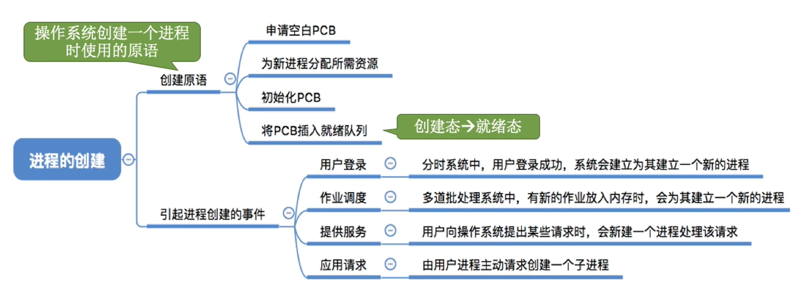
>
> ### 撤销原语
>
> 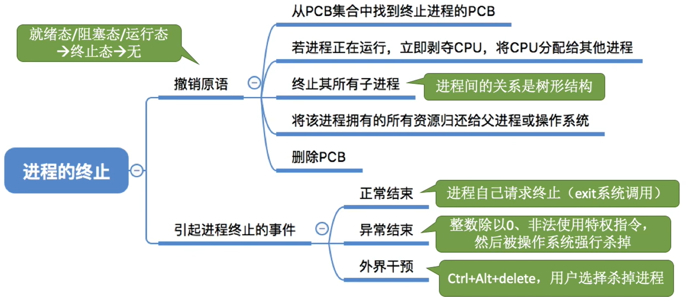
>
> ### 阻塞原语与唤醒原语
>
> 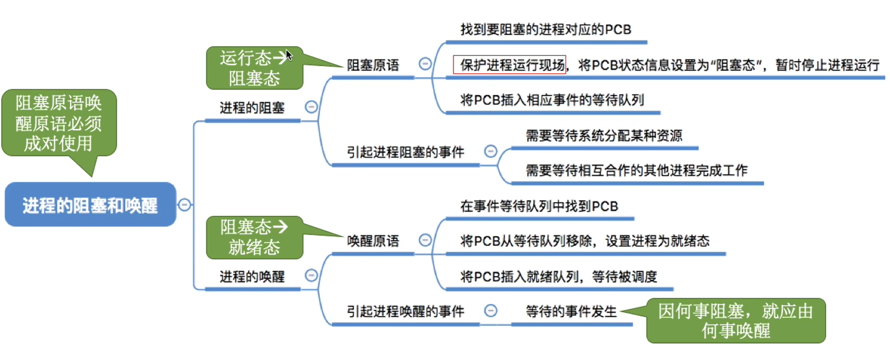
>
> ### 切换原语
>
> 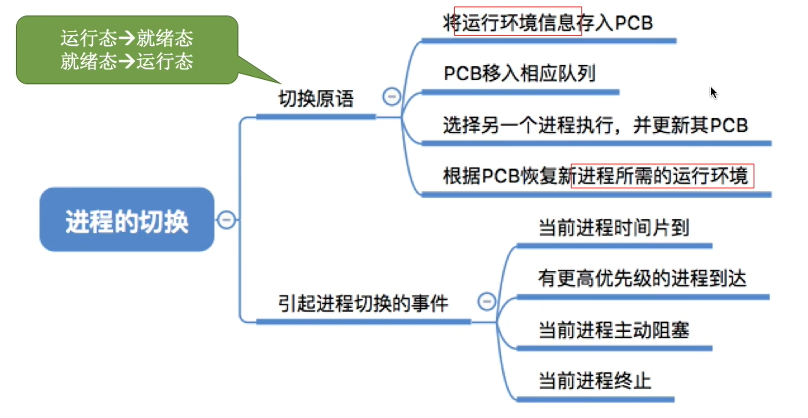

### 4、进程通信

> ### 什么是进程间通信
>
> 进程间通信（Inter-Process Communication，IPC），是指两个进程之间产生数据交互
>
> ### 为什么进程通信需要操作系统支持
>
> 进程是分配系统资源的单位（包括内存地址空间），因此各进程拥有的内存地址空间相互独立
>
> 为了保证安全，一个进程不能直接访问另一个进程的地址空间
>
> 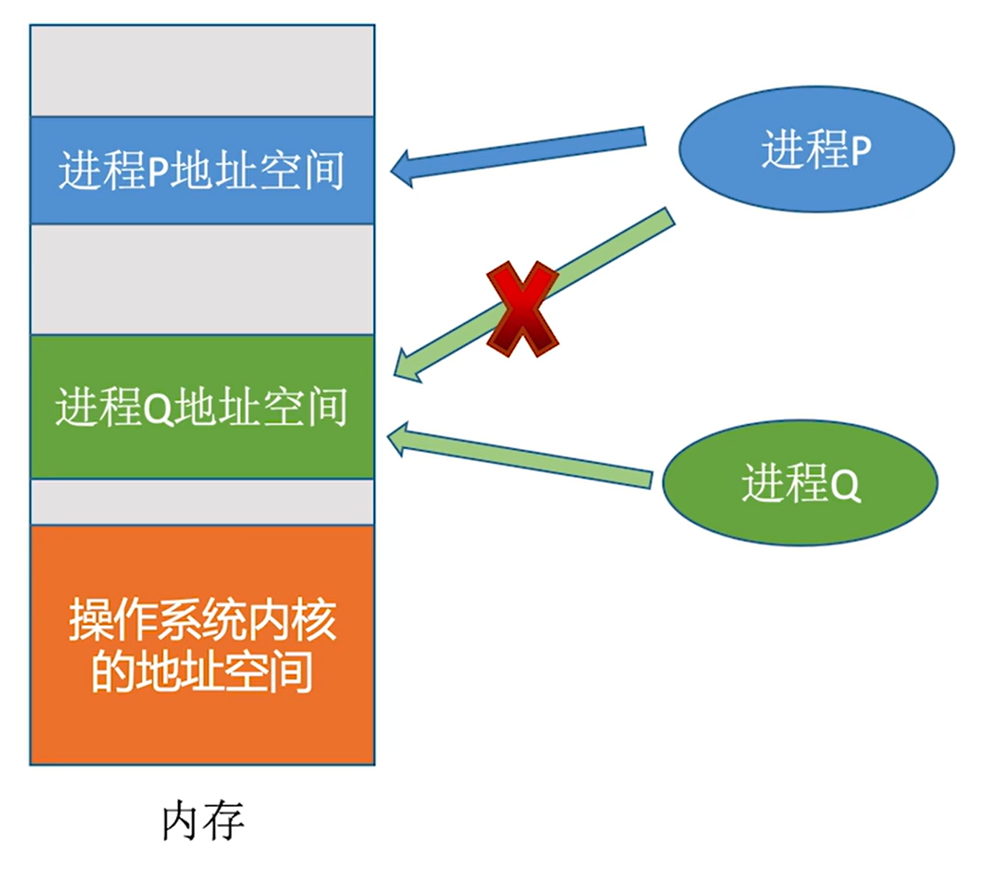

#### 1）共享存储

> ### 基于存储区的共享
>
> 操作系统在内存中划出一块**共享存储区**，数据的形式、存放位置都由通信进程控制，而不是操作系统。这种共享方式速度很快，是一种==高级通信==方式。
>
> 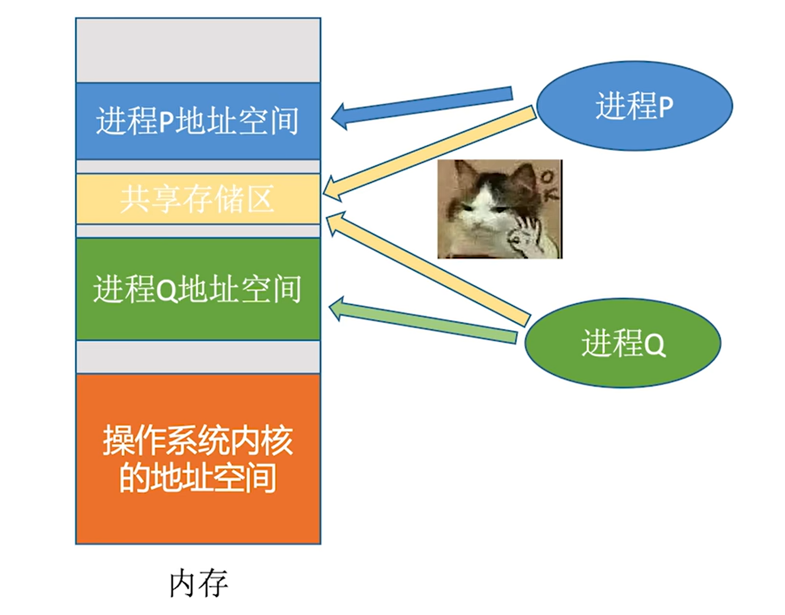
>
> ### 基于数据结构的共享
>
> 比如共享空间里只能放一个长度为10的**数组**。这种共享方式速度慢、限制多，是一种==低级通信==方式
>
> 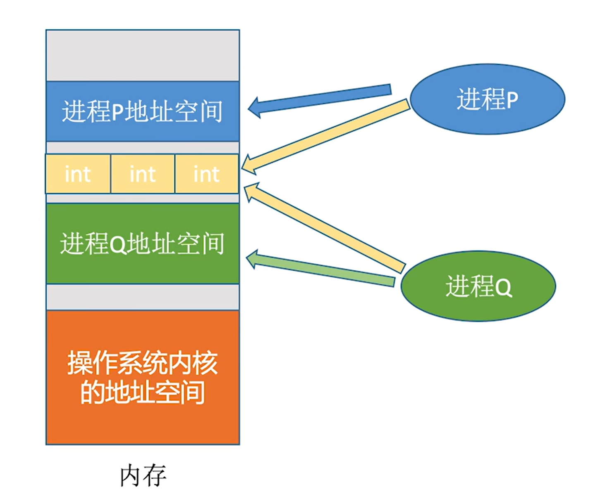

#### 2）消息传递

> 进程间的数据交换以格式化的消息为单位。进程通过操作系统提供的“发送消息/接收消息”两个原语进行数据交换
>
> ### 直接通信方式
>
> 点名道姓的传递方式
>
> 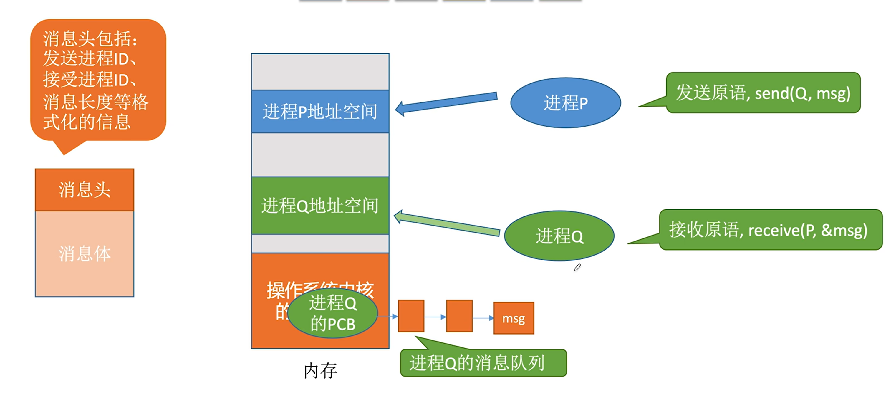
>
> ### 间接通信方式
>
> 以“信箱”作为中间实体进行消息传递
>
> 可以多个进程往同一个信箱send消息，也可以多个进程从同一个信箱中receive消息
>
> 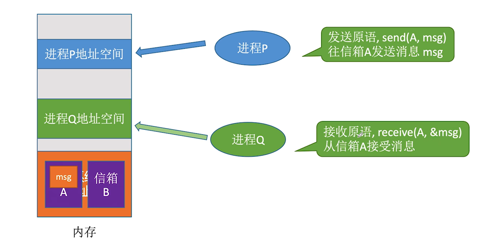

#### 3）管道通信

> 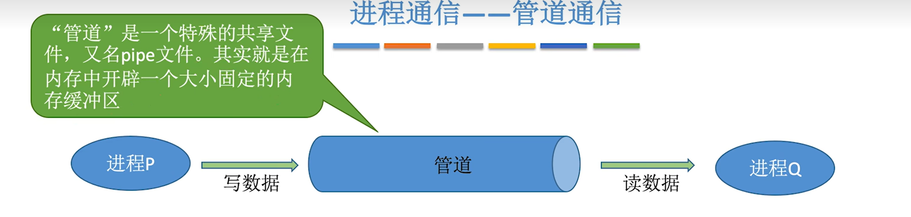
>
> 1. 管道只能采用**半双工通信**，某一时间段内只能实现单向的传输。如果要实现**双向同时通信**，则**需要设置两个管道**。
> 2. 各进程要**互斥**地访问管道（由操作系统实现）
> 3. 当**管道写满**时，**写进程**将**阻塞**，直到读进程将管道中的数据取走，即可唤醒写进程。
> 4. 当**管道读空**时，**读进程**将**阻塞**，直到写进程往管道中写入数据，即可唤醒读进程。
> 5. 管道中的数据一旦被读出，就彻底消失。因此，当多个进程读同一个管道时，可能会错乱。对此，通常有两种解决方案：①**一个管道允许多个写进程，一个读进程**（2014年408真题高教社官方答案）；②允许有**多个写进程，多个读进程**，但系统会让各个读进程轮流从管道中读数据（Linux）

### 5、线程概念多线程模型

#### 1）什么是线程，为什么要引入线程

> **传统的进程是程序执行流的==最小单位==**
>
>  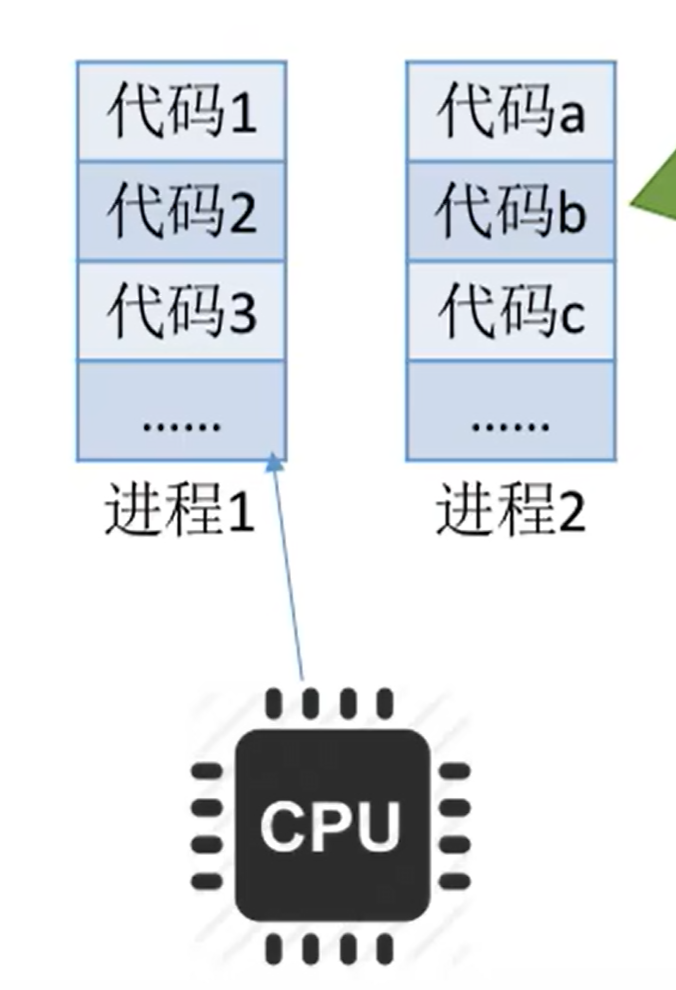
>
> **有的进程可能需要同时做很多事，而传统的进程只能串行地执行一系列程序。为此，引入了“线程”，来增加并发度。**
>
> 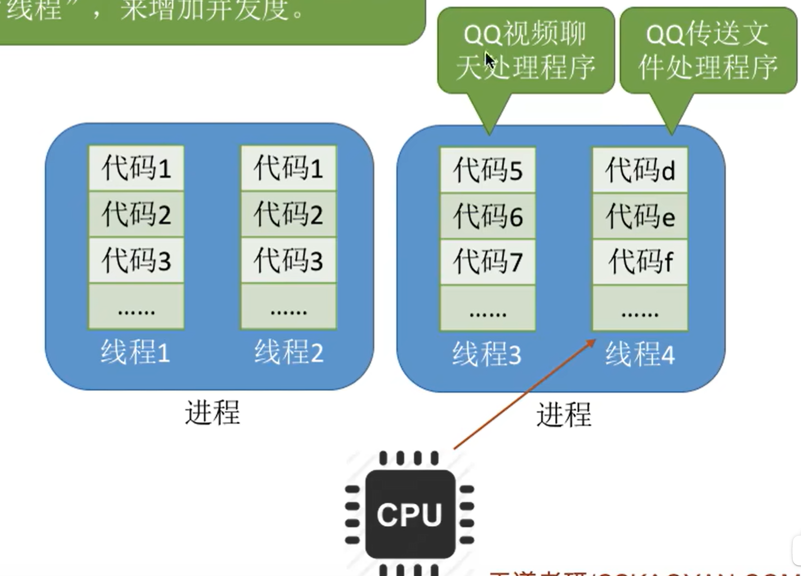
>
> ### 线程是一个基本的CPU执行单元，也是程序执行流的最小单位。
>
> 引入线程之后，不仅是进程之间可以并发，进程内的各线程也可以并发，从而进一步提升了系统的并发度，使得一个进程内也可以并发得处理各种任务
>
> #### 引入线程后，进程只作为除CPU之外的系统资源分配单位（如打印机、内存地址空间都是分配给进程的）

#### 2）引入线程机制后，有什么变化

> ### 资源分配、调度 
>
> 传统进程机制中，进程是资源分配、调度的基本单位
> 引入线程后，进程是资源分配的基本单位，线程是调度的基本单位
>
> ### 并发性
>
> 传统进程机制中，只能进程间并发
> 引入线程后，各进程间也能并发，提升了并发度
>
> ### 系统开销
>
> 传统的进程间并发，需要切换进程的运行环境，系统开销很大
> 线程间并发，如果是同一进程内的线程切换，则不需要切换进程环境，系统开销小
> 引入线程后，并发所带来的系统开销减小

#### 3）线程有哪些重要属性

> 线程是处理调度的单位
> 多CPU计算机中，各个线程可以占用不同得分CPU
> 每个线程都有一个线程ID、线程控制块（TCB）
> 线程也有就绪、阻塞、运行三种基本状态
> 线程几乎不拥有系统资源
> 同一进程的不同线程间共享进程的资源
> 由于共享内存地址空间，同一进程中的线程间通信甚至无需系统干预
> 同一进程中的线程切换，不会引起进程切换
> 不同线程中的线程切换，会引起进程切换切换同进程内的线程，系统开销很小切换进程，系统开销较大

#### 4）线程的实现方式

> ### 用户级线程（User-Level Thread,ULT)
>
> 历史背景：早期的操作系统只支持进程，不支持线程。当时的“线程”是由线程库实现的
>
> 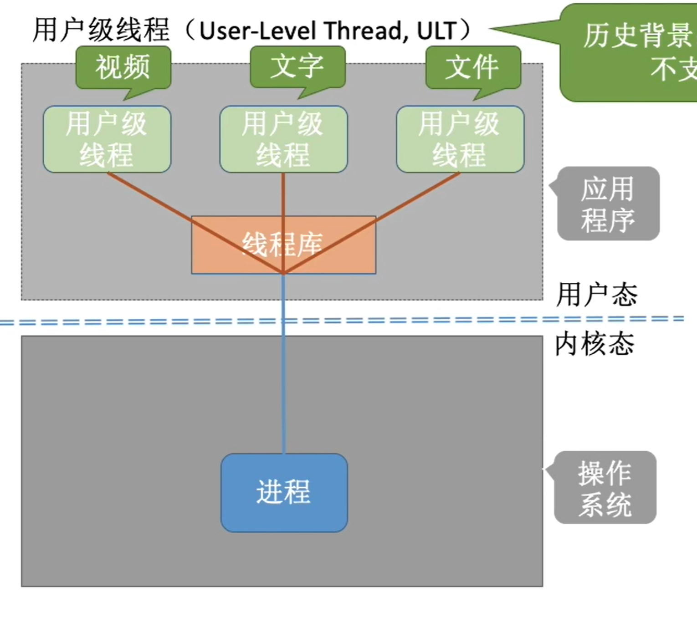
>
> 从代码角度来看，线程其实就是一段代码逻辑。很多编程语言提供了强大的线程库，可以实现线程的创建、销毁、调度等问题
>
> 1. 用户级线程由应用系统通过线程库实现，所有的线程管理工作都由应用程序负责（包括线程切换）
> 2. 用户级线程中，线程切换可以在用户态下即可完成，无需操作系统干预
> 3. 在用户看来，是有多个线程，但是在操作系统用户看来，并意识不到线程的存在。“用户级线程“就是从用户视角看能看到的线程
> 4. 优缺点
>    + 优点：用户级线程的切换在用户空间即可完成，不需要切换到核心态，线程管理系统开销小，效率高
>    + 缺点：当一个用户级线程被阻塞后，整个进程都会被阻塞，并发度不高。多个线程不可在多核处理机上并行运行
>
> ### 内核级线程（Kernel-Level Thread，KLT，又称”内核支持的线程“）
>
> 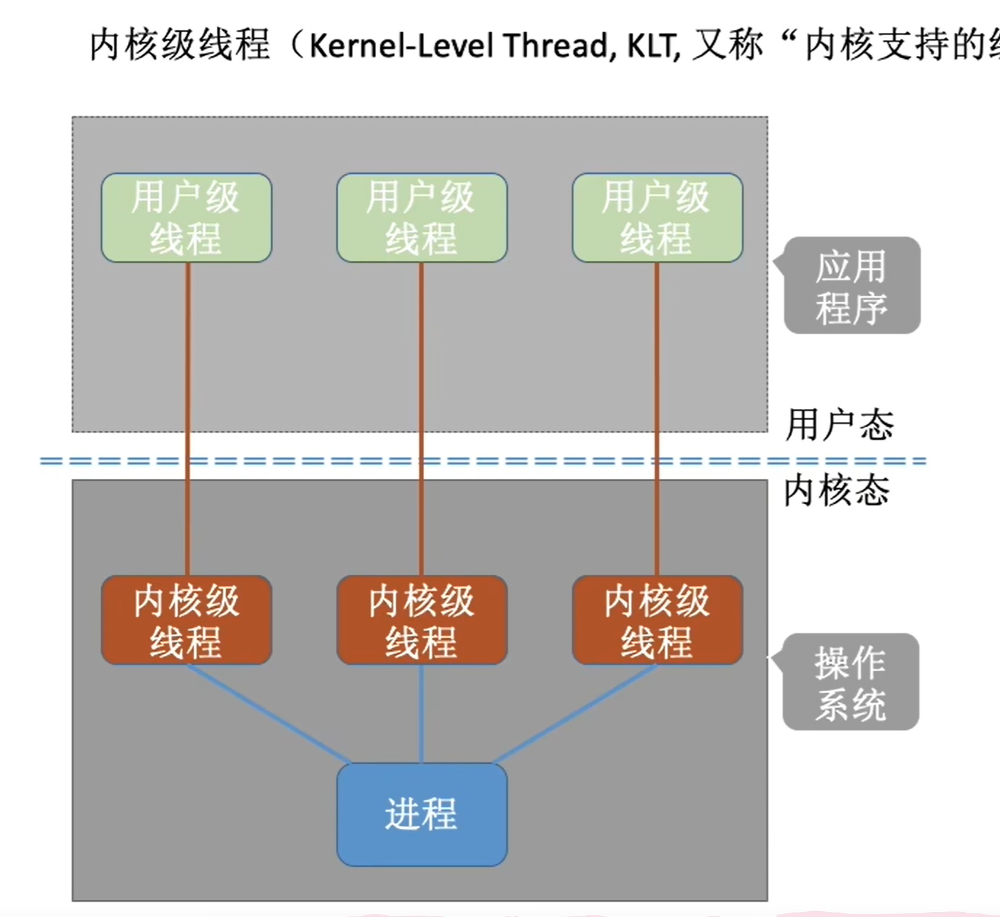
>
> 大多数现代操作系统都实现了内核级线程
>
> 1. 内核级线程的管理工作由操作系统内核完成
> 2. 线程调度、切换等工作都由内核负责，因此内核级线程的切换必然需要在核心态下才能完成
> 3. 操作系统会为每个内核级线程建立相应的TCB（Thread Control Block，线程控制模块），通过TCB对线程进行管理。”内核级线程“就是”从操作系统内核视角看能看到的线程“
> 4. 优缺点
>    + 优点：当一个线程被阻塞后，别的线程还可以继续执行，并发能力强。多线程可在多核处理机上并行执行
>    + 缺点：一个用户进程会占用多个内核级线程，线程切换由操作系统内核完成，需要切换到核心态，因此线程管理的成本高，开销大。

#### 5）多线程模型

> ### 一对一模型
>
> 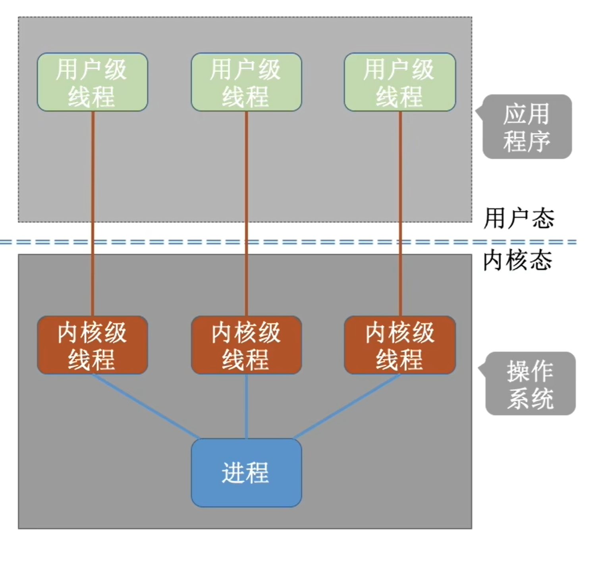
>
> #### **一对一模型：**一个用户级线程映射到一个内核级线程。每个用户进程有与用户级线程同数量的内核级线程。
>
> 优点：当一个线程被阻塞后，别的线程还可以继续执行，并发能力强。多线程可在多核处理机上并行执行。
> 缺点：一个用户进程会占用多个内核级线程，线程切换有操作系统内核完成，需要切换到核心态，因此线程管理的成本高，开销大
>
> ### 多对一模型
>
> 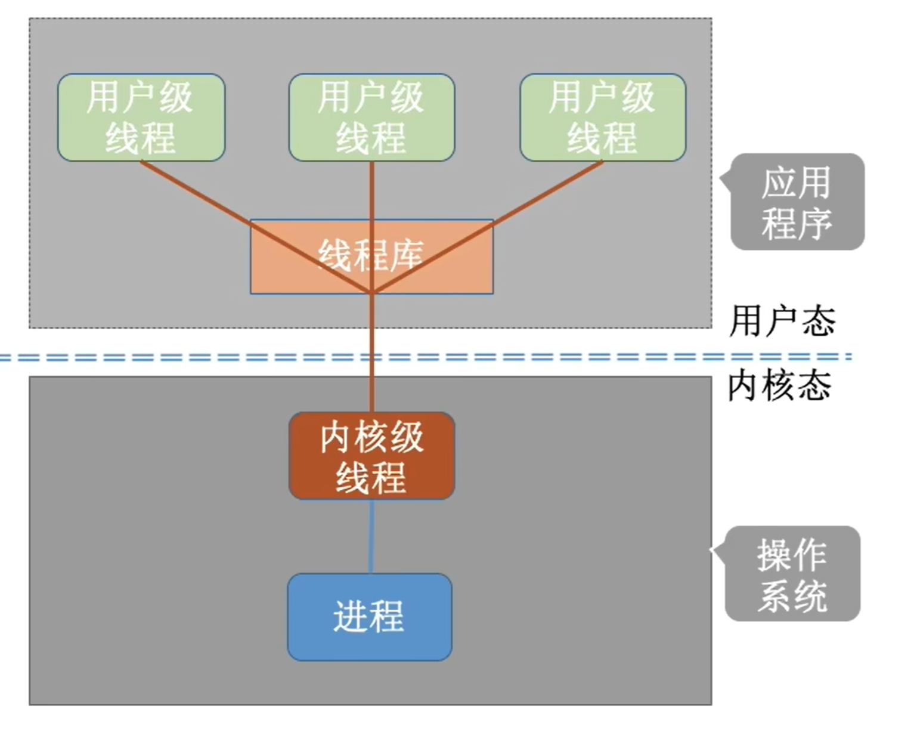
>
> #### **多对一模型：**多个用户级线程映射到一个内核级线程。且一个进程只被分配一个内核级线程
>
> 优点：用户级线程的切换在用户空间即可完成，不需要切换到核心态度，线程管理的系统开销小，效率高
> 缺点：当一个用户级线程被阻塞后，整个进程都会被阻塞，并发度不高。多个线程不可在多核处理机上并行运行
>
> 重点：操作系统只”看得见“内核级线程，因此只有内核级线程才是处理机分配的单位
>
> ### 多对多模型
>
> 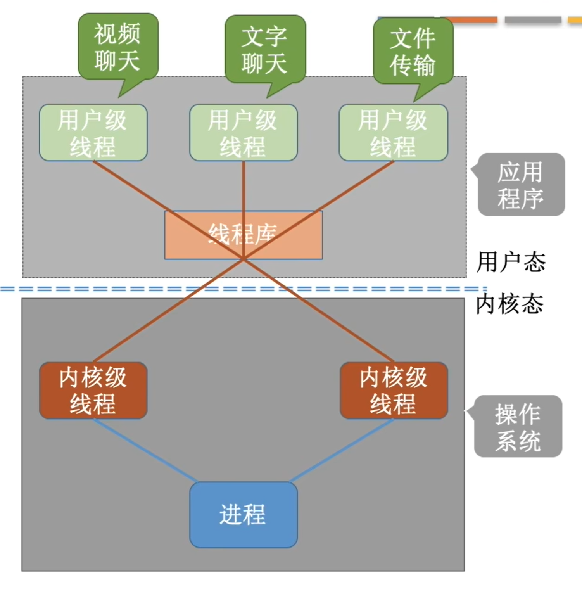
>
> #### 多对多模型：n用户级线程映射到m各内核级线程（n>=m）。每个用户进程对应m个内核线程。
>
> 克服了多对一模型并发度不高的缺点（一个阻塞完全阻塞），又克服了一对一模型中一个用户进程占太多内核级线程，开销太大的缺点。
>
> #### 可以这么理解：
>
> 用户级线程是”代码逻辑“的载体
> 内核级线程是”运行机会“的载体
>
> #### 内核线程才是处理机分配的单位。例如：多核CPU的环境下，左边这个进程最多能被分配两个核
>
> 一段代码逻辑只有获得了”运行机会“才能被CPU执行
>
> #### 内核级线程中可以运行任意一个有映射关系的用户级线程代码，只有两个内核及线程中正在运行的代码逻辑都阻塞时，这个进程才会阻塞

