# 操作系统

## 一、操作系统概述

### 1、操作系统的概念（定义）功能和目标

#### 操作系统的概念（定义）

**操作系统**(Operating System，OS），是指**控制**和**管理**整个计算机系统和硬件和软件资源，并合理地组织调度计算机的工作和资源分配；以**提供给用户和其他软件方便的接口和环境**；它是计算机系统中最基本的**系统软件**。

##### （1）作为系统资源的管理者

> **提供的功能：**
>
> + 处理机管理
> + 存储器管理
> + 文件管理
> + 设备管理
>
> **目标：**安全有效
>
> **补充知识：**执行一个程序前需要将该程序放到内存当中，才能被CPU出处理

##### （2）向上层提供方便易用的服务

> 封装思想：操作系统把一些丑陋的硬件功能封装成简单易用的服务，使得用户能更方便地使用计算机，用户无需关心底层硬件原理，只需要对操作系统底层发出命令即可。
>
> **GUI：图形化用户接口（Graphical User Interface）**
>
> 用户可以使用形象的图形化界面进行操作，而不再需要记忆复杂的命令、参数。
>
> **联机命令接口**
>
> 实例（windows系统） 联机命令接口=交互式命令接口
>
> **特点：**用户说一句，系统跟着做一句
>
> **脱机命令接口**
>
> 实例（Windows系统） 脱机命令接口=批处理命令接口
>
> **特点**：用户说一堆，系统跟着做一堆
>
> **程序接口**
>
> 可以在程序中进行系统调用来使用程序接口，普通用户不能直接使用程序接口，只能通过程序代码间接使用。
>
> **如：**写C语言“Hello world”时，在printf函数底层就使用到了操作系统提供的显式相关的“系统调用”
>
> 在有的教材当中：系统调用=广义指令

##### （3）作为最接近硬件的层次

> 没有任何软件支持的计算机称作裸机。在裸机上安装的操作系统，可以提供资源管理功能和方便用户的服务功能，将裸机改造成功能更强、使用更加方便的机器。
>
> 操作系统对硬件机器的拓展：将CPU、内存、磁盘、显示器、键盘等硬件合理地组织起来，让各种硬件能够互相协调配合，实现更多更复杂的功能。

### 2、操作系统的四个特征

并发、共享、虚拟、异步（并发和共享是最基本的特征，二者互为存在条件）

#### 并发

> **概念：**指两个或多个事件在同一时间间隔内发生。这些事件宏观上是同时发生的，但微观上是交替发生的。
>
> 常考易混淆的概念----并行：指两个或多个事件在同一时刻同时发生。
>
> **并发vs并行**
>
> **操作系统的并发性**指计算机系统中“同时”运行着多个程序，这些程序宏观上看是同时运行的，而微观上看是交替运行的。
>
> 操作系统就是伴随着“多道程序技术”而出现的。因此，**操作系统和程序并发是一起诞生的。**
>
> **重要考点**：
>
> **单核CPU**同一时刻只能执行一个程序，各个程序只能并发地执行
>
> **多核CPU**同一时刻可以同时执行多个程序，多个程序可以并行地执行
>
> 比如Intel的第八代i3处理器就是**4核CPU**，意味着可以**并行地执行4个程序**

#### 共享

> **概念：**共享即资源共享，是指系统中的资源可供内存中多个并发执行的进程共同使用
>
> **互斥共享方式：**系统中的某些资源，虽然可以提供给多个进程使用，但一个时间段内只允许一个进程访问该资源
>
> + 例：使用QQ和微信视频，同一时间段内摄像头只能分配给其中一个进程
>
> **同时共享方式：**系统中的某些资源，允许一个时间段内由多个进程“同时”对它们进行访问
>
> + 使用QQ发送文件A，同时使用微信发送文件B。宏观上看，两边都在同时读取并发送文件，说明两个进程都在访问硬盘资源，从中读取数据。微观上看，两个进程是交替着访问硬盘的。
>
> **注意：**
>
> + 如果失去并发性，则系统中只有一个程序正在运行，则共享性失去存在的意义
> + 如果失去共享性，则微信不能同时访问硬盘资源，就无法实现同时发送文件，也就无法并发

#### 虚拟

> **概念：**虚拟是指把一个物理上的实体变为若干个逻辑上的对应物。物理实体（前者）是实际存在的，而逻辑上对应物（后者）是用户感受到的。
>
> **空分复用技术**----虚拟存储器
>
> **时分复用技术**----虚拟处理器技术：虽然只有一个CPU，但是能同时运行多个程序，微观上处理机在各个微小的时间段内交替着为各个进程服务。
>
> 注意：
>
> + 如果失去了并发性，则一个时间段内系统中只需运行一道程序，那么就失去了实现虚拟性的意义了。因此，没有并发性，就谈不上虚拟性

#### 异步

> **概念：**异步是指在多少程序环境下，允许多个程序并发执行，但由于资源有限，进程的执行不是一贯到底的，而是走走停停，以不可预知的速度向前推进，这就是程序的异步性。
>
> 由于并发运行的程序会争抢着使用系统资源，而系统中的资源有限，因此进程的执行不是一贯到底地，而是走走停停的，以不可预知的速度向前推进。
>
> **注意：**
>
> + 如果失去了并发性，即系统只能串行地运行各个程序，那么每个程序的执行会一贯到底。**只有系统拥有并发性，才有可能导致异步性。**

### 3、操作系统的发展与分类

####  （1）手工操作阶段 


**主要缺点：**用户独占全机、人机速度矛盾导致资源利用率极低

#### （2）批处理阶段----单道批处理系统

引入脱机输入/输出技术，并由监督程序负责控制作业的输入输出


**主要优点：**缓解了一定程度的人机速度矛盾，资源利用率有所提升。

**主要缺点：**内存中仅能有一道程序运行，只有该程序运行结束之后才能调入下一道程序。CPU有大量的时间是在空闲等待I/O完成。资源利用率依然很低。

### 4、操作系统的运行机制

预备知识：程序是如何运行的？

由高级语言翻译为机器指令，程序运行的过程其实就是CPU执行一条一条的机器指令的过程

#### （1）内核程序和应用程序

> 我们普通程序员写的程序就是”**应用程序**“
>
> 微软、苹果由一帮人负责实现操作系统，他们写的就是”**内核程序**“

#### （2）特权指令和非特权指令

> 应用程序只能使用“**非特权指令**”如：加法指令、减法指令等
>
> 操作系统内核作为”管理者“有时候会让CPU执行一些”**特权指令**“，如：内存清零指令。这些指令影响重大，只允许”管理者”-----即操作系统内核来使用

#### （3）内核态和用户态

> CPU有两种状态，“内核态”和“用户态”
>
> 处于**内核态**时，说明此时正在运行的是**内核程序**，此时可以执行**特权指令**。
>
> 处于**用户态**时，说明此时正在运行的是**应用程序**，此时只能执行**非特权指令**。

#### （4）内核

> 内核是操作系统最重要的核心部分。
>
> 很多内核程序组成操作系统内核

#### （5）内核态、用户态的切换

> **内核态-->用户态**：执行一条特权指令----修改PSW的标志位为“用户态”。这个动作意味着操作系统将主动让出CPU使用权
>
> **用户态-->内核态**：由“中断”引发，硬件中断信号意味着操作系统将强行夺回CPU的使用权

### 5、中断和异常

#### （1）中断的作用

> CPU上会运行两种程序，一种是操作系统内核程序，一种是应用程序。
>
> “中断”是**让操作系统内核夺回CPU使用权**的唯一途径
>
> 如果没有“中断”机制，那么一旦应用程序上CPU运行，CPU就会一直运行这个应用程序(既然如此，何来“并发”)。

#### （2）中断的类型

> **内中断(也称异常、例外)**
>
> 例1：试图在用户态下执行特权指令
>
> 例2：执行除法指令时发现除数为0
>
> 例3：有时候应用程序想要请求操作系统内核的服务，此时会执行一条特殊的指令--陷入指令，该指令会引发一个内部中断信号
>
> 注：
>
> + 执行“陷入指令”，意味着应用程序主动地将CPU控制权还给操作系统内核。“系统调用”就是通过陷入指令完成地。
> + 与当前执行的指令有关，中断信号来自CPU内部
>
> **外中断（也称“中断”）**
>
> 例1：时钟中断----由时钟部件发来的中断信号（使得多个程序并发运行）
>
> 例2：I/O中断----由输入/输出设备发来的中断信号（当输入输出任务完成时，向CPU发出中断信号）
>
> 注：
>
> + 每一条指令执行结束，CPU都会例行检查是否有外中断信号
> + 与当前执行的指令无关，中断信号来源于CPU外部

#### （3）中断机制的基本原理

> 不同的中断信号，需要不同的中断处理程序来处理。当CPU检测到中断信号后，会根据中断信号的类型去查询“**中断向量表**”，以此来找到相应的中断处理程序在内存中的存放位置。
>
> 显然，中断程序一定是内核程序，需要运行在“内核态”

### 6、系统调用

#### 1）系统调用的定义

> “系统调用”是操作系统提供给应用程序（程序员/编程人员）使用的接口，可以理解为一种可供应用程序调用的特殊函数，==应用程序可以通过系统调用来请求获得操作系统内核的服务==。

#### 2）系统调用与库函数的区别

> 

#### 3）为什么操作系统是必须的

> 由操作系统内核对共享资源进行统一管理，并向上提供“系统调用”，用户进程想要使用打印机这种共享资源，只能通过系统调用向操作系统内核发出请求。内核会对各个请求进行协调处理。

#### 4）什么功能要用到系统掉用

> 应用程序通过==系统调用==请求操作系统的服务。而系统中的各种共享资源都由操作系统内核统一掌管，因此==凡是与共享资源有关的操作（如存储分配、I/O操作、文件管理等），都必须通过系统调用的方式向操作系统内核提出服务请求==，由操作系统内核代为完成。这样==可以保证系统的稳定性和安全性==，防止用户进行非法操作。

#### 5）系统调用的过程

> 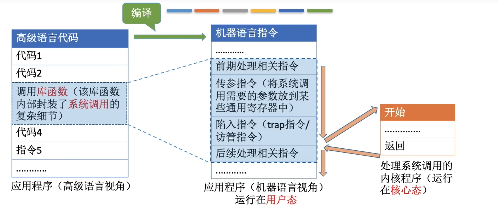
>
> 传递系统调用参数—>执行陷入指令（==用户态==）—>执行相应的内请求核程序处理系统调用（==核心态==）—>返回应用程序
>
> 注意：
>
> + ==陷入指令==是在==用户态==执行的，执行陷入指令之后立即引发一个==内中断==，使CPU==进入核心态==
> + 发出系统调用请求是在用户态，而对系统调用的相应处理在核心态下进行
>
> 注意别名：陷入指令=trap指令=访管指令

### 7、操作系统体系结构

> 
>
> + 原语是一种特殊的程序，具有原子性。也就是说，这段程序的运行必须一气呵成，不可被中断
> + Ubuntu、CentOS的开发团队主要工作是实现非内核功能，而内核都是用了Linux内核

#### 1）操作系统内核


#### 2）大内核和微内核性能对比

> 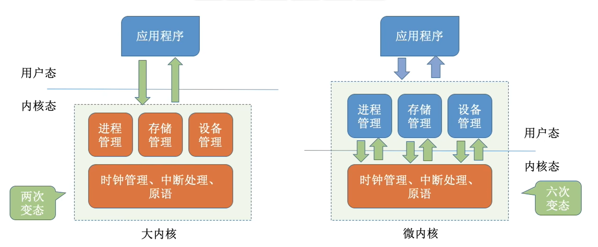
>
> 注意：==变态(CPU状态的转换)的过程是有成本的==，要消耗不少时间，==频繁地变态会降低系统性能==

#### 3）大内核

> 将操作系统的主要功能模块都作为系统内核，运行在核心态
> 优点：高性能
> 缺点：内核代码庞大，结构混乱，难以维护
>
> 典型的 ==大内核/宏内核/单内核== 操作系统：Linux、UNIX

#### 4）微内核

> 只把最基本的功能保留在内核
> 优点：内核功能少，结构清晰，方便维护
> 缺点：需要频繁地在核心态和用户态之间切换，性能低
>
> 典型的 ==微内核== 操作系统：Windows NT

### 8、操作系统引导

> 安装操作系统后
>
> 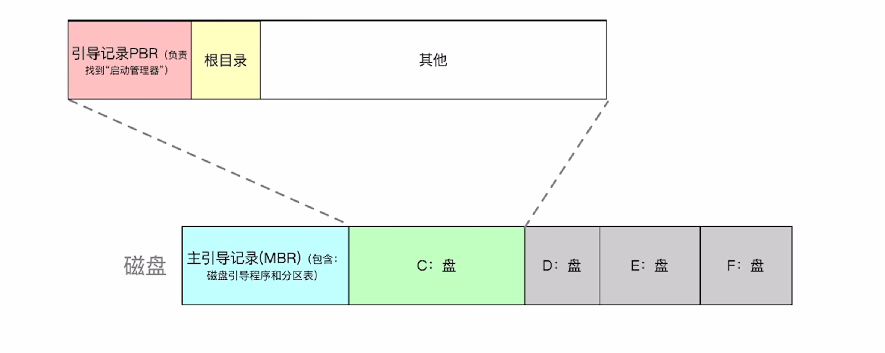

#### 1）操作系统引导（开机过程）

> 
>
> 注：
>
> + BIOS：Basic Input/Output System
>
> ==操作系统引导==：
>
> 1. CPU从一个特定的主存地址开始，取指令，执行ROM中的引导程序（先进行硬件自检，再开机）
> 2. 将磁盘的第一块——主引导记录读入内存，执行磁盘引导程序，扫描分区表
> 3. 从活动分区（又称主分区，即安装了操作系统的分区）读入分区引导记录，执行其中的程序
> 4. 从根目录下找到完整的操作系统初始化程序（即启动管理器）并执行，完成“开机”的一系列工作

### 9、虚拟机

#### 1）传统计算机

> 
>
> 一个机器上只能安装一个操作系统的局限性

#### 2）虚拟机

> 虚拟机：使用虚拟化技术，将一台物理机器虚拟化为多态虚拟机器（Virtual Machine，VM）每个虚拟机器都可以独立运行一个操作系统
>
> 同义术语：虚拟机管理程序/虚拟机监控程序/Virtual Machine Monitor/Hypervisor
>
> 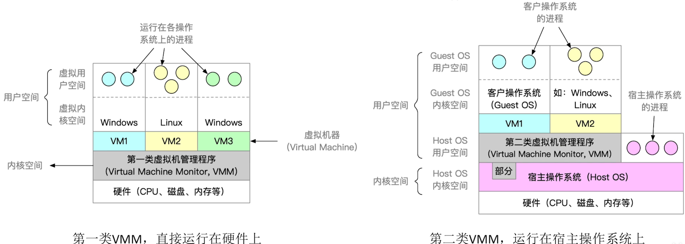

#### 3）两类虚拟机管理程序（VMM）的对比

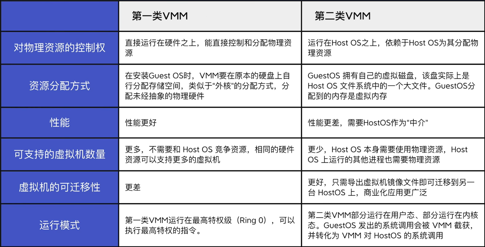


## 二、进程管理

### 1、进程的概念、组成、特征

#### （1）进程的概念

> **程序：**是静态的，就是个存放在磁盘里的可执行文件，就是一系列的指令集合
>
> **进程：**是动态的，是程序的一次执行过程（同一个程序多次执行会对应多个进程）
>
> ##### 思考：操作系统是这些进程的管理者，它要怎么区分各个进程？
>
> 当程序被创建时，操作系统会为该进程分配一个唯一的、不重复的“身份证号”——PID (Process ID,进程ID)

#### （2）进程的组成

> 更加确切的说，应该是”进程实体(进程映像)“由PCB、程序段、数据段组成。
>
> ##### 1）进程的组成——PCB
>
> 操作系统给要记录的**PID**、进程所属**用户ID（UID）**
>
> 还要记录给进程**分配了哪些资源**（如：分配了多少内存、正在使用哪些I/O设备、正在使用哪些文件）
>
> 还要记录进程的**运行情况**（如：CPU使用时间、磁盘使用情况、网络流量使用情况等等）
>
> 这些信息都被保存在一个数据结构PCB（Process Control Block）中，即进程加快
>
> 操作系统需要对各个并发运行的进程进行管理，但凡管理时所需要的信息，都会被放进PCB中
>
> PCB是进程存在的唯一标志，当进程被创建时，操作系统为其创建PCB，当进程结束时，会回收其PCB。
>
> **PCB是给操作系统使用的。**
>
> ##### 2）进程的组成——程序段、数据段
>
> **程序段：**程序的代码（指令序列）
>
> **数据段：**运行过程中产生的各种数据（如：程序中定义的变量）
>
> **程序段、数据段是给进程自己用的。**
>
> #### 知识滚雪球：程序是如何运行的？
>
> 一个进程实体（进程映像）由PCB、程序段、数据段组成。
>
> 进程是动态的，进程实体（进程映像）是静态的。
>
> 进程实体反应了进程在某一时刻的状态（如：x++后，x=2）
>
> **进程**是进程实体的**运行过程**，是系统进行**资源分配**和**调度**的一个独立单位。
>
> **注意：**PCB是进程存在的唯一标志

#### （3）进程的特征

> 程序是静态的，进程是动态的，相比于程序，进程拥有一下特征：
>
> 1. **动态性：**进程是程序的一次执行过程，是动态地产生、变化和消亡的
> 2. **并发性：**内存中有多个进程实体，各进程可并发执行
> 3. **独立性：**进程是能独立运行、独立获得资源、独立接受调度地基本单位
> 4. **异步性：**各进程按各自独立、不可预知的速度向前推进，操作系统要提供给”进程同步机制“来解决异步问题
> 5. **结构性：**每个进程都会配置一个PCB。结构上看进程由程序段、数据段、PCB组成

### 2、进程的状态与转换

#### （1）进程的状态

> 1. **创建态：**创建态进程正被创建时，它的状态是”创建态”，在这个阶段操作系统会为进程分配资源、初始化PCB
> 2. **就绪态：**当进程创建完成后，便进入”就绪态“处于就绪态的进程已具备运行条件，但由于没有空闲CPU，就暂时不能运行
> 3. **运行态：**如果一个进程此时在CPU上运行，那么这个进程处于”运行态“，CPU会执行该进程对应的程序（执行指令序列）
> 4. **阻塞态：**在程序运行的过程中，可能会请求等待某个事件的发生（如等待某种系统资源的分配，或者等待其他进程的相应）。在这个事件发生之前，进程无法继续往下执行，此操作系统会让这个进程下CPU，并让它进入“阻塞态”，当CPU空闲时，又会选择另一个“就绪态”进程上CPU运行。
> 5. **终止态：**一个进程可以执行exit系统调用，请求操作系统终止该进程。此时该进程会进入“终止态”，操作系统会让该进程下CPU，并回收内存空间等资源，最后还要回收该进程的PCB。当终止进程的工作完成之后，这个进程就彻底消失了。

#### （2）进程状态的转换

> 

#### （3）进程的组织——链接方式

> 
>
> 以队列的形式

#### （4）进程的组织——索引方式

>  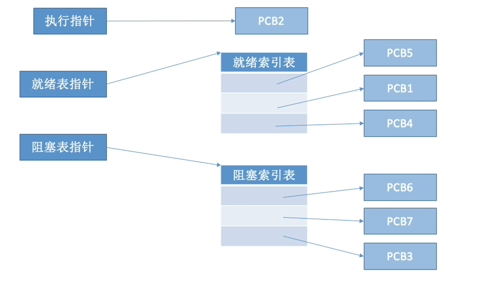
>
> 大多数的操作系统都是链接方式

### 3、进程控制

#### 1）基本概念

> ### 什么是进程控制
>
> **进程控制**的主要功能是对系统中的所有进程实施有效的管理，它具有创建新进程、撤销已有进程、实现进程状态转换等功能。
>
> ==简化理解==:反正进程控制就是要实现进程状态转换
>
> 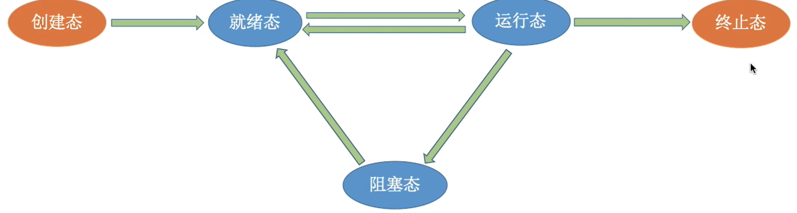
>
> ### 如何实现进程控制
>
> 使用==”原语“==实现，原语的执行具有==”原子性“==，一气呵成，如果不能一气呵成，就有可能导致操作系统中的某些关键数据结构信息==不统一==的情况，这会影响操作系统进行别的管理工作
>
> 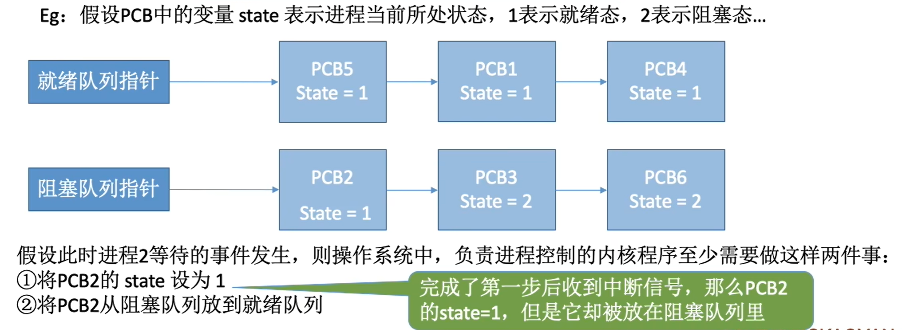

#### 2）如何实现原语的”原子性“

> **原语**的执行具有原子性，即执行过程中只能一气呵成，期间不允许被中断。可以用==”关中断指令“==和==“开中断指令”==这两个特权指令实现原子性。
>
> 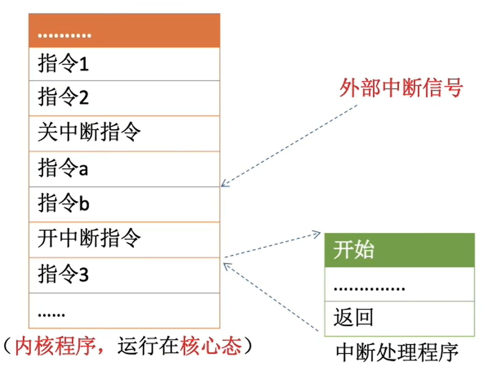
>
> CPU执行了==关中断指令==之后，就不能再例行检查中断信号，直到执行==开中断指令==之后才会恢复检查。
>
> 这样，关中断、开中断之间的这些指令序列就是不可中断的，这就实现了“原子性”

#### 3）进程控制相关的原语

> ### 进程的创建
>
> 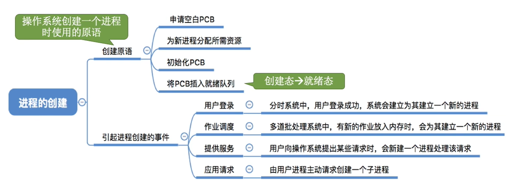
>
> ### 撤销原语
>
> 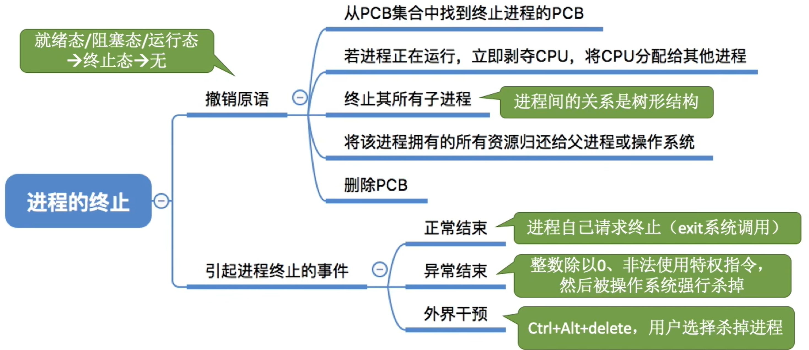
>
> ### 阻塞原语与唤醒原语
>
> 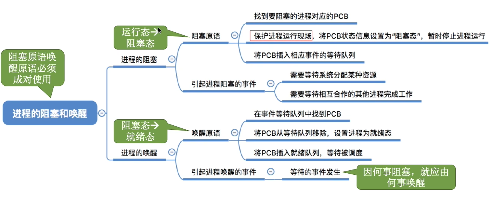
>
> ### 切换原语
>
> 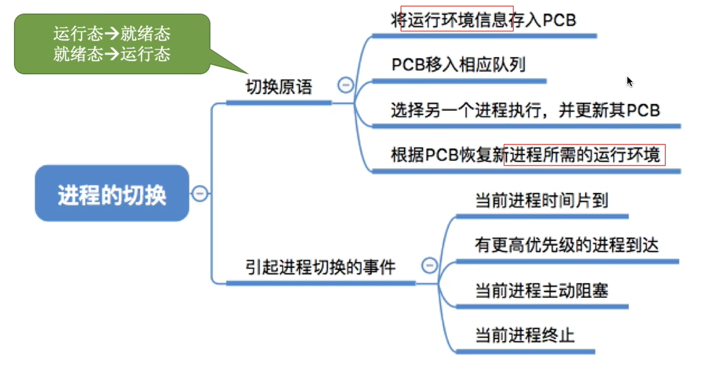

### 4、进程通信

> ### 什么是进程间通信
>
> 进程间通信（Inter-Process Communication，IPC），是指两个进程之间产生数据交互
>
> ### 为什么进程通信需要操作系统支持
>
> 进程是分配系统资源的单位（包括内存地址空间），因此各进程拥有的内存地址空间相互独立
>
> 为了保证安全，一个进程不能直接访问另一个进程的地址空间
>
> 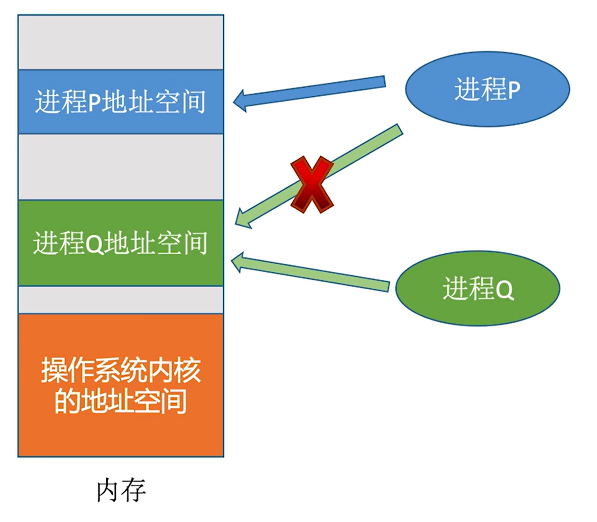

#### 1）共享存储

> ### 基于存储区的共享
>
> 操作系统在内存中划出一块**共享存储区**，数据的形式、存放位置都由通信进程控制，而不是操作系统。这种共享方式速度很快，是一种==高级通信==方式。
>
> 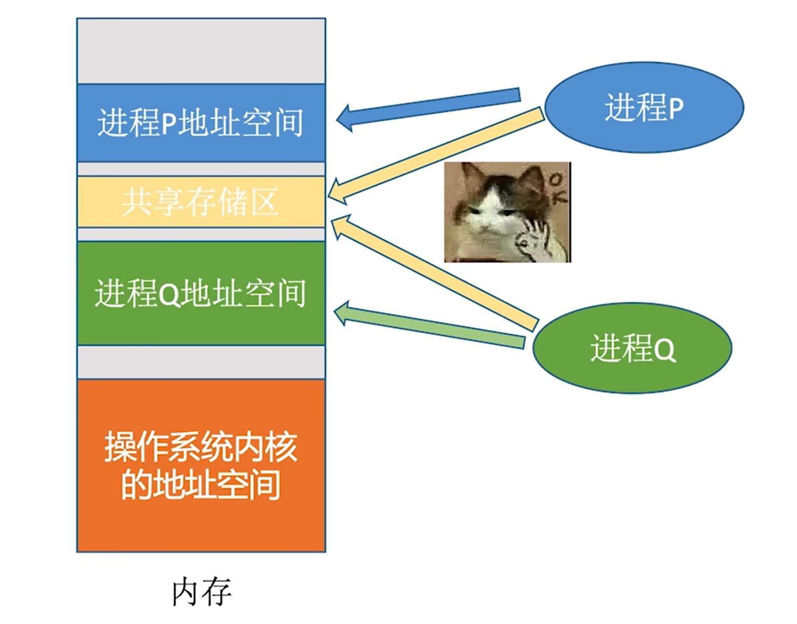
>
> ### 基于数据结构的共享
>
> 比如共享空间里只能放一个长度为10的**数组**。这种共享方式速度慢、限制多，是一种==低级通信==方式
>
> 

#### 2）消息传递

> 进程间的数据交换以格式化的消息为单位。进程通过操作系统提供的“发送消息/接收消息”两个原语进行数据交换
>
> ### 直接通信方式
>
> 点名道姓的传递方式
>
> 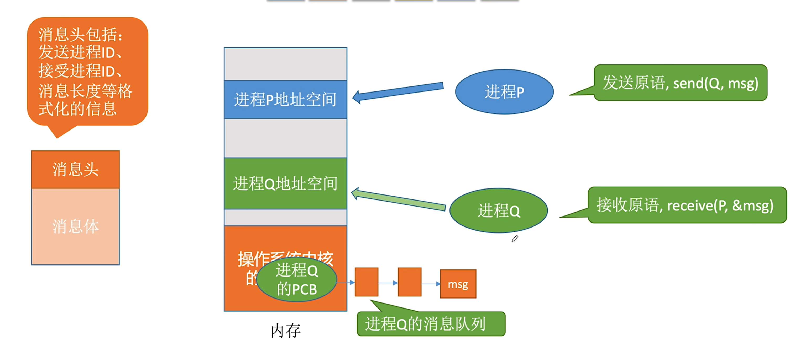
>
> ### 间接通信方式
>
> 以“信箱”作为中间实体进行消息传递
>
> 可以多个进程往同一个信箱send消息，也可以多个进程从同一个信箱中receive消息
>
> 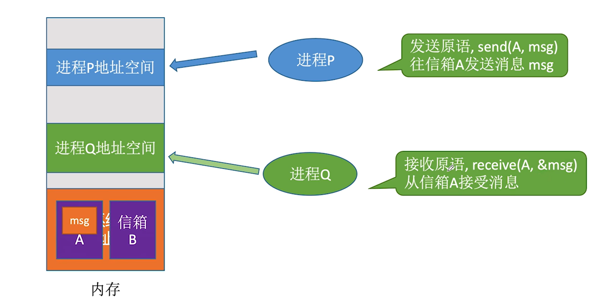

#### 3）管道通信

> 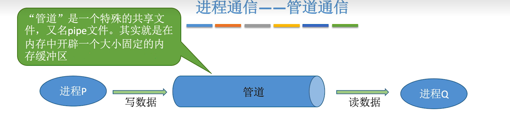
>
> 1. 管道只能采用**半双工通信**，某一时间段内只能实现单向的传输。如果要实现**双向同时通信**，则**需要设置两个管道**。
> 2. 各进程要**互斥**地访问管道（由操作系统实现）
> 3. 当**管道写满**时，**写进程**将**阻塞**，直到读进程将管道中的数据取走，即可唤醒写进程。
> 4. 当**管道读空**时，**读进程**将**阻塞**，直到写进程往管道中写入数据，即可唤醒读进程。
> 5. 管道中的数据一旦被读出，就彻底消失。因此，当多个进程读同一个管道时，可能会错乱。对此，通常有两种解决方案：①**一个管道允许多个写进程，一个读进程**（2014年408真题高教社官方答案）；②允许有**多个写进程，多个读进程**，但系统会让各个读进程轮流从管道中读数据（Linux）

### 5、线程概念多线程模型

#### 1）什么是线程，为什么要引入线程

> **传统的进程是程序执行流的==最小单位==**
>
>  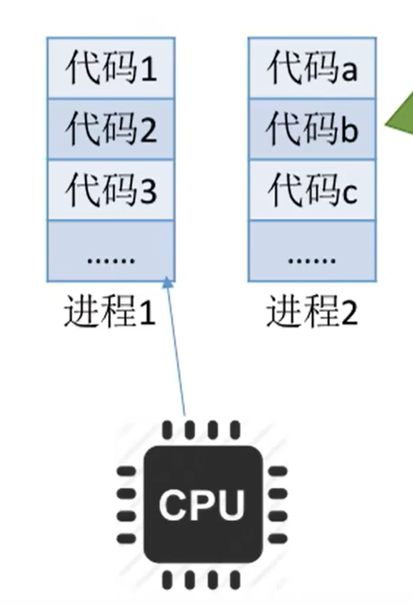
>
> **有的进程可能需要同时做很多事，而传统的进程只能串行地执行一系列程序。为此，引入了“线程”，来增加并发度。**
>
> 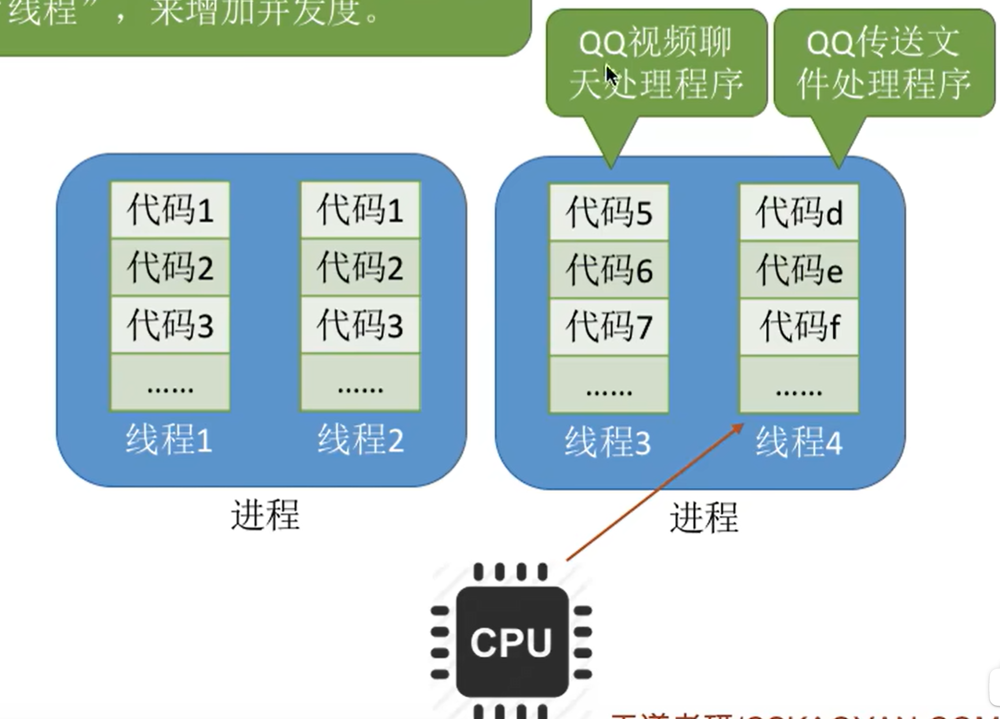
>
> ### 线程是一个基本的CPU执行单元，也是程序执行流的最小单位。
>
> 引入线程之后，不仅是进程之间可以并发，进程内的各线程也可以并发，从而进一步提升了系统的并发度，使得一个进程内也可以并发得处理各种任务
>
> #### 引入线程后，进程只作为除CPU之外的系统资源分配单位（如打印机、内存地址空间都是分配给进程的）

#### 2）引入线程机制后，有什么变化

> ### 资源分配、调度 
>
> 传统进程机制中，进程是资源分配、调度的基本单位
> 引入线程后，进程是资源分配的基本单位，线程是调度的基本单位
>
> ### 并发性
>
> 传统进程机制中，只能进程间并发
> 引入线程后，各进程间也能并发，提升了并发度
>
> ### 系统开销
>
> 传统的进程间并发，需要切换进程的运行环境，系统开销很大
> 线程间并发，如果是同一进程内的线程切换，则不需要切换进程环境，系统开销小
> 引入线程后，并发所带来的系统开销减小

#### 3）线程有哪些重要属性

> 线程是处理调度的单位
> 多CPU计算机中，各个线程可以占用不同得分CPU
> 每个线程都有一个线程ID、线程控制块（TCB）
> 线程也有就绪、阻塞、运行三种基本状态
> 线程几乎不拥有系统资源
> 同一进程的不同线程间共享进程的资源
> 由于共享内存地址空间，同一进程中的线程间通信甚至无需系统干预
> 同一进程中的线程切换，不会引起进程切换
> 不同线程中的线程切换，会引起进程切换切换同进程内的线程，系统开销很小切换进程，系统开销较大

#### 4）线程的实现方式

> ### 用户级线程（User-Level Thread,ULT)
>
> 历史背景：早期的操作系统只支持进程，不支持线程。当时的“线程”是由线程库实现的
>
> 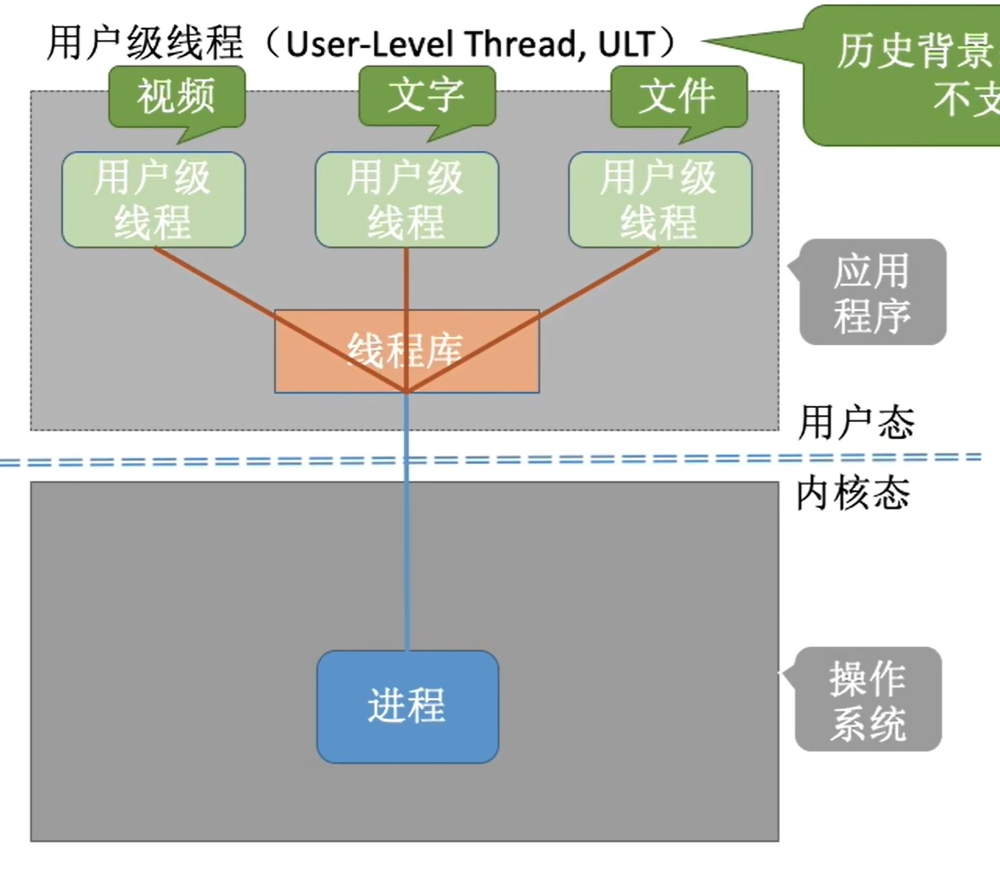
>
> 从代码角度来看，线程其实就是一段代码逻辑。很多编程语言提供了强大的线程库，可以实现线程的创建、销毁、调度等问题
>
> 1. 用户级线程由应用系统通过线程库实现，所有的线程管理工作都由应用程序负责（包括线程切换）
> 2. 用户级线程中，线程切换可以在用户态下即可完成，无需操作系统干预
> 3. 在用户看来，是有多个线程，但是在操作系统用户看来，并意识不到线程的存在。“用户级线程“就是从用户视角看能看到的线程
> 4. 优缺点
>    + 优点：用户级线程的切换在用户空间即可完成，不需要切换到核心态，线程管理系统开销小，效率高
>    + 缺点：当一个用户级线程被阻塞后，整个进程都会被阻塞，并发度不高。多个线程不可在多核处理机上并行运行
>
> ### 内核级线程（Kernel-Level Thread，KLT，又称”内核支持的线程“）
>
> 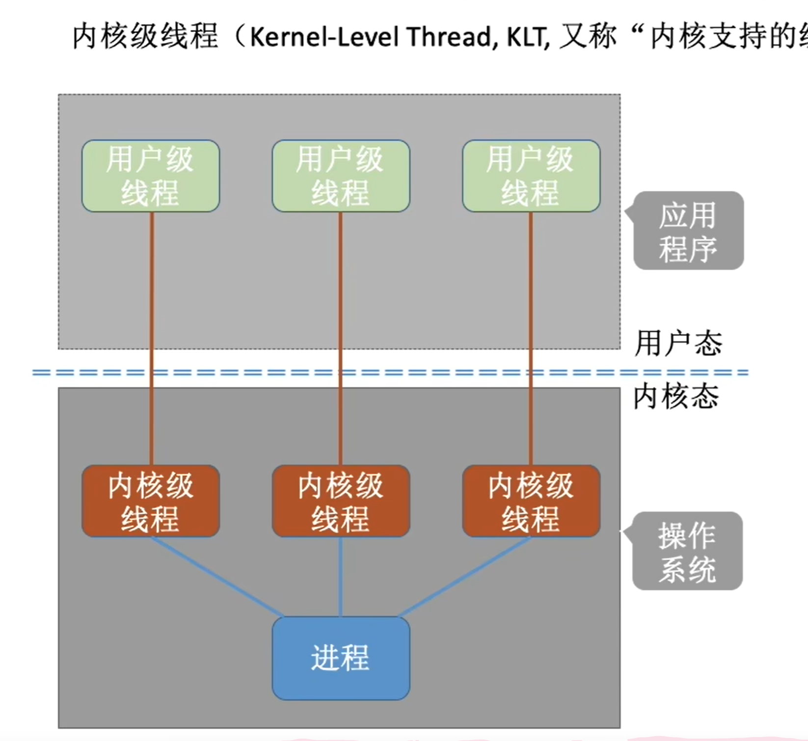
>
> 大多数现代操作系统都实现了内核级线程
>
> 1. 内核级线程的管理工作由操作系统内核完成
> 2. 线程调度、切换等工作都由内核负责，因此内核级线程的切换必然需要在核心态下才能完成
> 3. 操作系统会为每个内核级线程建立相应的TCB（Thread Control Block，线程控制模块），通过TCB对线程进行管理。”内核级线程“就是”从操作系统内核视角看能看到的线程“
> 4. 优缺点
>    + 优点：当一个线程被阻塞后，别的线程还可以继续执行，并发能力强。多线程可在多核处理机上并行执行
>    + 缺点：一个用户进程会占用多个内核级线程，线程切换由操作系统内核完成，需要切换到核心态，因此线程管理的成本高，开销大。

#### 5）多线程模型

> ### 一对一模型
>
> 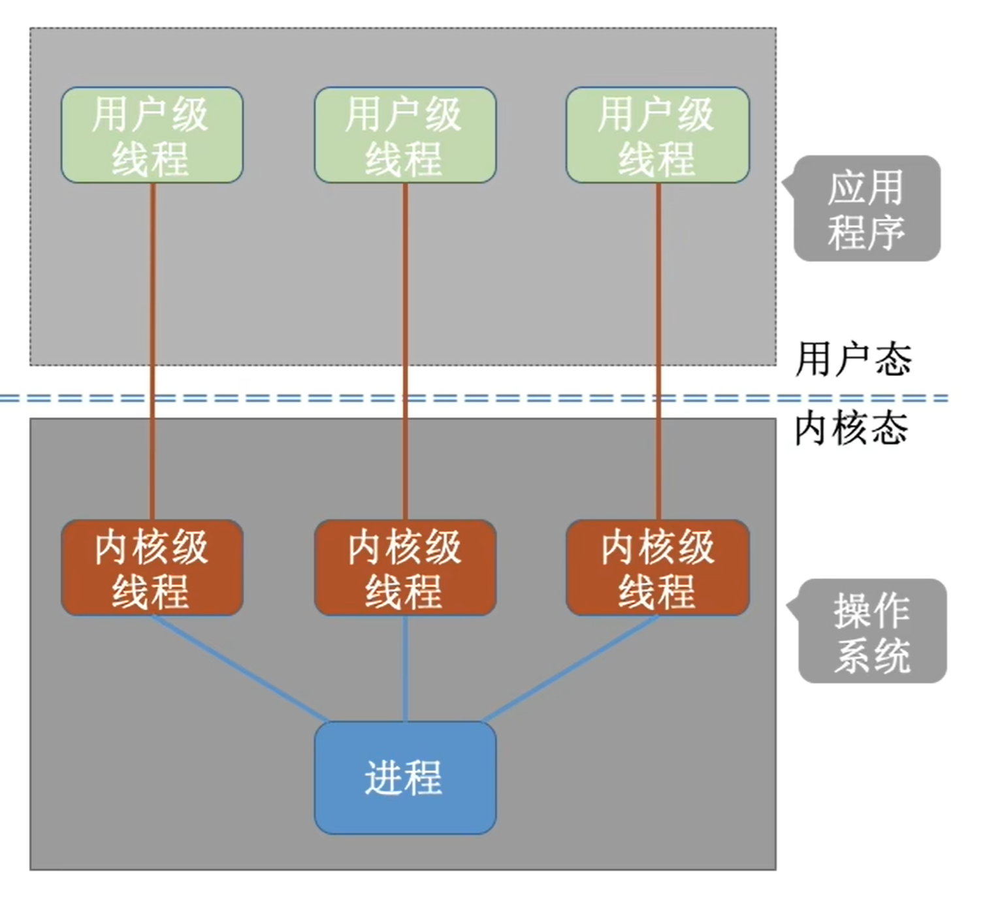
>
> #### **一对一模型：**一个用户级线程映射到一个内核级线程。每个用户进程有与用户级线程同数量的内核级线程。
>
> 优点：当一个线程被阻塞后，别的线程还可以继续执行，并发能力强。多线程可在多核处理机上并行执行。
> 缺点：一个用户进程会占用多个内核级线程，线程切换有操作系统内核完成，需要切换到核心态，因此线程管理的成本高，开销大
>
> ### 多对一模型
>
> 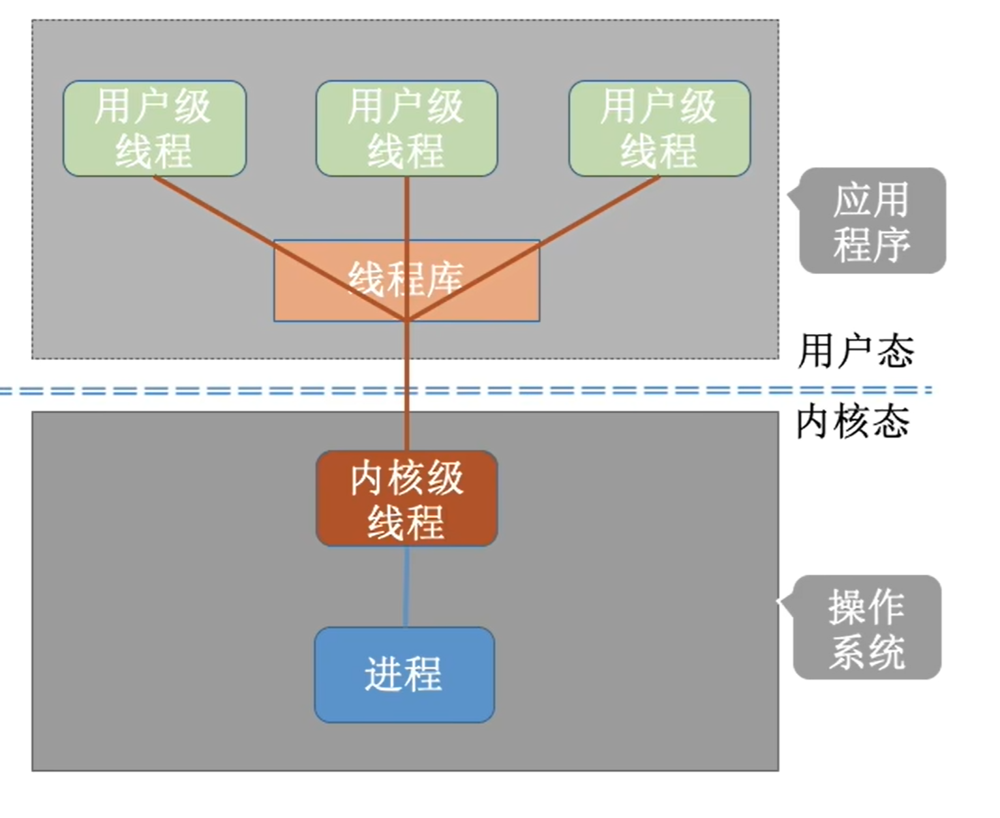
>
> #### **多对一模型：**多个用户级线程映射到一个内核级线程。且一个进程只被分配一个内核级线程
>
> 优点：用户级线程的切换在用户空间即可完成，不需要切换到核心态度，线程管理的系统开销小，效率高
> 缺点：当一个用户级线程被阻塞后，整个进程都会被阻塞，并发度不高。多个线程不可在多核处理机上并行运行
>
> 重点：操作系统只”看得见“内核级线程，因此只有内核级线程才是处理机分配的单位
>
> ### 多对多模型
>
> 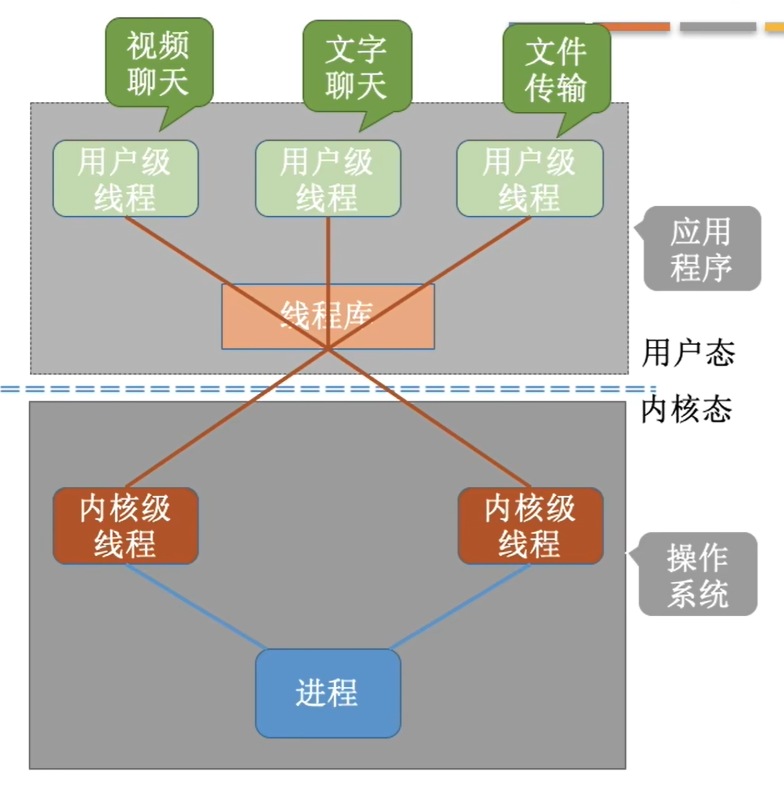
>
> #### 多对多模型：n用户级线程映射到m各内核级线程（n>=m）。每个用户进程对应m个内核线程。
>
> 克服了多对一模型并发度不高的缺点（一个阻塞完全阻塞），又克服了一对一模型中一个用户进程占太多内核级线程，开销太大的缺点。
>
> #### 可以这么理解：
>
> 用户级线程是”代码逻辑“的载体
> 内核级线程是”运行机会“的载体
>
> #### 内核线程才是处理机分配的单位。例如：多核CPU的环境下，左边这个进程最多能被分配两个核
>
> 一段代码逻辑只有获得了”运行机会“才能被CPU执行
>
> #### 内核级线程中可以运行任意一个有映射关系的用户级线程代码，只有两个内核及线程中正在运行的代码逻辑都阻塞时，这个进程才会阻塞

### 6、线程的状态与转换

#### 状态与转换

> 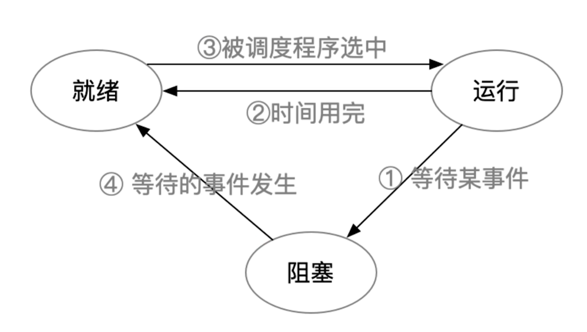

#### 组织与控制

> 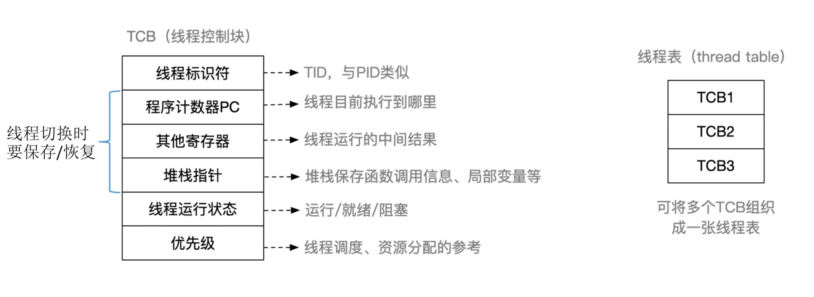

### 7、处理机调度概念、层次

#### 1）基本概念

> 当有一堆任务要处理，但由于资源有限，这些事情没法同时处理。这就需要确定==某种规则==来==决定==处理这些任务的顺序，这就是调度问题

#### 2）三个层次

> ### 高级调度
>
> > ==高级调度（作业调度）==。按一定的原则从外存的作业后备队列中挑选一个作业调入内存，并创建进程。==每个作业只调入一次，调出一次。==作业调入时会建立PCB。调出时才撤销PCB。
>
> ### 低级调度
>
> > ==低级调度（进程调度/处理机调度）==——按照某种策略从就绪队列中选取一个进程，将处理机分配给它。
> > 进程调度是操作系统中==最基本的一种调度==，在一般的操作系统中都必须配置进程调度
> > 进程调度的==频率很高==，一般是几十毫秒一次。
>
> ### 中级调度
>
> > ==中级调度（内存调度）==——按照某种策略决定将哪个处于挂起状态的进程重新调入内存
> > 内存不够时，可将某些进程的数据调出外存。等内存空闲或者进程需要运行时再重新调入内存。
> > 暂时调到外存等待的进程状态为==挂起状态==。被挂起的进程PCB会被组织成挂起队列
> > 一个进程可能会被多次调出、调入内存，因此中级调度发生的频率要比高级调度更高。

#### 3）三个调度的联系、对比

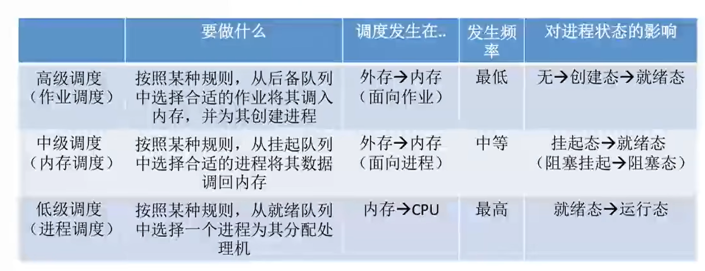

#### 4）补充知识

> 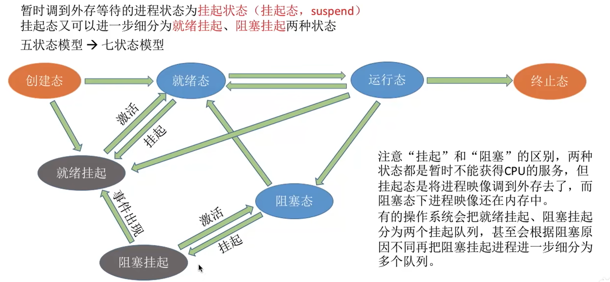

### 8、进程调度的时机切换与过程调度方式

#### 1）进程调度的时机

> 进程调度（低级调度），就是按照某种算法从就绪队列中选择一个进程为其分配处理机。
>
> 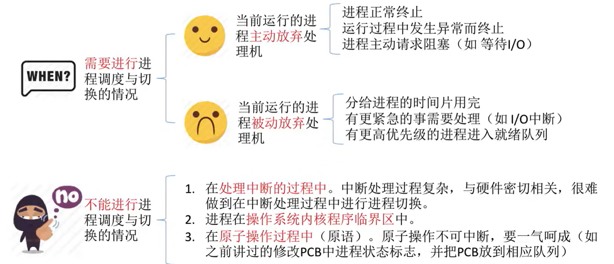
>
> 进程在==操作系统内核程序临界区==中==不能==进行调度与切换

#### 2）进程调度的方式

> ### 非剥夺调度方式
>
> > 又称==非抢占方式==，即只允许进程主动放弃处理机。在运行过程中即便有更紧迫的任务到达，当前进程依然会继续使用处理机，直到该进程终止或主动要求进入阻塞态。
> >
> > **实现简单，系统开销小但是无法及时处理紧急任务，适合于早期的批处理系统。**
>
> ### 剥夺调度方式
>
> > 又称==抢占方式==。当一个进程正在处理机上执行时，如果有一更更重要或更紧迫的进程需要使用处理机，则立即暂停正在执行的过程，将处理机分配给更重要紧迫的那个进程。
> >
> > **可以优先处理更紧急的进程，也可实现让各进程按时间片轮流执行的功能（通过时钟中断）。适合于分时操作系统、实时操作系统。**

#### 3）进程切换与过程

> ### 狭义的进程调度
>
> > 指的是==从就绪队列中选中一个要运行的进程==。（这个进程可以是刚刚被执行的进程，也可能是另一个进程，后一种情况就需要进程切换）
>
> ### 进程切换
>
> > 是指一个进程让出处理机，由另一个进程占用处理机的过程。
> >
> > > #### 进程切换的过程主要完成了：
> > >
> > > 1. 对原来运行进程各种数据的报存
> > > 2. 对新的进程各种数据的恢复（如：程序计数器，程序状态字、各种数据寄存器等处理机现场信息，这些信息一般保存在进程控制模块）
>
> ### 广义的进程调度
>
> 包含了选择一个进程和进程切换两个步骤。
>
> ### 注意
>
> ==进程切换是有代价的==，因此如果==过于频繁==的进行进程==调度、切换==，必然会使整个==系统的效率降低==，使系统大部分时间都花在了进程的切换上，而真正用于执行进程的时间减少。

### 9、调度器/闲逛进程

#### 1）调度器/调度程序（scheduler）

> 
>
> ### 调度程序决定
>
> > 让谁运行？——调度算法
> >
> > 运行多长时间？——时间片大小
>
> ### 调度时机——什么事件会触发“调度程序
>
> > + 创建新进程
> > + 进程退出·
> > + 运行进程阻塞
> > + I/O中断发生（可能唤醒某些阻塞程序）
>
> ### 抢占式VS非抢占式
>
> > + 非抢占式调度策略，只有运行进程阻塞或退出才触发调度程序工作
> > + 抢占式调度策略，每个时钟中断或k个时钟中断会触发调度程序工作
>
> ### 线程/进程
>
> > 不支持内核级线程的操作系统，调度程序的处理对象是进程
> > 支持内核级线程的操作系统，调度程序的处理对象是内核线程

#### 2）闲逛进程

> 调度进程永远的备胎，没有其他就绪进程时运行闲逛进程（idle）
>
> ### 闲逛进程的特性
>
> > + 优先级最低
> > + 可以是0地址指令，占一个完整的指令周期（指令周期末尾例行检查中断）、
> > + 能耗低

### 10、调度算法的评价指标

#### 1）CPU利用率

> 指CPU”忙碌"时间占总时间的比例。
>
> ### **利用率** = 忙碌时间/总时间
>
> > **例题：**
> >
> > 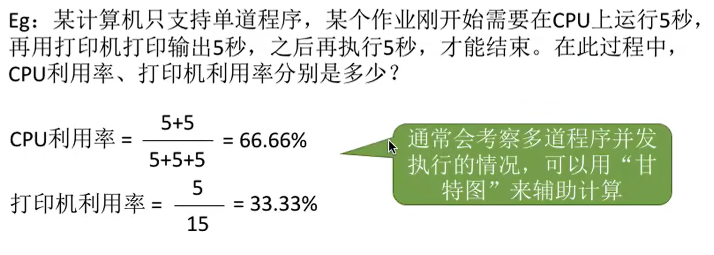

#### 2)系统吞吐量

> 单位时间内完成作业的数量
>
> ### 系统吞吐量=总共完成了多少作业/总共花了多少时间
>
> > **例题：**
> >
> > 

#### 3）周转时间

> 是指从作业被提交给系统开始，到作业完成为止的这段时间间隔。
> 它包括四个部分：作业在外存后备队列上等待作业调度（高级调度）的时间、进程在就绪队列上等待进程调度（低级调度）的时间、进程在CPU上执行的时间、进程等待I/O操作完成的时间。后三项在一个作业的整个处理过程中，可能发生多次。
>
> ### （作业）周转时间=作业完成时间-作业提交时间
>
> ### 平均周转时间=各作业周转时间之和/作业数
>
> > 周转时间相同但是实际运行时间不一样带来的体验也不一样，运行时间越长越好
>
> ### 带权周转时间=作业周转时间/时机运行的时间=（作业完成时间-作业提交时间）/作业实际运行时间
>
> ### 平均带权周转时间=各作业带权周转时间之和/作业数

#### 4）等待时间

> 指进程/作业处于等待处理机状态时间之和，等待时间越长，用户满意度越低。
>
> > 对于进程来说，等待时间就是指进程建立后等待被服务的时间之和，在等待I/O完成的期间其实进程也是在被服务的，所以不计入等待时间。
> > 对于作业来说，不急要考虑建立进程后的等待时间，还要加上作业在外存后备队列中等待的时间。
>
> 一个作业总共需要被CPU服务多久，被I/O设备服务多久一般是确定不变的，因此调度算法其实只会影响作业/进程的等待时间。当然与前面指标类似，也有“平均等待时间”来评价整体性能。

#### 5）响应时间

> 指从用户提交请求到首次产生响应所用的时间。
>

### 11、调度算法

#### 1）先来先服务（FCFS）

> ### 算法思想
>
> > 主要从“公平”的角度考虑（类似于我们生活中排队买东西的例子）
>
> ### 算法规则
>
> > 按照作业/进程到达的先后顺序进行服务
>
> ### 用于作业/进程调度
>
> > 用于作业调度时，考虑的是那个作业先到达后备队列；用于进程调度时，考虑的是哪个进程先到达就绪队列
>
> ### 是否可抢占
>
> > 非抢占式的算法
>
> ### 优缺点
>
> > 优点：公平、算法实现简单
> > 缺点：排在长作业（进程）后面的短作业需要等待很长时间，带权周转时间很大，对短作业来说用户体验不好。即。FCFS算法对长作业有利，对短作业不利
>
> ### 是否会导致饥饿（某进程/作业长期得不到服务）
>
> > 不会
>
> ### 例题
>
> > 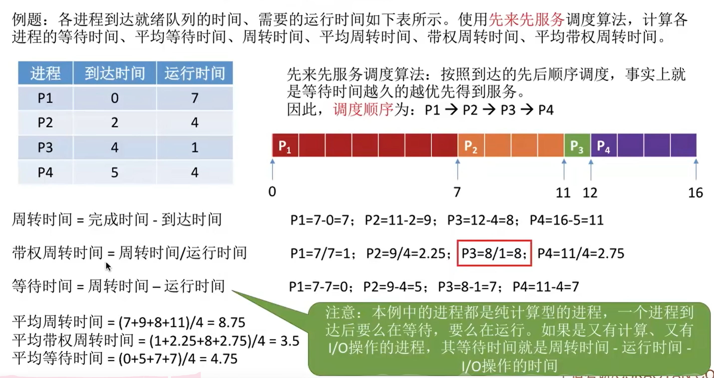

#### 2)短作业优先（SJF）

> ### 算法思想
>
> > 追求最少的平均等待时间，最少的平均周转时间、最少的平均带权周转时间
>
> ### 算法规则
>
> > 最短的作业/进程优先得到服务（所谓“最短”，是指要求服务时间最短）
>
> ### 用于作业/进程调度
>
> > 即可用于作业调度，也可用于进程调度。用于进程调度时称为“短进程优先（SPF，Shortest Process First）算法
>
> ### 是否可抢占？
>
> > SJF和SPF是非抢占式的算法。但是也有抢占式的版本——最短剩余时间优先算法（SRTN，Shortest Remaining Time Next）
>
> ### 优缺点
>
> > 优点：”最短的“平均等待时间、平均周转时间
> > 缺点：不公平。对短作业有利，对长作业不利。可能产生饥饿现象。另外，作业/进程的运行时间是由用户提供的，并不一定真实，不一定能做到真正的短作业优先
>
> ### 是否会导致饥饿
>
> > 会。如果源源不断地有短作业/进程到来，可能使长作业/进程长时间得不到服务，产生“饥饿”现象。如果一直得不到服务，则称为“饿死”
>
> ### 例题
>
> > 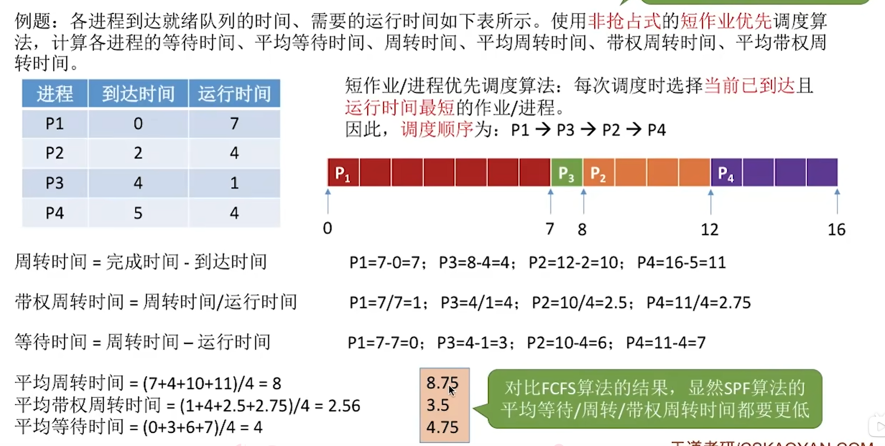
> >
> > 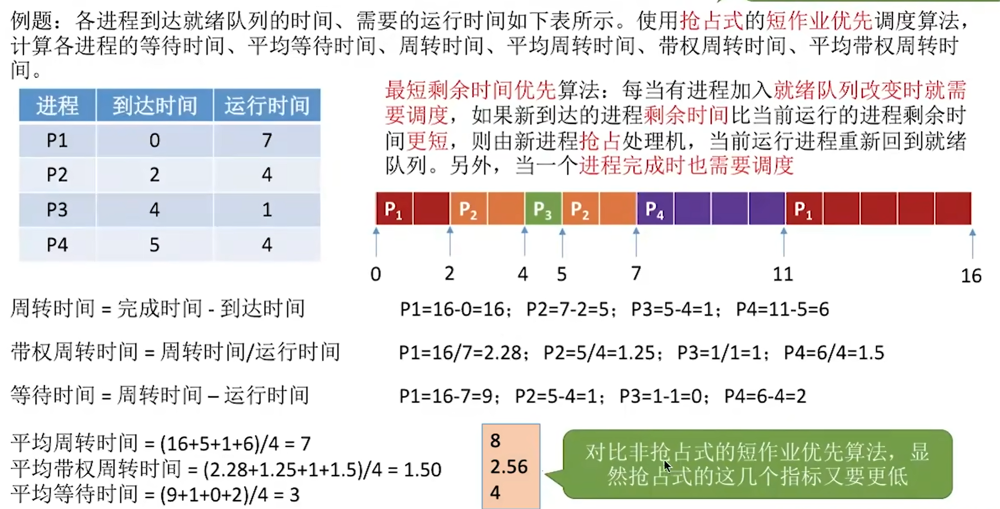

#### 3）高响应比优先（HRRN，Highest Response Ratio Next）

> ### 算法思想
>
> > 要综合考虑作业/进程的等待时间和要求服务的时间
>
> ### 算法规则
>
> > 在每次调度时先计算各个作业/进程的响应比，选择响应比最高的作业/进程为其服务
>
> ### 用于作业/进程调度
>
> > 即可用于作业调度 也可用于进程调度
>
> ### 是否可抢占
>
> > 非抢占式的算法。因此只有当前运行的作业/进程主动放弃处理机时，才需要调度，才需要计算响应比
>
> ### 优缺点
>
> > 综合考虑了等待时间和运行时间（要求服务时间）
> > 等待时间相同时，要求服务时间短的优先（SJF的优点）
> > 要求服务时间相同时，等待时间长的优先（FCFS的优点）
> > 对于长作业来说，随着等待时间越来越久，其响应比也会越来越大，从而避免了长作业饥饿的问题
>
> ### 是否会导致饥饿
>
> > 不会
>
> ### 例题
>
> > 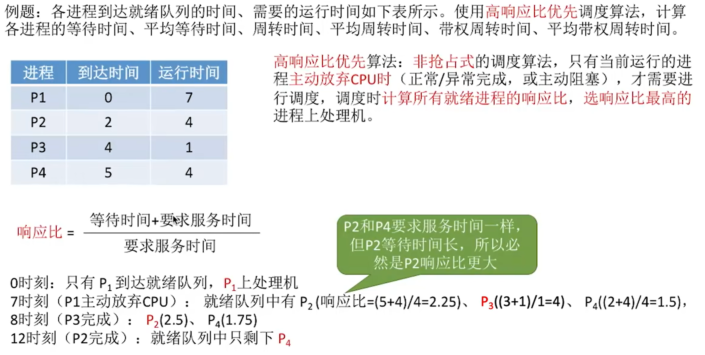

#### 4）时间片轮转（RR。Round-Robin）

> ### 算法思想
>
> >  公平地、轮流地为各个进程服务，让每个进程在一定时间间隔内都可以得到响应
>
> ### 算法规则
>
> > 按照各进程到达就绪队列地顺序，轮流让各个进程执行一个==时间片==（如100ms）。若进程未在一个时间片呢执行完，则剥夺处理机，将进程重新放入就绪队列队尾重新排队
>
> ### 用于作业/进程调度
>
> > 用于进程调度（只有作业放入内存建立了相应的进程后，才能被分配处理机时间片）
>
> ### 可否被抢占？
>
> > 若进程未能在时间片内运行完，将被强行剥夺处理机使用权，因此时间片轮转调度算法属于==抢占式==的算法。由时钟装置发出==时钟中断==来通知CPU时间已到。
>
> ### 优缺点
>
> > 优点：公平；相应快，适用于分时操作系统；
> > 缺点：由于高频率的进程切换，因此有一定开销；不区分任务的紧急程度
>
> ### 是否会导致饥饿
>
> > 不会
>
> ### 例题
>
> > 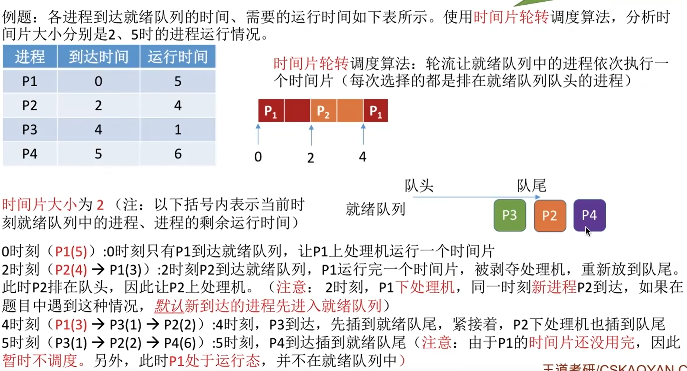
> >
> > 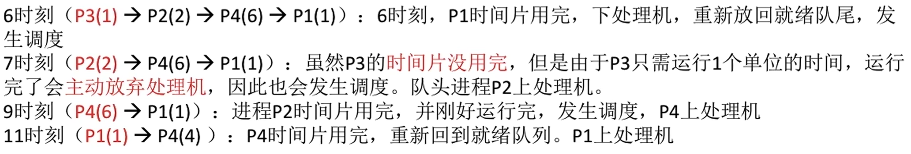
> >
> > 
> >
> > 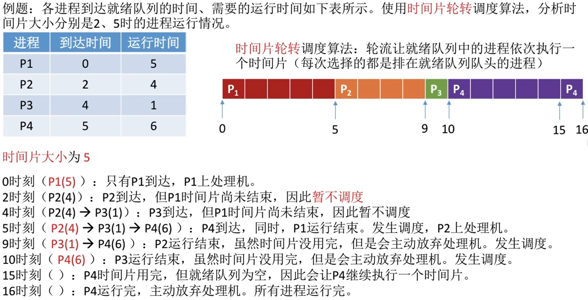
> >
> > 
> >
> > ### 时间片选择
> >
> > 

#### 5）优先级调度

> ### 算法思想
>
> > 随着计算机的发展，特别是实时操作系统的出现，越来越多的应用场景需要根据任务的紧急程度来决定处理顺序
>
> ### 算法规则
>
> > 调度时选择优先级最高的作业/进程
>
> ### 用于作业/进程调度
>
> > 既可用于作业调度，也可用于进程调度。甚至，还会用于在之后会学习的I/O调度中
>
> ### 是否可抢占
>
> > 抢占式、非抢占式都有。做题时的区别在于：非抢占式只需在进程主动放弃处理机时进行调度即可，而非抢占式还需在就绪队列变化时，检查是否会发生抢占。
>
> ### 优缺点
>
> > 优点：用优先级区分紧急程序、重要程度，适用于实时操作系统。可灵活地调整对各种作业/进程的偏好程度
> > 缺点：若源源不断地有高优先级进程到来，则可能导致饥饿
>
> ### 是否导致饥饿
>
> > 会

#### 6）多级反馈队列

> ### 算法思想
>
> 对其他调度算法的折中权衡
>
> ### 算法规则
>
> 1. 设置多级就绪队列，各级队列优先级从高到低，时间片从小到大
> 2. 新进程到达时先进入第1级队列，按FCFS原则排队等待被分配时间片，若用完时间片进程还未结束，则进程进入下一级队列队尾。如果此时已经是在最下级的队列，则重新放回该队列队尾
> 3. 只有第k级队列为空时，才会为k+1级队头的进程分配时间片
>
> ### 用于作业/进程调度
>
> 用于进程调度
>
> ### 是否可抢占？
>
> 抢占式的算法。在k级队列的进程运行过程中，若更上级的队列（1-k-1级）中进入了一个新进程，则由于新进程处于优先据更高的队列中，因此新进程会抢占处理机，原来运行的进程放回k级队列队尾
>
> ### 优缺点
>
> 对各类型进程相对公平（FCFS的优点）：每个新到达的进程都可以很快就得到响应（RR的优点）；短进程只用较少的时间就可以完成（SPF的优点）；不必实现估计进程的运行时间（避免用户作假）；可灵活地调整对各类进程地偏好程度，比如CPU密集型进程、I/O密集型进程（拓展：可以将因I/O而阻塞地进程重新放回原队列，这样I/O型进程就可以保持较高优先级）
>
> ### 是否会导致饥饿
>
> 会
>
> ### 例题
>
> > 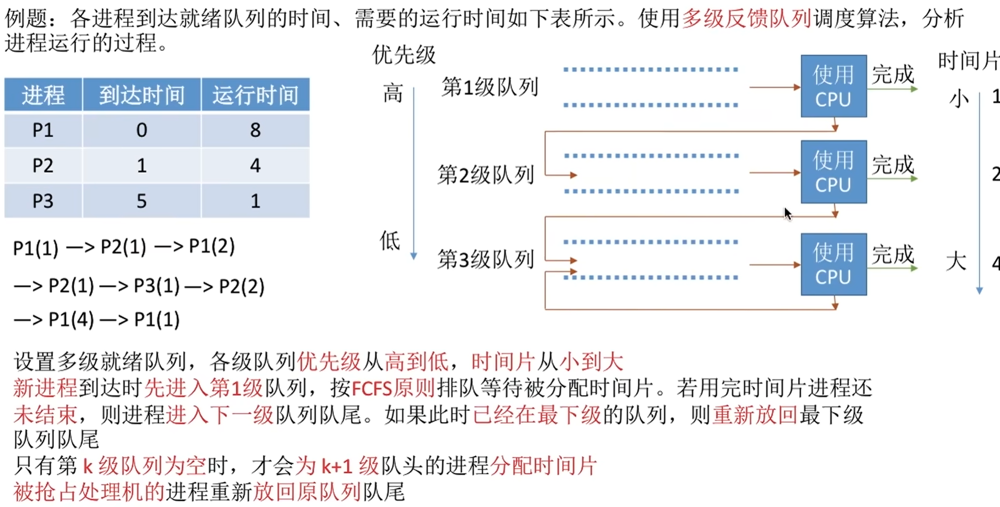

#### 7）多级队列调度算法

> 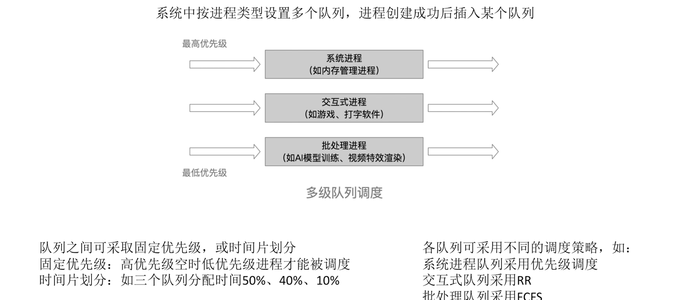

### 12、进程同步、进程互斥

#### 什么是进程同步？

> ### 知识点回顾
>
> > 进程具有**异步性**的特征。**异步性**是指，各并发执行的进程以各自独立的、不可预知的速度向前推进。
>
> ### 进程同步
>
> > **同步**亦称**直接制约关系**，它是指为完成某种任务而建立的两个或多个进程，这些进程因为需要在某些位置上**协调**它们的**工作次序**而产生的制约关系。进程间的直接制约关系就是源于它们之间的相互合作。

#### 什么是进程互斥？

> 进程的“并发”需要“共享”的支持。各个并发执行的进程不可避免地需要共享一些系统资源
>
> ### 临界资源
>
> > 我们把一个时间段内只允许一个进程使用的资源称为临界资源。许多物理设备（比如摄像头、打印机）都属于临界资源。此外还有许多变量、数据、内存缓冲区都属于临界资源
>
> ### 进程互斥
>
> > 对临界资源的访问，必须互斥地进行。互斥、亦称间接制约关系。进程互斥指当一个进程访问某临界资源时，另一个想要访问该临界资源的进程必须等待。当前访问临界资源的进程访问结束，释放该资源之后，另一个进程才能去访问临界资源。
>
> ### 互斥访问的逻辑
>
> > 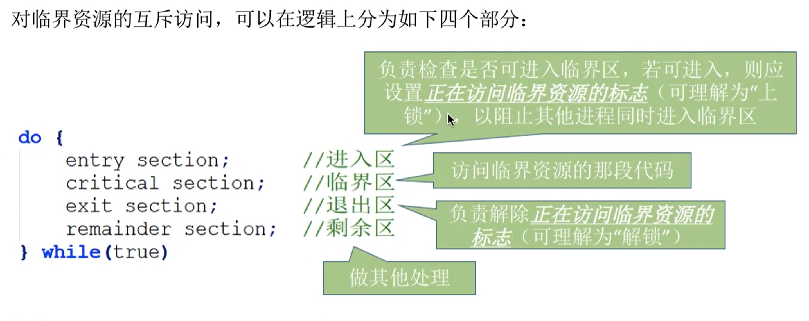
> >
> > #### 注意
> >
> > > ==临界区==是进程中==访问临界资源==的代码段
> > > ==进入区==和==退出区==是==负责实现互斥==的代码段
> > > 临界区也可称为“临界段”。
>
> ### 遵循原则
>
> > 1. 空闲让进。临界区空闲时，可以允许一个请求进入临界区的进程立即进入临界区；
> > 2. 忙则等待。当已有进程进入临界区时，其他试图进入临界区的进程必须等待；
> > 3. 有限等待。对请求访问的进程，应保证能有限时间内进入临界区（保证不会饥饿）；
> > 4. 让权等待。当进程不能进入临界区时，应立即释放处理机，防止进程忙等待。

### 13、进程互斥的软件实现方法

#### 1）单标志法

> ### 算法思想
>
> > 两个进程在访问完临界区后会把使用临界区的权限转交给另一个进程。也就是每个进程进入临界区的权限只能被另一个进程赋予
> >
> > 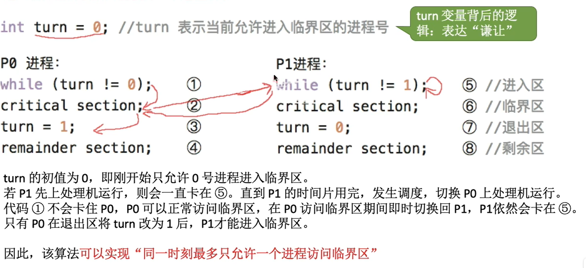
>
> ### 缺陷
>
> > 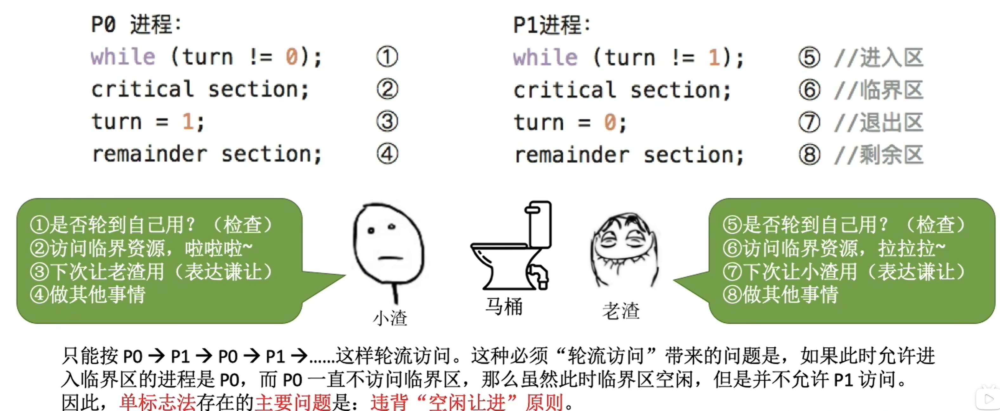

#### 2）双标志先检查

> ### 算法思想
>
> > 设置一个布尔型数组flag[],数组中各个元素用来标记各进程想进入临界区的意愿，比如“flag[0]=ture"意味着0号进程P0现在想要进入临界区。每个进程在进入临界区之前先检查当前有没有别的进程想进入临界区，如果没有，则把自身对应的标志flag[i]设为true，之后开始访问临界区。
>
> ### 缺陷
>
> > 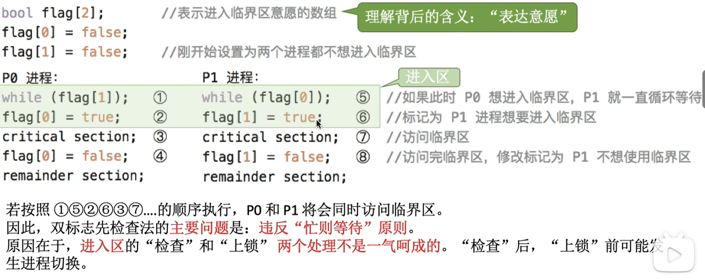

#### 3）双标志后检查

> ### 算法思想
>
> > 双标志先检查法的改版。前一个算法的问题是先”检查“后”上锁“，但是这两个操作又无法一气呵成，因此导致了两个进程同时进入临界区的问题。因此，人们又想到先”上锁“后”检查“的方法，来避免上述问题。
>
> ### 缺陷
>
> > 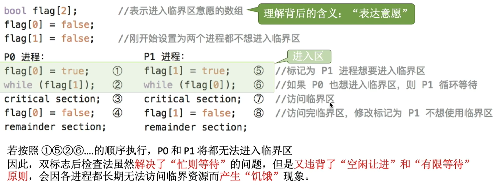

#### 4）Peterson算法

> ### 算法思想
>
> > 结合双标志法、单标志法的思想。如果双方都争着想进入临界区，那可以让进程尝试”孔融让梨“（谦让）。做一个有礼貌的进程
>
> ### 缺陷
>
> > 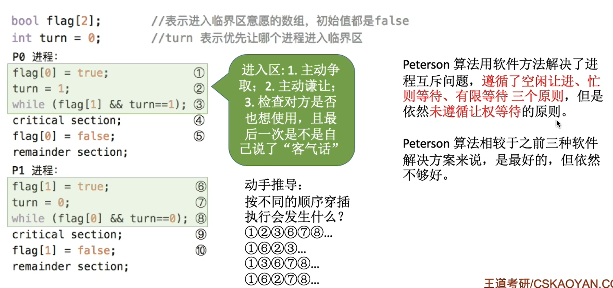

### 14、进程互斥的硬件实现方法

#### 1）中断屏蔽方法

> ### 原理
>
> > 利用”开/关中断指令“实现（与原语的实现思想相同，即在某进程开始访问临界区到结束访问为止都不允许被中断，也就不能发生进程切换，因此也不可能发生两个同时访问临界区的情况）
> >
> > 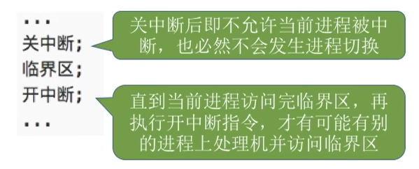
>
> ### 优缺点
>
> > 优点：简单、高效
> > 缺点：不适用于多处理机；只适用于操作系统内核进程，不适用于用户进程（因为开/关中断指令只能运行在内核态，这组指令如果能让用户随意使用会很危险）

#### 2）TestAndSet指令

> ### 原理
>
> > 简称TS指令，也有地方称为TestAndSetLock指令
> > TSL指令是用硬件实现的，执行的过程不允许被中断，只能一气呵成。以下是用c语言描述的逻辑
> >
> > 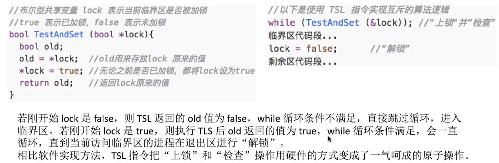
>
> ### 优缺点
>
> > 优点：实现简单，无需像软件实现方法那样严格检查是否会有逻辑漏洞；适用于多处理机环境
> > 缺点：不满足”让权等待“原则，暂时无法进入临界区的进程会占用CPU并循环执行TSL指令，从而导致”忙等“。

#### 3）Swap指令

> ### 原理
>
> > 有的地方也叫Exchange指令，或简称XCHG指令
> > Swap指令是用硬件实现的，执行的过程不允许被中断，只能一气呵成。以下是用C语言描述的逻辑
> >
> > 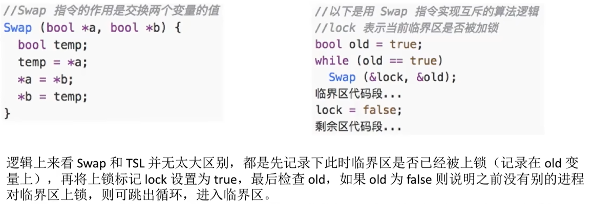
>
> ### 优缺点
>
> 优点：实现简单，无需像软件实现方法那样严格检查是否有逻辑漏洞；适用于多处理机环境
> 缺点：不满足”让权等待”原则，暂时无法进入临界区的进程会占用CPU并循环执行TSL指令，从而导致“忙等”

### 15、互斥锁

> ### 互斥锁
>
> > 解决临界区最简单的工具就是互斥锁（mutex lock）。一个进程在进入临界区是应获得锁；在退出临界区时释放锁。函数acquire()获得锁，而函数release()释放锁。
> >
> > 每个互斥锁都有一个布尔变量available，表示锁是否可用。如果锁是可用的，调用acqiure()会成功，且锁不再可用。当一个进程试图获取不可用的锁时，会被阻塞，知道锁被释放。
> >
> > ```c
> > acquire(){
> >     while(!available)
> >         ;					//忙等待
> >     available = false;		//获得锁
> > }
> > release(){
> >     available = true;		//释放锁
> > }
> > 
> > ```
> >
> > acquire()或release()的执行必须是原子操作，因此互斥锁通常采用硬件机制来实现。
>
> ### 优缺点
>
> > 互斥锁的主要缺点是忙等待，当有一个进程在临界区中，任何其他进程在进入临界区时必须连续循环调用acquire().当多个进程共享同一CPU时，就浪费了CPU周期。因此，互斥锁通常用于多处理器系统，一个线程可以在一个处理器上等待，不影响其他线程的执行。
> >
> > 需要连续循环忙等的互斥锁，都可称为自旋锁（spin lock），如TSL指令、swap指令、单标志法
>
> ### 特性：
>
> > + 需忙等，进程时间片用完才下处理机，违反“让权等待”
> > + 优点：等待期间不用切换进程上下文，多处理机系统中，若上锁的时间短，则等待代价很低
> > + 常用于多处理器系统，一个核忙等，其他核照常工作，并快速释放临界区
> > + 不太适用与单处理机系统，忙等的过程不可能解锁
> >
> > 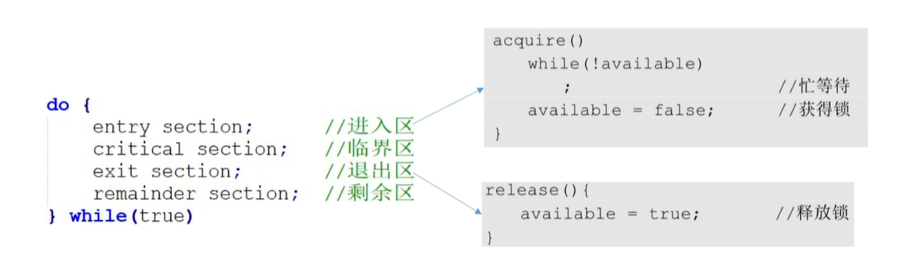

### 16、信号量机制

> 用户进程可以通过使用操作系统提供的一对==原语==[^2]来对==信号量==[^3]进行操作，从而很方便的实现了进程互斥、进程同步。
>
> 一对原语：==wait(S)原语和signal(S)原语==[^4]，可以把原语理解为我们自己写的函数，函数名分别为wait和signal，括号里的信号量S其实就是函数调用时传入的一个参数
>
> [^2]:原语是一种特殊的程序段，其执行只能一气呵成，不可被中断。原语是由关中断/开中断指令实现的。软件解决方案的主要问题是由”进入区的各种操作无法一气呵成“，因此如果能把进入区、退出区的操作都用”原语“实现，这些操作能”一气呵成“就能避免问题。
> [^3]:信号量其实就是一个变量（可以是一个整数，也可以是更复杂的记录型变量），可以用一个信号量来表示系统中某种资源的数量，比如：系统中只有一台打印机，就可以设置一个初值为1的信号量
> [^4]:wait、signal原语常简称为P、V操作（来自荷兰语proberen和verhogen）。因此，做题的时候常把wait(S)、signal(S)两个操作分别写为P(S)、V(S)

#### 1）整型信号量

> > 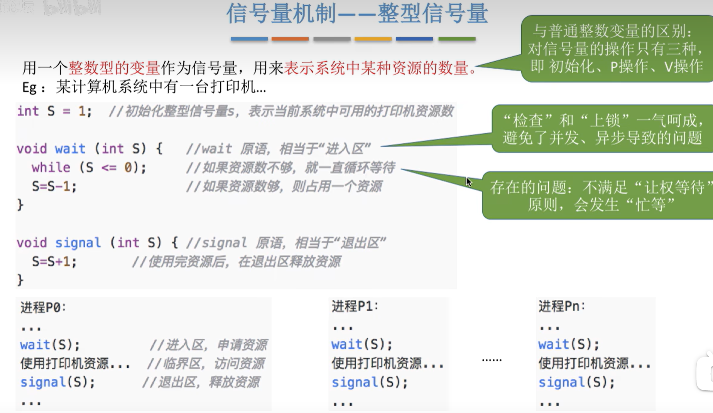
>
> ### 存在问题
>
> > 不满足让权等待原则

#### 2）记录型信号量

> > 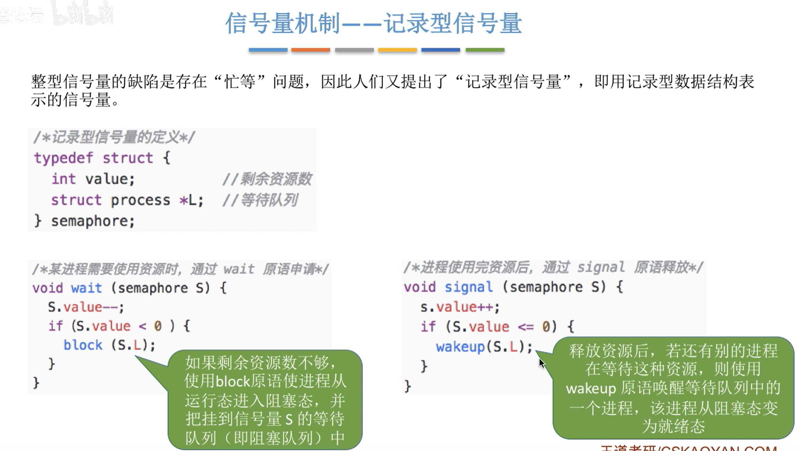
> >
> > 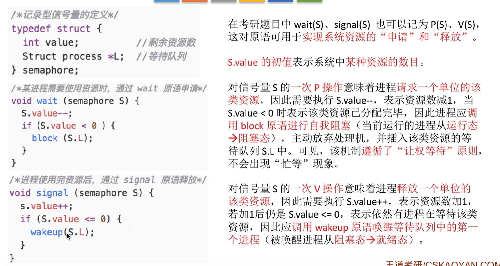
>
> ### 注意
>
> > 要能够自己推断在什么条件下需要执行block或wakeup

### 17、用信号量机制实现进程互斥、同步、前驱关系

> 不要一头钻到代码里，要注意理解信号量背后的含义，**一个信号量对应一种资源**
>
> 信号量的值=这种资源的剩余数量（信号量的值如果小于0，说明此时有进程在等待这种资源）
>
> P(S)——申请一个资源S，如果**资源不够就阻塞等待**
> V(S)——释放一个资源S，如果有进程在等待该资源，**则唤醒一个进程**

#### 1）信号量机制实现进程互斥

> 1. 分析并发进程的关键活动，划定临界区（如：对临界资源打印机的访问就应放在临界区）
> 2. 设置互斥信号量mutex，初值为1
> 3. 在进入区P(mutex)——申请资源
> 4. 在退出区V(mutex)——释放资源
>
> ### 代码实现
>
> ```c
> //记录型信号量的定义
> typedef struct{
>     int value;			//剩余资源数
>     struct process *L;	//等待队列
> }semaphore;//要回自己定义记录型信息量
> 
> //信号量机制实现互斥
> semaphore mutex = 1;	//初始化信号量
> 
> P1(){
>     ...
>     P(mutex);			//使用临界资源前需要加锁
>     临界区代码段;
>     V(mutex);			//使用临界资源后需要解锁
>     ...
> }
> 
> P2(){
>     ...
>     P(mutex);			
>     临界区代码段;
>     V(mutex);			
>     ...
> }
> ```
>
> ### 注意
>
> > 对不同的临界资源需要设置不同的互斥信号量。
> > P、V操作必须成对出现。
> > 缺少**P(mutex)**就不能保证临界资源的互斥访问。
> > 缺少**V(mutex)**会导致资源永不被释放，等待进程永不会被唤醒

#### 2）信号量机制实现进程同步

> ### 进程同步
>
> > 要让各并发程序按要求有序地推进
>
> 1. 分析什么地方需要实现“同步关系”，即必须保证“一前一后”执行的两个操作（或两句代码）
>
> 2. 设置同步信号量S，初始为0
>
> 3. 在“前操作”之后执行V(S)
>
> 4. 在“后操作”之后执行P(S)
>
> 	口诀：前V后P
>
> ### 代码演示
>
> ```c
> //信号量机制实现同步
> semaphore S = 0;	//初始化同步信号量，初始值为0理解：信号量S代表“某种资源”，刚开始是没有这种资源的。P2需要使用这种资源，而又只能由p1产生这种资源
> 
> p1(){
>     代码1;
>     代码2;
>     V(S);
>     代码3;
> }
> p1(){
>     P(S);
>     代码4;
>     代码5;
>     代码6;
> }
> //保证了代码4一定是在代码2之后执行的
> ```
>
> 若先执行到V(S)操作，贼S++后S=1.之后当执行到P(S)操作时，由于S=1，表示有可用资源，会执行S- -,S的值变回0，P2进程不会执行block原语，而是继续往下执行代码4.
> 若执行到P(S)操作，由于S=0，S- -后S=-1，表示此时没有可用资源，因此P操作中会执行block原语，主动请求阻塞。之后当执行完代码2，继而V(S)操作，S++，使S变回0，由于此时有进程在该信号量对应的阻塞队列中，因此会在V操作中执行wakeup原语，唤醒P2进程。这样P2就可以继续执行代码4了。

#### 3）信号量机制实现前驱关系

> 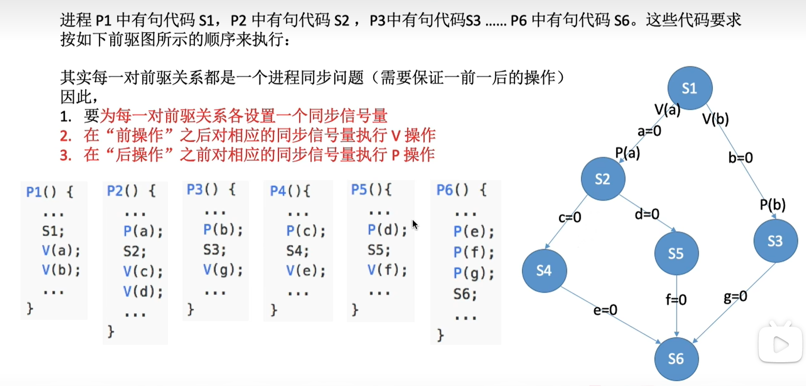

### 18、生产者-消费者问题

> ### 问题描述
>
> > 系统中有一组生产者进程和一组消费者进程，生产这进程每次生产一个产品放入缓冲区，消费者进程每次从缓冲区去除一个产品并使用（注：这里的“产品”理解为某种数据）
> > 生产者、消费者共享一个初始为空、大小为n的缓冲区。
> > 只有缓冲过去没满时，生产者才能把产品放入缓冲区，否则必须等待（缓冲区没满—>生产者生产）
> > 只有缓冲区不空时，消费者才能从中取出产品，否则必须等待（缓冲区没空—>消费者消费）
> > 缓冲区是临界资源各进程必须互斥的访问
>
> ### 例题
>
> > 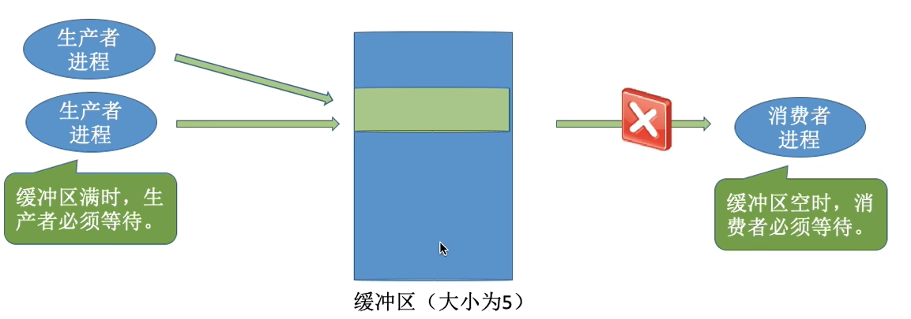
> >
> > #### PV操作题目分析步骤：
> >
> > > 1. 关系分析。找出题目中描述的各个进程。分析它们之间的同步、互斥关系。
> > > 2. 整理思路。根据各进程的操作流程确定P、V操作的大致顺序。
> > > 3. 设置信号量。并根据题目条件确定信号量初值。（互斥信号量初值一般为1，同步信号量的初值要看对应资源的初始值是多少）
> > >
> > > 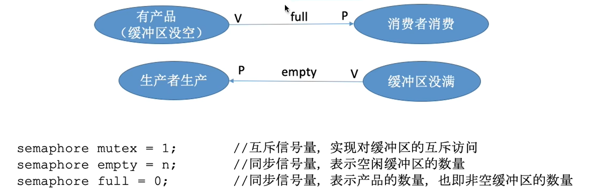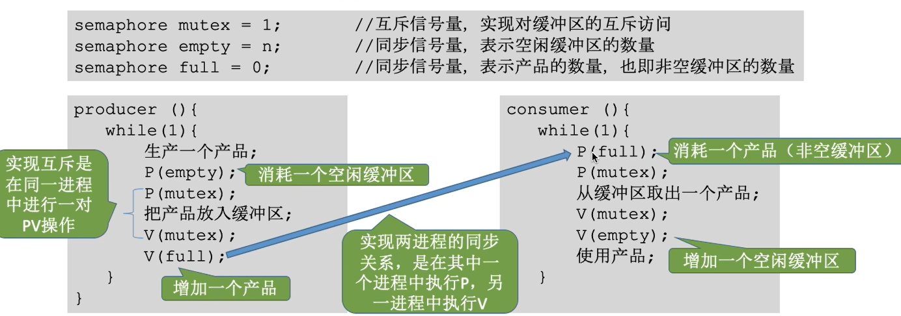
>
> ### 思考：能否改变相邻P、V操作的顺序
>
> > 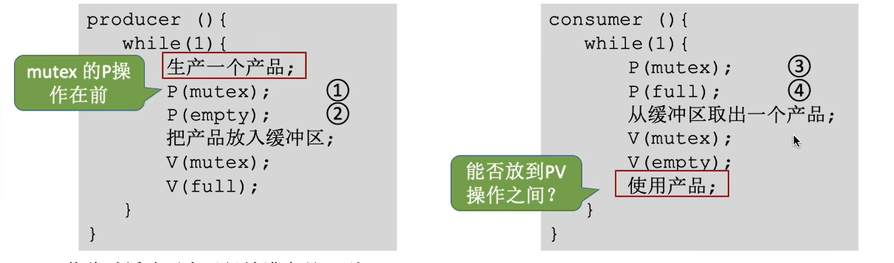
> >
> > 若此时缓冲区内已经放满产品，则empty=0，full=n。
> > 则生产者进程执行①使mutex变为0，再执行②，由于已没有空闲缓冲区，因此生产者被阻塞。由于生产者阻塞，因此切换回消费者进程。消费者进程执行③，由于mutex为0，即生产者还没释放对临界资源的“锁”，因此消费者也被阻塞。
> > 这就造成了生产者等待消费者释放空闲缓冲区，而消费者又等待生产者释放临界区的情况，生产者和消费者循环等待被对方唤醒，出现“死锁”。
> > 同样的，若缓冲区没有产品，即full=0，empty=n。按③④①的顺序执行就会发生死锁。
> > 因此，**实现互斥的P操作一定要在实现同步的P操作之后。**
> > V操作不会导致进程阻塞，因此**两个V操作顺序可以交换。**

### 19、多生产者-多消费者问题

> ### 问题描述
>
> > 桌子上有一只盘子，每次只能向其中放入一个水果。爸爸专向盘子中放苹果，妈妈专门向盘子中放橘子，儿子专门等着吃盘子中的橘子，女儿专等着吃盘子中的苹果。只有盘子空时，爸爸或妈妈才可向盘子中放一个水果。仅当盘子中有自己需要的水果时，儿子或女儿可以从盘子中取出水果。用PV操作实现上述过程。

