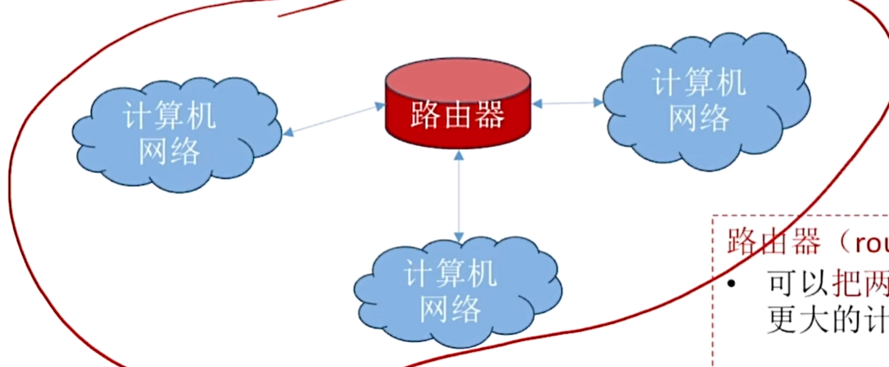
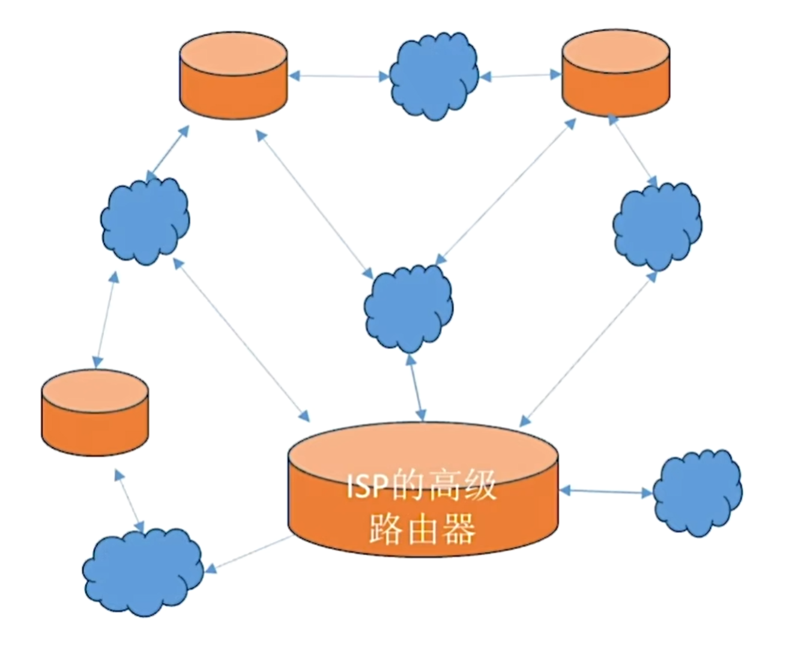

# 计算机网络

## 第一章 计算机网络体系结构

### 1、计算机网络的概念

#### 1）什么是计算机网络

> **计算机网络（Computer networking）**是一个将众多==分散的、自治==的计算机系统，通过==通信设备==与==线路==连接起来，由功能完善的软件实现==资源共享==和==信息传递==的系统。

#### 2）计算机网络、互连网、互连网的区别

> **计算机网络（简称网络）**：由若干结点（node）和连接这些结点的链路（link）组成。
>
> **结点**可以是计算机、集线器、交换机、路由器等
>
> **链路**可以是有线链路、无线链路。
>
> **集线器（Hub）**
>
> + 可以把多个结点连接起来，组成一个计算机网络
> + 普通民用领域已很少用集线器
> + “集线器”工作在物理层，将在第二章学习
>
> **交换机（Switch）**
>
> + 可以把多个结点连接起来，组成一个计算机网络
> + 家庭、公司、学校通常用交换机组成内部网络
> + “交换机”工作在数据链路层，将在第三章学习
>
> **路由器（router）：**
>
> + 可以把两个或多个计算机网络互相连接起来，形成规模更大的计算机网络，也可称作互连网
> + 路由器工作在网络层，将在第四章学习
>
> Tips：计算机网络课程中的“路由器”和家用路由器“有一些区别。==家用路由器=路由器+交换机+其他功能==
>
> **互连网（internet）：**可以把两个或多个计算机网络互相连接起来，形成规模更大的计算机网络，也可称作互连网
>
> 
>
> **互联网（Internet）：**由各大ISP和国际机构组建的，覆盖全球范围的互连网（internet ）
>
> **ISP:**internet Service Provider,即互联网服务提供商，如中国电信/移动/联通
>
> **互联网**必须使用==TCP/IP==协议通信，互连网可使用任意协议通信。
>
> 

