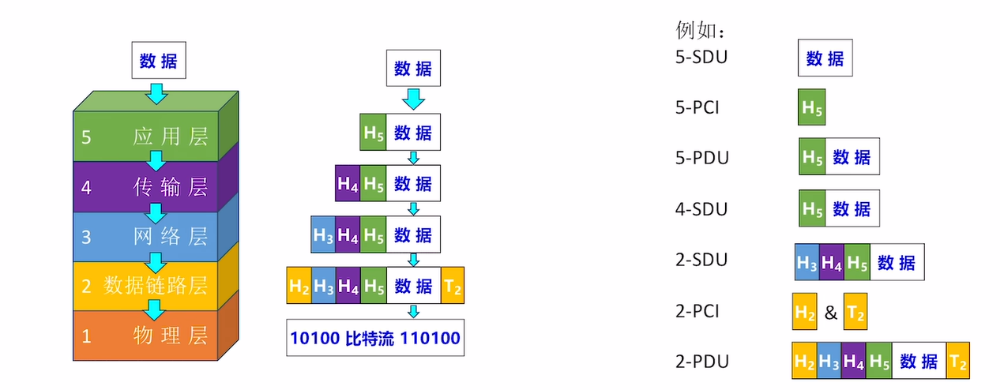

# 计算机网络

## 第一章 计算机网络体系结构

### 1、计算机网络的概念

#### 1）什么是计算机网络

> **计算机网络（Computer networking）**是一个将众多==分散的、自治==的计算机系统，通过==通信设备==与==线路==连接起来，由功能完善的软件实现==资源共享==和==信息传递==的系统。

#### 2）计算机网络、互连网、互连网的区别

> **计算机网络（简称网络）**：由若干结点（node）和连接这些结点的链路（link）组成。
>
> **结点**可以是计算机、集线器、交换机、路由器等
>
> **链路**可以是有线链路、无线链路。
>
> **集线器（Hub）**
>
> + 可以把多个结点连接起来，组成一个计算机网络
> + 普通民用领域已很少用集线器
> + “集线器”工作在物理层，将在第二章学习
>
> **交换机（Switch）**
>
> + 可以把多个结点连接起来，组成一个计算机网络
> + 家庭、公司、学校通常用交换机组成内部网络
> + “交换机”工作在数据链路层，将在第三章学习
>
> **路由器（router）：**
>
> + 可以把两个或多个计算机网络互相连接起来，形成规模更大的计算机网络，也可称作互连网
> + 路由器工作在网络层，将在第四章学习
>
> Tips：计算机网络课程中的“路由器”和家用路由器“有一些区别。==家用路由器=路由器+交换机+其他功能==
>
> **互连网（internet）：**可以把两个或多个计算机网络互相连接起来，形成规模更大的计算机网络，也可称作互连网
>
> 
>
> **互联网（Internet）：**由各大ISP和国际机构组建的，覆盖全球范围的互连网（internet ）
>
> **ISP:**internet Service Provider,即互联网服务提供者，如中国电信/移动/联通
>
> **互联网**必须使用==TCP/IP==协议通信，互连网可使用任意协议通信。
>
> 

### 2、计算机网络的组成、功能

#### 1）组成

> ## 从组成部分看
>
> > ### 硬件
> >
> > > ##### 主机，即端系统
> > >
> > > 如：电脑、手机、物联网设备（内部安装网络适配器（网卡））
> > >
> > > ##### 通信设备
> > >
> > > 如：集线器、交换机、路由器
> > >
> > > ##### 通信链路
> > >
> > > 如：网线、光纤、同轴电缆
> >
> > ### 软件
> >
> > > 方便用户使用，实现资源共享。如：Email客户端、聊天软件、网盘软件
> >
> > ### 协议
> >
> > > 规定计算机网络中的通行规则
> > >
> > > 由硬件、软件共同实现，如：网络适配器+软件 实现网络通信协议
>
> 
>
> ## 从工作方式看
>
> > ### 边缘部分
> >
> > > 工作方式：直接为用户服务（通信、资源共享）
> > > 主要由连接到互联网上的主机及软件组成
> >
> > ### 核心部分
> >
> > > 工作方式：为边缘部分提供服务（连通性、交换服务）
> > > 由大量网络和连接这些网络的路由器组成
>
> 
>
> ### 从逻辑功能看
>
> > #### 资源子网
> >
> > > 计算机网络中运行应用程序，向用户提供可共享的硬件、软件和信息资源的部分。
> > > 主要由连接到互联网上的主机组成
> >
> > #### 通信子网
> >
> > > 计算机网络中负责计算机信息传输的部分。即把计算机和其他用户装置互连在一起的所有通信设备和介质的总称
> > > 主要由 通信链路+通信设备+协议 构成
> > > 注：主机内部实现信息传输的网络适配器、底层协议 属于通信子网的范畴
>
> 

#### 2）功能

> ### 数据通信
>
> > **实现计算机之间的数据传输。是最基本、最重要的功能**
>
> ### 资源共享
>
> > **硬件、软件、数据资源**
> > 如：智能音箱 请求服务器处理
> > 如：应用商店
> > 如：分享视频
> >
> > 
>
> ### 分布式处理
>
> > **将某个复杂任务分配给网络中多台计算机处理**
> > 如：大矩阵运算、MapReduce
> >
> > 
>
> ### 提高可靠性
>
> > **网络中各台计算机互为替代机**
> > 如：某网盘服务器集群网络，数据冗余备份
> >
> > 
>
> ### 负载均衡
>
> > **网络中各台计算机共同分担繁重工作**
> > 如：某游戏用多台服务器均衡处理玩家请求
> >
> > 
>
> ### 其他
>
> > **满足社会需求、生活需求**
> > 如：远程办公、远程教育、娱乐等

### 3、电路交换、报文交换、分组交换

#### 1）电路交换（Circuit Switching）：通过物理线路的连接，动态地分配传输线路资源

> ### 电路交换的过程
>
> > 1. 建立连接（尝试占用通信资源）
> > 2. 通信（一直占用通信资源）
> > 3. 释放连接（尝试归还通信资源）
>
> ### 优点
>
> > 通信前从主叫端到被叫端建立一条==专用的物理通路==，在通信的全部时间内，两个用户==始终占用==端到端的==线路资源==。数据直送，**传输效率高**。
>
> ### 缺点
>
> > **建立/释放连接**，需要**额外的时间开销**
> > **线路**被通信双方**独占**，**利用率低**
> > **线路**分配的**灵活性差。**
> > 交换节点**不支持“差错控制”**（无法发现传输过程中的发生的数据错误）
>
> 电路交换更适用于：低频次、大量地传输数据，计算机之间数据往往是“突发式”传输，即往往会高频词、少量地传输数据。
>
> 

#### 2）报文交换：

> ### 存储转发的思想：
>
> > 把传送的数据单元先存储进中间节点，再根据目的地址转发至下一节点。
>
> 
>
> ### 优点
>
> > 通信前无需建立连接
> > 数据以“报文”为单位被交换节点间“存储转发”，通信线路可以灵活分配
> > 在通信时间内，两个用户无需独占一整条物理线路。相比于电路交换，线路利用率高
> > 交换节点支持“差错控制”（通过校验技术）
>
> ### 缺点
>
> > 报文不定长
> > 长报文的存储转发时间开销大、缓存开销大
> > 长报文容易出错，重传代价高

#### 3）分组交换

> 
>
> ### 优点
>
> > 通信前**无需建立连接**
> > 数据以“**分组**”为单位被交换节点间“**存储转发**”，通信**线路可以灵活分配**
> > 在通信时间内，两个用户**无需独占**一条物理线路。相比于电路交换，**线路利用率高**
> > 交换节点**支持“差错控制“**（通过校验技术）
>
> ### 相比于报文交换，分组交换改进了如下问题：
>
> > 分组定长，方便存储转发管理
> > 分组的存储转发时间开销小、缓存开销小
> > 分组不易出错，重传代价低
>
> ### 缺点
>
> > 相比于报文交换，控制信息占比增加
> > 相比于电路交换，依然存在存储转发时延
> > 报文被拆分为多个分组，传输过程中可能出现失序、丢失等问题，增加处理的复杂度。

#### ”虚电路交换“技术

> ### 虚电路交换的过程（将在第四章学习）
>
> 1. 建立连接（虚拟电路）
> 2. 通信（分组按序、按已建立好的既定线路发送，通信双方不独占线路）
> 3. 释放连接

### 4、电路交换、报文交换、分组交换（性能分析）

|                          | 电路交换                      | 报文交换 | 分组交换               |
| ------------------------ | ----------------------------- | -------- | ---------------------- |
| 完成传输所需时间         | 最少（排除建立/释放连接耗时） | 最多     | 较少                   |
| 存储转发时延             | 无                            | 较高     | 较低                   |
| 通信前是否需要建立连接？ | 是                            | 否       | 否                     |
| 缓存开销                 | 无                            | 高       | 低                     |
| 是否支持差错控制         | 不支持                        | 支持     | 支持                   |
| 保温数据有序到达？       | 是                            | 是       | 否                     |
| 是否需要额外的控制信息   | 否                            | 是       | 是（控制信息占比最大） |
| 线路分配灵活性           | 不灵活                        | 灵活     | 非常灵活               |
| 线路利用率               | 低                            | 高       | 非常高                 |

#### 1）电路交换

> 

#### 2）报文交换

> 

#### 3）分组交换

> 

### 5、计算机网络的分类

#### 1）按分布范围分类

> ### 广域网（WAN）Wide Area Network
>
> > 范围：几十~几千公里
> > 跨省/跨国/跨洲
>
> ### 城域网（MAN）Metropolitan Area Network
>
> > 范围：几千米~几十千米
> > 一个或几个相邻城市
> > 通信技术：常采用“以太网技术”，因此常并入局域网范畴探讨
>
> ### 局域网（LAN）Local Area Network
>
> > 范围：几十米~几千米
> > 学校/企业/工作单位/家庭
> > 通信技术：以太网技术
>
> ### 个域网（PAN）Personal Area Network
>
> > 范围：几十米以内
> > 家庭/个人
> > 通常是通过无线技术将个人设备因此连接起来的网络，因此也常称为无线个域网（WPAN）
>
> ### 注
>
> > 如今的局域网几乎都是采用“以太网技术”实现，因此“以太网"几乎成了”局域网“的代名词。
>
> ### 举例：
>
> > 
> >
> > 

#### 2）按传输技术分类

> ### 广播式网络
>
> > 当一台计算机发送数据分组时，广播范围内所有计算机都会收到该分组，并通过检查分组的目的地址决定是否接收该分组
> >
> > #### Eg：所有无线网络都是“广播式”
>
> ### 点对点网络
>
> > 数据只会从发出方”点对点”发到接收方，精准送达
> >
> > #### Eg：路由器转发的数据分组

#### 3）按拓扑结构分类

> ### 总线型结构
>
> > 数据“广播式”传输；存在“总线争用”问题
> >
> > 
>
> ### 环型结构
>
> > 数据“广播式”传输；通过“令牌”解决总线争用问题，令牌顺环形依次传递，拿到令牌者可使用总线
> >
> > 
>
> ### 星形结构
>
> > 由中央设备实现数据的“点对点”传输；不存在“总线争用”问题
> >
> > 
>
> ### 网状结构
>
> > 数据通过各中间节点逐一存储转发；属于“点到点”传输
> >
> > 

#### 4）按使用者分类

> ### 公用网
>
> > 向公众开放的网络。如：办宽带、交手机话费即可使用的互联网
>
> ### 专用网
>
> > 仅供某个组织内部使用的网络。如：政府、军队、电力、银行的内部网络 

#### 5）按传输介质分类

> ### 有线网络
>
> > 如：网线、光纤
>
> ### 无线网络
>
> > 如：5G、WiFi、卫星

### 6、计算机网络的性能指标

#### 1）性能指标1：速率

> 信道（Channel）：表示向某一方向传送信息的通道（信道不等于通信线路）一条通信线路在逻辑上往往对应一条发送信道和一条接受信道
>
> 
>
> ### 速率（Speed）：
>
> > 指连接到网络上的节点在信道上传输数据的速率。也称**数据率**或**比特率**、**数据传输速率**
>
> ### 速率单位：
>
> > bit/s，或b/s，或bps（bit per second）
>
> ### 注意
>
> > 有时候也会用B/S（1B=8吧，B=Byte字节，b=bit比特）
>
> 

#### 4）性能指标2：带宽

> ### 带宽（bandwidth）
>
> > 某信道所能传送的**最高速率**
> >
> > #### 单位
> >
> > > bps（或记为b/s、bit/s；可加上数量前缀k、M、G、T）
>
> ### 通信原理中的带宽
>
> > 表示某信道允许通过的信号频带范围。
> >
> > #### 单位
> >
> > > Hz（可加上数量前缀k、M、G、T）
>
> ### 例题
>
> > 节点间通信实际能达到的最高速率，由带宽、节点性能共同限制。
> >
> > 

#### 3）新能指标3：吞吐量

> ### 吞吐量
>
> > 指单位时间内通过某个网络（或信道、接口）的实际数据量
> > 吞吐量手带宽限制、受复杂的网络负载情况影响
>
> ### 例题
>
> > 

#### 4）性能指标4：时延

> ### 时延（Delay）
>
> > 指数据（一个报文或分组、甚至比特）从网络（或链路）的一端传送到另一端所需的时间。有时也称为延迟或迟延。
>
> ### 总时延=发送时延+传播时延+处理时延+排队时延
>
> > 
> >
> > 
> >
> > 
>
> ### 例题
>
> > 

#### 5）性能指标5：时延带宽积

> ### 时延带宽积（bit）=传播时延 x 带宽
>
> ### 时延带宽积的含义
>
> > 一条链路中，**已**从**发送端发出但尚未到达接**收端的**最大比特数**
>
> ### 例题
>
> > 
> >
> > 

#### 6）性能指标6：往返时延

> ### 往返时延RTT（Round-Trip Time）
>
> > 表示从发送方发送完数据，到发送方收到来自接收方的确认总共经历的时间
> >
> > 
> >
> > #### 往返时延RTT=t~2~+t~3~+t~4~+t~5~
> >
> > + t~2~：“数据”的单向传播时延
> > + t~3~：接收方收到数据后的处理时延
> > + t~4~：”确认“的发送时延
> > + t~5~：”确认“的传播时延（通常t~5~与t~2~相等）
> > + **t~1~：发送方发送数据的发送时延（不计入RTT）**
>
> ### 例题
>
> > 

#### 7）性能指标7：信道利用率

> ### 信道利用率
>
> > 某个信道有百分之多少的时间是有数据通过的
>
> ### 信道利用率=有数据通过的时间/有数据通过的时间+没有数据通过的时间
>
> > 信道利用率不能太低，浪费资源
> > 信道利用率也不能太高，容易导致网路拥堵
>
> ### 例题
>
> > 
>
> ### 网络利用率
>
> > 网络利用率是全网络的信道利用率的加权平均值
> >
> > 信道利用率并非越高越好。当某信道的利用率增大时，该信道引起的实验顺序增加

### 7、计算机网络的分层结构

#### 1）“分层”的设计思想

> 分层的设计思想：将庞大而复杂的问题，转化为若干较小的局部问题
>
> ### 计算机网络是一个非常复杂的系统，要完成诸多功能，如：
>
> + **差错控制**：确保数据再传输过程中不出错。
> + **流量控制**：发送端的发送速率必须使接收端来得及接受，不要太快
> + **分段和重装**：发送端将要发送的数据块划分为更小的单位，并在接收端将其还原
> + **复用和分用**：发送端几个高层会话复用一条低层的连接，在接收端再进行分用
> + **连接建立和释放**：交换数据前先建立一条逻辑连接，数据传送结束后释放连接
>
> ### 计算机网络的分层结构
>
> > 

#### 2）三种常见的计算机网络体系结构

> 
>
> ### 网络体系结构的概念
>
> > **网络的体系结构（Network Architecture）**是计算机网络的各层及其协议的**集合**，就是这个计算机网络及其构件所应完成的**功能的精确定义（不涉及实现）。**
> >
> > **实现（implementation）**是遵循这种体系结构的前提下，用何种硬件或软件完成这些功能问题
> >
> > 体系结构是抽象的，而实现是具体的。

#### 3）各层之间的关系

> ### 水平视角来看
>
> > 
> >
> > #### 实体
> >
> > > 实体：再计算机网络的分层结构中，第n层的活动元素（软件+硬件）通常称为第n层实体
> >
> > #### 协议
> >
> > > 协议：即网络协议（Network Protocol），是控制对等实体之间进行通信的规则的集合，是水平的。
>
> ### 垂直视角来看
>
> > 
> >
> > #### 接口
> >
> > > 接口：即同一节点内相邻两层的实体交换信息的逻辑接口，又称为服务访问点（Service Access Point，SAP）
> >
> > #### 服务
> >
> > > 服务：服务是指下层为紧邻的上层提供的功能调用，它是垂直的。

#### 4）数据传输过程（水平视角）

> ### YSCS协议：
>
> + 发送方将数据压缩后，需要增加“首部”，说明采用了哪种压缩算法
> + 接收方根据“首部”信息选择解压缩算法将数据解压
> + ……其他规定……
>
> 

#### 5）数据的传输过程（垂直视角）

> 
>
> ### 协议数据单元（PDU）
>
> > 对等层次之间传送的数据单位。第n层的PDU记为n-PDU
>
> ### 服务数据单元（SDU）
>
> > 为完成上一层实体所要求的功能而传送的数据。第n层的SDU记为n-SDU
>
> ### 协议控制信息（PCI）
>
> > 控制协议操作的信息。第n层的PCI记为n-PCI
>
> 
>
> ### 三者的关系为：n-SDU+n-PCI=n-PDU=(n-1)-SDU

#### 6)协议的三要素

> ### 协议
>
> > 即网络协议（Network Protocol），是控制对等实体之间进行通信的规则的集合，是水平的。
>
> 协议由**语法**、**语义**、和**同步**三个部分组成（协议的三要素）
>
> ### 语法
>
> > **语法**，数据与控制信息的格式。例如，协议控制信息（首部）部分占几个字节、每个字节是什么含义；协议的数据部分最多有多少字节。
>
> ### 语义
>
> > **语义**，即需要发出何种控制信息、完成何种动作及做出何种应答。例如，协议中需要明确规定：发送方发送完数据后，接收方是否需要“应答”，以及应答的种类有哪些（如：传输成功、传输失败）
>
> ### 同步
>
> > **同步（或时序）**，执行各种操作的条件、时序关系等，即事件实现顺序的详细说明。例如，发送方发完数据后，接收方需要立即应答。如果发送方在10秒内未收到”传输成功“应答，则发送方会再次发送数据

### 8、OSI参考模型&TCP/IP模型

#### OSI参考模型

> 
>
> ### 常见网络设备的功能层次
>
> > 
>
> ### 1）物理层
>
> > **物理层任务：**实现相邻节点之间比特（0或1）的传输
> >
> > 1. 需定义电路接口参数（如：形状、尺寸、引脚数等）
> > 2. 需定义传输信号的含义、电气特征（如：5V表示1，1V表示0；每比特电信号持续事件0.1ms）
> >
> > 
>
> ### 2）链路层
>
> > **链路层任务：**确保相邻节点之间的链路逻辑上无差错。包含以下功能
> >
> > 1. 差错控制：检错+纠错，或检错+丢弃+重传
> > 2. 流量控制：协调两个结点的速率
> >
> > 
>
> ### 3）网络层
>
> > **网络层任务：**把”分组“从源结点转发到目的结点。包含以下功能
> >
> > 1. 路由选择：构造并维护路由表，决定分组到达目的节点的最佳路径
> > 2. 分组转发：将”分组“从适合的端口转发出去
> > 3. 拥塞控制：发现网络拥塞，并采取措施缓解拥塞
> > 4. 网际互联：实现异构网络互联
> > 5. 其他功能：差错控制、流量控制、连接建立与释放、可靠传输管理
> >
> > 
>
> ### 4）传输层
>
> > **传输层任务：**实现端到端通信（即实现进程到进程的通信，”端“指”端口“）。包含以下功能
> >
> > 1. 复用和分用：发送端几个高层实体复用一条低层的连接，在接收端再进行分用
> > 2. 其他功能：差错控制、流量控制、连接建立与释放、可靠传输管理
> >
> > 
>
> ### 5)会话层
>
> > 会话层任务：管理进程间会话
> >
> > 主要功能：会话管理（采用检查点机制，当通信失效时从检查点继续恢复通信）
>
> ### 6）表示层
>
> > 表示层任务：解决不同主机上信息表示不一致的问题
> >
> > 主要功能：数据格式转换（如编码转换、压缩/解压、加密/解密）
>
> ### 7）应用层
>
> > 应用层任务：实现特定的网络应用
> >
> > 功能繁多，根据应用需求设计
>
> ### 总结：各层数据传输单位
>
> > 
> >
> > 

#### TCP/IP模型

> 
>
> ### 应用层
>
> > 应用层任务：实现特定的网络应用（功能复杂且的多样）
> >
> > TCP/IP的理念：如果某些应用需要数据格式转换、会话管理功能，就交给应用层的特定协议去实现 
>
> ### 网络接口层
>
> > 网络接口层任务：实现相邻节点间的数据传输（为网络层传输”分组“）。但具体怎么传不作规定（这使得TCP/IP网络体系结构具有更强的灵活性、适应性。）
> >
> > TCP/IP理念：网络硬件种类繁多，不应该有过多限制
>
> ### OSI参考模型vsTCP/IP模型
>
> > 
>
> ### 传输层
>
> > 传输层功能：复用和分用、差错控制、流量控制、连接建立与释放、可靠传输管理
> >
> > 在TCP/IP模型中，由传输层负责保证数据传输的正确性、可靠性
>
> ### 网络层
>
> > 网络层功能：路由选择、分组转发、拥塞控制、网际互连
>
> > 
>
> ### 总结：TCP/IP各层功能
>
> > 

## 第二章 物理层

> ### 三种常见的计算机网络体系结构
>
> > 
> >
> > 物理层任务：实现相邻节点之间比特（0或1）的传输
>
> ### 数据的传输过程（垂直视角）
>
> > 

### 1、《通信基础》基本概念

#### 1）信源、信宿、信号、信道

> ### 信源
>
> > 信源：信号的来源（即数据的发送方）
>
> ### 信宿
>
> > 信宿：信号的”归宿“（即数据接收方）
>
> ### 信号
>
> > 数据的载体分为：
> >
> > + 数字信号：信号值是离散的
> > + 模拟信号：信号值是连续的
> >
> > 
> >
> > #### 从数学函数角度理解信号值
> >
> > > 
>
> ### 信道
>
> > 信道：信号的通道
> > 注：一条物理线路通常包含两条信道，即发送信道、接受信道

#### 2）码元的概念

> ### 码元
>
> 每一个信号就是一个码元
>
> ### 码元宽度
>
> 可以把”信号周期“称为”码元宽度“。
>
> ### 例题
>
> > 
> >
> > 
> >
> > #### 优点（4进制/8进制码元）
> >
> > 每个”信号周期“可以传输更多信息。换句话说，每个码元可以携带更多信息。
> >
> > #### 代价
> >
> > 需要加强信号功率，并且对信道要求更高
>
> ### 4进制/8进制码元
>
> + 如果一个码元（即一个信号）可能有4种状态，那么可以称其为4进制码元（一个码元携带2bit数据）
> + 类似的，如果一个码元（即一个信号）可能有8种状态，那么可以称其为8进制码元（一个码元携带3bit数据）
>
> ### 用模拟信号设计4进制码元
>
> > 
>
> ### 重要：码元和比特的关系
>
> > 一个码元可以携带多少比特数据？
> >
> > 如果一个“周期”内可能出现K种信号，则：
> >
> > 1码元=log~2~bit

#### 3）速率

> ### 波特率
>
> > 每秒传输几个码元
> > 单位：码元/秒，或波特（Baud）
>
> ### 比特率
>
> > 每秒传输几个比特
> > 单位：bit/s，或b/s，bps
>
> ### 注
>
> > 若一个码元携带n比特的信息量，则波特率M Baud对应的比特率为Mn b/s

### 2、信道的极限容量

#### 1）回顾：带宽

> ### 在《计算机网络》中
>
> **带宽（bandwidth）**：表示某信道所能通过的“最高数据率”。
> 单位：bps（或记为b/s，bit/s；可加上数量前缀K、M、G、T）
>
> ### 在《通信原理》（通信领域的一门基础学科）中
>
> **带宽（bandwidth）**：表示某信道允许通过的信号频带范围。
> 单位：HZ（读作”赫/赫兹“；可加上数量前缀K、M、G、T）。

#### 2）噪声

> **信号：**是数据的载体，在信道上传输
>
> **噪声：**对信道产生干扰，影响数据传输效率（环境中的电场、电磁波）

#### 3）奈奎斯特定理（奈氏准则）

> 对于一个理想低通信道（没有噪声、带宽有限的信道）
>
> 极限波特率=2W（单位：波特，即码元/秒）
>
> W是信道的频率带宽（单位：Hz）
>
> ### 例题
>
> > 

#### 4）香农定理

> 对于一个有噪声、带宽有限的通道。
>
> 极限比特率=Wlog~2~（1+S/N）（单位：b/s）
>
> ### S/N信噪比
>
> 信噪比=S/N=信号的功率/噪声的功率
> 信噪比越高，噪声对数据传输的影响越小
>
> ### 信噪比的另一种记法
>
> 
>
> ### 注意
>
> 使用香农定理时，我们用比值不用分贝。
>
> ### 例题
>
> > 

#### 5）奈奎斯特定理&香农定理

> 

### 3、编码与调制

#### 1)编码&解码、调制&解调

> ### 数字信号（编码&解码）/网卡
>
> > 
>
> ### 模拟信号（调制&解调）/光猫
>
> > 

#### 2）常用的编码方法

> ### 各种编码方式规则
>
> > 
>
> ### 各种编码的特点
>
> > 
>
> ### 例题
>
> > 
> >
> > 

#### 3）常用的调制方法

> ### 一个码元携带多个比特
>
> > #### 调幅AM 增加幅度的种类
> >
> > #### 调频FM 增加频率的种类
> >
> > #### 调相PM 增加相位的种类
> >
> > 
>
> ### 正交幅度调制（QAM）
>
> > 将AM、PM结合起来，形成叠加信号
> >
> > 若设计m种幅值、n种相位，则将AM、PM信号两两“复合”。可调制出mn种信号，则QAM
> >
> > 1码元=log~2~mn bit
> >
> > 
>
> ### 例题
>
> > 
>
> > 
>
> > 

#### 知识回顾与重要考点

> 

#### 总结：各种编码的特点

> 

### 4、传输介质

#### 1）常用的传输介质

> ## 导向型
>
> ### 双绞线
>
> > #### 主要构成
> >
> > 两根导线相互绞合而成 

#### 2）物理层接口的特性