# 计算机网络

## 第一章 计算机网络体系结构

### 1、计算机网络的概念

#### 1）什么是计算机网络

> **计算机网络（Computer networking）**是一个将众多==分散的、自治==的计算机系统，通过==通信设备==与==线路==连接起来，由功能完善的软件实现==资源共享==和==信息传递==的系统。

#### 2）计算机网络、互连网、互连网的区别

> **计算机网络（简称网络）**：由若干结点（node）和连接这些结点的链路（link）组成。
>
> **结点**可以是计算机、集线器、交换机、路由器等
>
> **链路**可以是有线链路、无线链路。
>
> **集线器（Hub）**
>
> + 可以把多个结点连接起来，组成一个计算机网络
> + 普通民用领域已很少用集线器
> + “集线器”工作在物理层，将在第二章学习
>
> **交换机（Switch）**
>
> + 可以把多个结点连接起来，组成一个计算机网络
> + 家庭、公司、学校通常用交换机组成内部网络
> + “交换机”工作在数据链路层，将在第三章学习
>
> **路由器（router）：**
>
> + 可以把两个或多个计算机网络互相连接起来，形成规模更大的计算机网络，也可称作互连网
> + 路由器工作在网络层，将在第四章学习
>
> Tips：计算机网络课程中的“路由器”和家用路由器“有一些区别。==家用路由器=路由器+交换机+其他功能==
>
> **互连网（internet）：**可以把两个或多个计算机网络互相连接起来，形成规模更大的计算机网络，也可称作互连网
>
> 
>
> **互联网（Internet）：**由各大ISP和国际机构组建的，覆盖全球范围的互连网（internet ）
>
> **ISP:**internet Service Provider,即互联网服务提供者，如中国电信/移动/联通
>
> **互联网**必须使用==TCP/IP==协议通信，互连网可使用任意协议通信。
>
> 

### 2、计算机网络的组成、功能

#### 1）组成

> ## 从组成部分看
>
> > ### 硬件
> >
> > > ##### 主机，即端系统
> > >
> > > 如：电脑、手机、物联网设备（内部安装网络适配器（网卡））
> > >
> > > ##### 通信设备
> > >
> > > 如：集线器、交换机、路由器
> > >
> > > ##### 通信链路
> > >
> > > 如：网线、光纤、同轴电缆
> >
> > ### 软件
> >
> > > 方便用户使用，实现资源共享。如：Email客户端、聊天软件、网盘软件
> >
> > ### 协议
> >
> > > 规定计算机网络中的通行规则
> > >
> > > 由硬件、软件共同实现，如：网络适配器+软件 实现网络通信协议
>
> 
>
> ## 从工作方式看
>
> > ### 边缘部分
> >
> > > 工作方式：直接为用户服务（通信、资源共享）
> > > 主要由连接到互联网上的主机及软件组成
> >
> > ### 核心部分
> >
> > > 工作方式：为边缘部分提供服务（连通性、交换服务）
> > > 由大量网络和连接这些网络的路由器组成
>
> 
>
> ### 从逻辑功能看
>
> > #### 资源子网
> >
> > > 计算机网络中运行应用程序，向用户提供可共享的硬件、软件和信息资源的部分。
> > > 主要由连接到互联网上的主机组成
> >
> > #### 通信子网
> >
> > > 计算机网络中负责计算机信息传输的部分。即把计算机和其他用户装置互连在一起的所有通信设备和介质的总称
> > > 主要由 通信链路+通信设备+协议 构成
> > > 注：主机内部实现信息传输的网络适配器、底层协议 属于通信子网的范畴
>
> 

#### 2）功能

> ### 数据通信
>
> > **实现计算机之间的数据传输。是最基本、最重要的功能**
>
> ### 资源共享
>
> > **硬件、软件、数据资源**
> > 如：智能音箱 请求服务器处理
> > 如：应用商店
> > 如：分享视频
> >
> > 
>
> ### 分布式处理
>
> > **将某个复杂任务分配给网络中多台计算机处理**
> > 如：大矩阵运算、MapReduce
> >
> > 
>
> ### 提高可靠性
>
> > **网络中各台计算机互为替代机**
> > 如：某网盘服务器集群网络，数据冗余备份
> >
> > 
>
> ### 负载均衡
>
> > **网络中各台计算机共同分担繁重工作**
> > 如：某游戏用多台服务器均衡处理玩家请求
> >
> > 
>
> ### 其他
>
> > **满足社会需求、生活需求**
> > 如：远程办公、远程教育、娱乐等

### 3、电路交换、报文交换、分组交换

#### 1）电路交换（Circuit Switching）：通过物理线路的连接，动态地分配传输线路资源

> ### 电路交换的过程
>
> > 1. 建立连接（尝试占用通信资源）
> > 2. 通信（一直占用通信资源）
> > 3. 释放连接（尝试归还通信资源）
>
> ### 优点
>
> > 通信前从主叫端到被叫端建立一条==专用的物理通路==，在通信的全部时间内，两个用户==始终占用==端到端的==线路资源==。数据直送，**传输效率高**。
>
> ### 缺点
>
> > **建立/释放连接**，需要**额外的时间开销**
> > **线路**被通信双方**独占**，**利用率低**
> > **线路**分配的**灵活性差。**
> > 交换节点**不支持“差错控制”**（无法发现传输过程中的发生的数据错误）
>
> 电路交换更适用于：低频次、大量地传输数据，计算机之间数据往往是“突发式”传输，即往往会高频词、少量地传输数据。
>
> 

#### 2）报文交换：

> ### 存储转发的思想：
>
> > 把传送的数据单元先存储进中间节点，再根据目的地址转发至下一节点。
>
> 
>
> ### 优点
>
> > 通信前无需建立连接
> > 数据以“报文”为单位被交换节点间“存储转发”，通信线路可以灵活分配
> > 在通信时间内，两个用户无需独占一整条物理线路。相比于电路交换，线路利用率高
> > 交换节点支持“差错控制”（通过校验技术）
>
> ### 缺点
>
> > 报文不定长
> > 长报文的存储转发时间开销大、缓存开销大
> > 长报文容易出错，重传代价高

#### 3）分组交换

> 
>
> ### 优点
>
> > 通信前**无需建立连接**
> > 数据以“**分组**”为单位被交换节点间“**存储转发**”，通信**线路可以灵活分配**
> > 在通信时间内，两个用户**无需独占**一条物理线路。相比于电路交换，**线路利用率高**
> > 交换节点**支持“差错控制“**（通过校验技术）
>
> ### 相比于报文交换，分组交换改进了如下问题：
>
> > 分组定长，方便存储转发管理
> > 分组的存储转发时间开销小、缓存开销小
> > 分组不易出错，重传代价低
>
> ### 缺点
>
> > 相比于报文交换，控制信息占比增加
> > 相比于电路交换，依然存在存储转发时延
> > 报文被拆分为多个分组，传输过程中可能出现失序、丢失等问题，增加处理的复杂度。

#### ”虚电路交换“技术

> ### 虚电路交换的过程（将在第四章学习）
>
> 1. 建立连接（虚拟电路）
> 2. 通信（分组按序、按已建立好的既定线路发送，通信双方不独占线路）
> 3. 释放连接

### 4、电路交换、报文交换、分组交换（性能分析）

|                          | 电路交换                      | 报文交换 | 分组交换               |
| ------------------------ | ----------------------------- | -------- | ---------------------- |
| 完成传输所需时间         | 最少（排除建立/释放连接耗时） | 最多     | 较少                   |
| 存储转发时延             | 无                            | 较高     | 较低                   |
| 通信前是否需要建立连接？ | 是                            | 否       | 否                     |
| 缓存开销                 | 无                            | 高       | 低                     |
| 是否支持差错控制         | 不支持                        | 支持     | 支持                   |
| 保温数据有序到达？       | 是                            | 是       | 否                     |
| 是否需要额外的控制信息   | 否                            | 是       | 是（控制信息占比最大） |
| 线路分配灵活性           | 不灵活                        | 灵活     | 非常灵活               |
| 线路利用率               | 低                            | 高       | 非常高                 |

#### 1）电路交换

> 

#### 2）报文交换

> 

#### 3）分组交换

> 

### 5、计算机网络的分类

#### 1）按分布范围分类

> ### 广域网（WAN）Wide Area Network
>
> > 范围：几十~几千公里
> > 跨省/跨国/跨洲
>
> ### 城域网（MAN）Metropolitan Area Network
>
> > 范围：几千米~几十千米
> > 一个或几个相邻城市
> > 通信技术：常采用“以太网技术”，因此常并入局域网范畴探讨
>
> ### 局域网（LAN）Local Area Network
>
> > 范围：几十米~几千米
> > 学校/企业/工作单位/家庭
> > 通信技术：以太网技术
>
> ### 个域网（PAN）Personal Area Network
>
> > 范围：几十米以内
> > 家庭/个人
> > 通常是通过无线技术将个人设备因此连接起来的网络，因此也常称为无线个域网（WPAN）
>
> ### 注
>
> > 如今的局域网几乎都是采用“以太网技术”实现，因此“以太网"几乎成了”局域网“的代名词。
>
> ### 举例：
>
> > 
> >
> > 

#### 2）按传输技术分类

> ### 广播式网络
>
> > 当一台计算机发送数据分组时，广播范围内所有计算机都会收到该分组，并通过检查分组的目的地址决定是否接收该分组
> >
> > #### Eg：所有无线网络都是“广播式”
>
> ### 点对点网络
>
> > 数据只会从发出方”点对点”发到接收方，精准送达
> >
> > #### Eg：路由器转发的数据分组

#### 3）按拓扑结构分类

> ### 总线型结构
>
> > 数据“广播式”传输；存在“总线争用”问题
> >
> > 
>
> ### 环型结构
>
> > 数据“广播式”传输；通过“令牌”解决总线争用问题，令牌顺环形依次传递，拿到令牌者可使用总线
> >
> > 
>
> ### 星形结构
>
> > 由中央设备实现数据的“点对点”传输；不存在“总线争用”问题
> >
> > 
>
> ### 网状结构
>
> > 数据通过各中间节点逐一存储转发；属于“点到点”传输
> >
> > 

#### 4）按使用者分类

> ### 公用网
>
> > 向公众开放的网络。如：办宽带、交手机话费即可使用的互联网
>
> ### 专用网
>
> > 仅供某个组织内部使用的网络。如：政府、军队、电力、银行的内部网络 

#### 5）按传输介质分类

> ### 有线网络
>
> > 如：网线、光纤
>
> ### 无线网络
>
> > 如：5G、WiFi、卫星

### 6、计算机网络的性能指标

#### 1）性能指标1：速率

> 信道（Channel）：表示向某一方向传送信息的通道（信道不等于通信线路）一条通信线路在逻辑上往往对应一条发送信道和一条接受信道
>
> 
>
> ### 速率（Speed）：
>
> > 指连接到网络上的节点在信道上传输数据的速率。也称**数据率**或**比特率**、**数据传输速率**
>
> ### 速率单位：
>
> > bit/s，或b/s，或bps（bit per second）
>
> ### 注意
>
> > 有时候也会用B/S（1B=8吧，B=Byte字节，b=bit比特）
>
> 

#### 4）性能指标2：带宽

> ### 带宽（bandwidth）
>
> > 某信道所能传送的**最高速率**
> >
> > #### 单位
> >
> > > bps（或记为b/s、bit/s；可加上数量前缀k、M、G、T）
>
> ### 通信原理中的带宽
>
> > 表示某信道允许通过的信号频带范围。
> >
> > #### 单位
> >
> > > Hz（可加上数量前缀k、M、G、T）
>
> ### 例题
>
> > 节点间通信实际能达到的最高速率，由带宽、节点性能共同限制。
> >
> > 

#### 3）新能指标3：吞吐量

> ### 吞吐量
>
> > 指单位时间内通过某个网络（或信道、接口）的实际数据量
> > 吞吐量手带宽限制、受复杂的网络负载情况影响
>
> ### 例题
>
> > 

#### 4）性能指标4：时延

> ### 时延（Delay）
>
> > 指数据（一个报文或分组、甚至比特）从网络（或链路）的一端传送到另一端所需的时间。有时也称为延迟或迟延。
>
> ### 总时延=发送时延+传播时延+处理时延+排队时延
>
> > 
> >
> > 
> >
> > 
>
> ### 例题
>
> > 

#### 5）性能指标5：时延带宽积

> ### 时延带宽积（bit）=传播时延 x 带宽
>
> ### 时延带宽积的含义
>
> > 一条链路中，**已**从**发送端发出但尚未到达接**收端的**最大比特数**
>
> ### 例题
>
> > 
> >
> > 

#### 6）性能指标6：往返时延

> ### 往返时延RTT（Round-Trip Time）
>
> > 表示从发送方发送完数据，到发送方收到来自接收方的确认总共经历的时间
> >
> > 
> >
> > #### 往返时延RTT=t~2~+t~3~+t~4~+t~5~
> >
> > + t~2~：“数据”的单向传播时延
> > + t~3~：接收方收到数据后的处理时延
> > + t~4~：”确认“的发送时延
> > + t~5~：”确认“的传播时延（通常t~5~与t~2~相等）
> > + **t~1~：发送方发送数据的发送时延（不计入RTT）**
>
> ### 例题
>
> > 

#### 7）性能指标7：信道利用率

> ### 信道利用率
>
> > 某个信道有百分之多少的时间是有数据通过的
>
> ### 信道利用率=有数据通过的时间/有数据通过的时间+没有数据通过的时间
>
> > 信道利用率不能太低，浪费资源
> > 信道利用率也不能太高，容易导致网路拥堵
>
> ### 例题
>
> > 
>
> ### 网络利用率
>
> > 网络利用率是全网络的信道利用率的加权平均值
> >
> > 信道利用率并非越高越好。当某信道的利用率增大时，该信道引起的实验顺序增加

### 7、计算机网络的分层结构

#### 1）“分层”的设计思想

> 分层的设计思想：将庞大而复杂的问题，转化为若干较小的局部问题
>
> ### 计算机网络是一个非常复杂的系统，要完成诸多功能，如：
>
> + **差错控制**：确保数据再传输过程中不出错。
> + **流量控制**：发送端的发送速率必须使接收端来得及接受，不要太快
> + **分段和重装**：发送端将要发送的数据块划分为更小的单位，并在接收端将其还原
> + **复用和分用**：发送端几个高层会话复用一条低层的连接，在接收端再进行分用
> + **连接建立和释放**：交换数据前先建立一条逻辑连接，数据传送结束后释放连接
>
> ### 计算机网络的分层结构
>
> > 

#### 2）三种常见的计算机网络体系结构

> 
>
> ### 网络体系结构的概念
>
> > **网络的体系结构（Network Architecture）**是计算机网络的各层及其协议的**集合**，就是这个计算机网络及其构件所应完成的**功能的精确定义（不涉及实现）。**
> >
> > **实现（implementation）**是遵循这种体系结构的前提下，用何种硬件或软件完成这些功能问题
> >
> > 体系结构是抽象的，而实现是具体的。

#### 3）各层之间的关系

> ### 水平视角来看
>
> > 
> >
> > #### 实体
> >
> > > 实体：再计算机网络的分层结构中，第n层的活动元素（软件+硬件）通常称为第n层实体
> >
> > #### 协议
> >
> > > 协议：即网络协议（Network Protocol），是控制对等实体之间进行通信的规则的集合，是水平的。
>
> ### 垂直视角来看
>
> > 
> >
> > #### 接口
> >
> > > 接口：即同一节点内相邻两层的实体交换信息的逻辑接口，又称为服务访问点（Service Access Point，SAP）
> >
> > #### 服务
> >
> > > 服务：服务是指下层为紧邻的上层提供的功能调用，它是垂直的。

#### 4）数据传输过程（水平视角）

> ### YSCS协议：
>
> + 发送方将数据压缩后，需要增加“首部”，说明采用了哪种压缩算法
> + 接收方根据“首部”信息选择解压缩算法将数据解压
> + ……其他规定……
>
> 

#### 5）数据的传输过程（垂直视角）

> 
>
> ### 协议数据单元（PDU）
>
> > 对等层次之间传送的数据单位。第n层的PDU记为n-PDU
>
> ### 服务数据单元（SDU）
>
> > 为完成上一层实体所要求的功能而传送的数据。第n层的SDU记为n-SDU
>
> ### 协议控制信息（PCI）
>
> > 控制协议操作的信息。第n层的PCI记为n-PCI
>
> 
>
> ### 三者的关系为：n-SDU+n-PCI=n-PDU=(n-1)-SDU

#### 6)协议的三要素

> ### 协议
>
> > 即网络协议（Network Protocol），是控制对等实体之间进行通信的规则的集合，是水平的。
>
> 协议由**语法**、**语义**、和**同步**三个部分组成（协议的三要素）
>
> ### 语法
>
> > **语法**，数据与控制信息的格式。例如，协议控制信息（首部）部分占几个字节、每个字节是什么含义；协议的数据部分最多有多少字节。
>
> ### 语义
>
> > **语义**，即需要发出何种控制信息、完成何种动作及做出何种应答。例如，协议中需要明确规定：发送方发送完数据后，接收方是否需要“应答”，以及应答的种类有哪些（如：传输成功、传输失败）
>
> ### 同步
>
> > **同步（或时序）**，执行各种操作的条件、时序关系等，即事件实现顺序的详细说明。例如，发送方发完数据后，接收方需要立即应答。如果发送方在10秒内未收到”传输成功“应答，则发送方会再次发送数据

### 8、OSI参考模型&TCP/IP模型

#### OSI参考模型

> 
>
> ### 常见网络设备的功能层次
>
> > 
>
> ### 1）物理层
>
> > **物理层任务：**实现相邻节点之间比特（0或1）的传输
> >
> > 1. 需定义电路接口参数（如：形状、尺寸、引脚数等）
> > 2. 需定义传输信号的含义、电气特征（如：5V表示1，1V表示0；每比特电信号持续事件0.1ms）
> >
> > 
>
> ### 2）链路层
>
> > **链路层任务：**确保相邻节点之间的链路逻辑上无差错。包含以下功能
> >
> > 1. 差错控制：检错+纠错，或检错+丢弃+重传
> > 2. 流量控制：协调两个结点的速率
> >
> > 
>
> ### 3）网络层
>
> > **网络层任务：**把”分组“从源结点转发到目的结点。包含以下功能
> >
> > 1. 路由选择：构造并维护路由表，决定分组到达目的节点的最佳路径
> > 2. 分组转发：将”分组“从适合的端口转发出去
> > 3. 拥塞控制：发现网络拥塞，并采取措施缓解拥塞
> > 4. 网际互联：实现异构网络互联
> > 5. 其他功能：差错控制、流量控制、连接建立与释放、可靠传输管理
> >
> > 
>
> ### 4）传输层
>
> > **传输层任务：**实现端到端通信（即实现进程到进程的通信，”端“指”端口“）。包含以下功能
> >
> > 1. 复用和分用：发送端几个高层实体复用一条低层的连接，在接收端再进行分用
> > 2. 其他功能：差错控制、流量控制、连接建立与释放、可靠传输管理
> >
> > 
>
> ### 5)会话层
>
> > 会话层任务：管理进程间会话
> >
> > 主要功能：会话管理（采用检查点机制，当通信失效时从检查点继续恢复通信）
>
> ### 6）表示层
>
> > 表示层任务：解决不同主机上信息表示不一致的问题
> >
> > 主要功能：数据格式转换（如编码转换、压缩/解压、加密/解密）
>
> ### 7）应用层
>
> > 应用层任务：实现特定的网络应用
> >
> > 功能繁多，根据应用需求设计
>
> ### 总结：各层数据传输单位
>
> > 
> >
> > 

#### TCP/IP模型

> 
>
> ### 应用层
>
> > 应用层任务：实现特定的网络应用（功能复杂且的多样）
> >
> > TCP/IP的理念：如果某些应用需要数据格式转换、会话管理功能，就交给应用层的特定协议去实现 
>
> ### 网络接口层
>
> > 网络接口层任务：实现相邻节点间的数据传输（为网络层传输”分组“）。但具体怎么传不作规定（这使得TCP/IP网络体系结构具有更强的灵活性、适应性。）
> >
> > TCP/IP理念：网络硬件种类繁多，不应该有过多限制
>
> ### OSI参考模型vsTCP/IP模型
>
> > 
>
> ### 传输层
>
> > 传输层功能：复用和分用、差错控制、流量控制、连接建立与释放、可靠传输管理
> >
> > 在TCP/IP模型中，由传输层负责保证数据传输的正确性、可靠性
>
> ### 网络层
>
> > 网络层功能：路由选择、分组转发、拥塞控制、网际互连
>
> > 
>
> ### 总结：TCP/IP各层功能
>
> > 

## 第二章 物理层

> ### 三种常见的计算机网络体系结构
>
> > 
> >
> > 物理层任务：实现相邻节点之间比特（0或1）的传输
>
> ### 数据的传输过程（垂直视角）
>
> > 

### 1、《通信基础》基本概念

#### 1）信源、信宿、信号、信道

> ### 信源
>
> > 信源：信号的来源（即数据的发送方）
>
> ### 信宿
>
> > 信宿：信号的”归宿“（即数据接收方）
>
> ### 信号
>
> > 数据的载体分为：
> >
> > + 数字信号：信号值是离散的
> > + 模拟信号：信号值是连续的
> >
> > 
> >
> > #### 从数学函数角度理解信号值
> >
> > > 
>
> ### 信道
>
> > 信道：信号的通道
> > 注：一条物理线路通常包含两条信道，即发送信道、接受信道

#### 2）码元的概念

> ### 码元
>
> 每一个信号就是一个码元
>
> ### 码元宽度
>
> 可以把”信号周期“称为”码元宽度“。
>
> ### 例题
>
> > 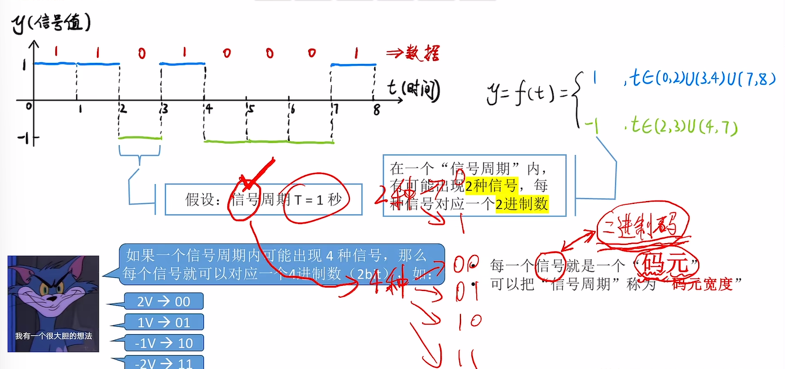
> >
> > 
> >
> > #### 优点（4进制/8进制码元）
> >
> > 每个”信号周期“可以传输更多信息。换句话说，每个码元可以携带更多信息。
> >
> > #### 代价
> >
> > 需要加强信号功率，并且对信道要求更高
>
> ### 4进制/8进制码元
>
> + 如果一个码元（即一个信号）可能有4种状态，那么可以称其为4进制码元（一个码元携带2bit数据）
> + 类似的，如果一个码元（即一个信号）可能有8种状态，那么可以称其为8进制码元（一个码元携带3bit数据）
>
> ### 用模拟信号设计4进制码元
>
> > 
>
> ### 重要：码元和比特的关系
>
> > 一个码元可以携带多少比特数据？
> >
> > 如果一个“周期”内可能出现K种信号，则：
> >
> > 1码元=log~2~bit

#### 3）速率

> ### 波特率
>
> > 每秒传输几个码元
> > 单位：码元/秒，或波特（Baud）
>
> ### 比特率
>
> > 每秒传输几个比特
> > 单位：bit/s，或b/s，bps
>
> ### 注
>
> > 若一个码元携带n比特的信息量，则波特率M Baud对应的比特率为Mn b/s

### 2、信道的极限容量

#### 1）回顾：带宽

> ### 在《计算机网络》中
>
> **带宽（bandwidth）**：表示某信道所能通过的“最高数据率”。
> 单位：bps（或记为b/s，bit/s；可加上数量前缀K、M、G、T）
>
> ### 在《通信原理》（通信领域的一门基础学科）中
>
> **带宽（bandwidth）**：表示某信道允许通过的信号频带范围。
> 单位：HZ（读作”赫/赫兹“；可加上数量前缀K、M、G、T）。

#### 2）噪声

> **信号：**是数据的载体，在信道上传输
>
> **噪声：**对信道产生干扰，影响数据传输效率（环境中的电场、电磁波）

#### 3）奈奎斯特定理（奈氏准则）

> 对于一个理想低通信道（没有噪声、带宽有限的信道）
>
> 极限波特率=2W（单位：波特，即码元/秒）
>
> W是信道的频率带宽（单位：Hz）
>
> ### 例题
>
> > 

#### 4）香农定理

> 对于一个有噪声、带宽有限的通道。
>
> 极限比特率=Wlog~2~（1+S/N）（单位：b/s）
>
> ### S/N信噪比
>
> 信噪比=S/N=信号的功率/噪声的功率
> 信噪比越高，噪声对数据传输的影响越小
>
> ### 信噪比的另一种记法
>
> 
>
> ### 注意
>
> 使用香农定理时，我们用比值不用分贝。
>
> ### 例题
>
> > 

#### 5）奈奎斯特定理&香农定理

> 

### 3、编码与调制

#### 1)编码&解码、调制&解调

> ### 数字信号（编码&解码）/网卡
>
> > 
>
> ### 模拟信号（调制&解调）/光猫
>
> > 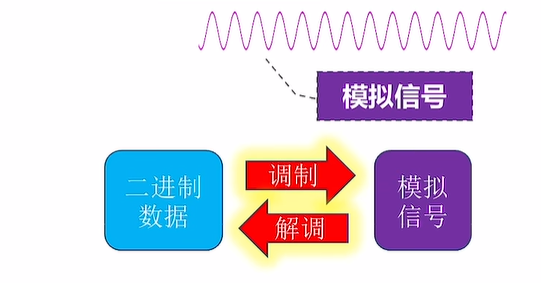

#### 2）常用的编码方法

> ### 各种编码方式规则
>
> > 
>
> ### 各种编码的特点
>
> > 
>
> ### 例题
>
> > 
> >
> > 

#### 3）常用的调制方法

> ### 一个码元携带多个比特
>
> > #### 调幅AM 增加幅度的种类
> >
> > #### 调频FM 增加频率的种类
> >
> > #### 调相PM 增加相位的种类
> >
> > 
>
> ### 正交幅度调制（QAM）
>
> > 将AM、PM结合起来，形成叠加信号
> >
> > 若设计m种幅值、n种相位，则将AM、PM信号两两“复合”。可调制出mn种信号，则QAM
> >
> > 1码元=log~2~mn bit
> >
> > 
>
> ### 例题
>
> > 
>
> > 
>
> > 

#### 知识回顾与重要考点

> 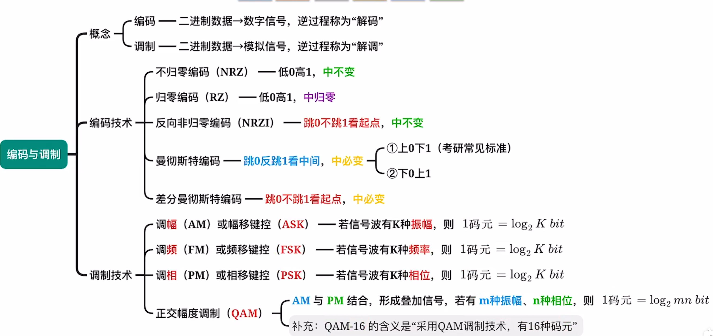

#### 总结：各种编码的特点

> 

### 4、传输介质

#### 1）常用的传输介质

> ## 导向型
>
> ### 双绞线
>
> > #### 主要构成
> >
> > > 两根导线相互绞合而成
> > >
> > > ==有屏蔽层===屏蔽双绞线（STP）
> > > ==没有屏蔽层===非屏蔽双绞线（UTP）
> >
> > #### 抗干扰能力
> >
> > > 较好。绞合、屏蔽层可以提升抗电磁干扰能力
> >
> > #### 代表应用
> >
> > > 近些年的局域网、早期电话线
>
> 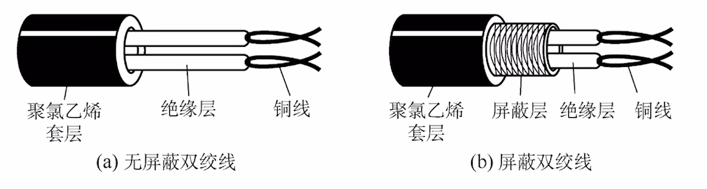
>
> ### 同轴电缆
>
> > #### 主要构成
> >
> > > 内导体（用于传输信号）+外导体屏蔽层（用于抗电磁干扰）
> >
> > #### 抗干扰能力
> >
> > > 好。屏蔽层带来良好的抗干扰性
> >
> > #### 代表应用
> >
> > > 早期局域网、早期有线电视
>
> 
>
> ### 光纤
>
> > #### 主要构成
> >
> > > 纤芯（高折射率）+包层（底折射率）
> > > 利用光的全发射特性，在纤芯内传输光脉冲信号
> >
> > #### 分类
> >
> > > ==单模光纤：==只有一条光线在一根光纤中传输，适合长距离传输，信号传输损耗小
> > > ==多模光纤：==多条光线在一根光纤中传输，适合近距离传输，远距离传输光信号容易失真
> >
> > #### 抗干扰能力
> >
> > > 非常好.光信号对电磁干扰不敏感
> >
> > #### 其他优点
> >
> > > 信号传输损耗小，长距离传输时中继器少；很细很省布线空间
>
> 
>
> ### 以太网对优先传输介质的命名规则
>
> 
>
> ## 非导向型传输介质（无线传输介质）
>
> ### 无线电波
>
> > 特点：穿透能力强、传输距离长、信号指向性弱
> > 如：手机信号、WIFI
>
> ### 微波通信
>
> > 特点：频率带宽高、信号指向性强、保密性差（容易被窃听）
> > 如：卫星通信（卫星作为信号中继器，传播时延较大）
>
> ### 其他
>
> > 红外线通信、激光通信等——信号指向性强
>
> 

#### 2）物理层接口的特性

> ### 机械特性
>
> > 指明接口所用接线器的形状和尺寸、引脚数目和排列、固定和锁定装置等
>
> ### 电气特性
>
> > 指明在接口电缆的各条线上出现的电压的范围、传输速率、距离限制等
>
> ### 功能特性
>
> > 指明某条线上出现的某一电平的电压的意义
>
> ### 过程特性
>
> > 指明对于不同功能的各种可能时间的出现顺序

### 5、物理层设备

#### 1）中继器（Repeater）

> 中继器只有两个端口。通过一个端口接受信号，将失真信号整形再生，并转发至另一端口（信号再生会产生一些时延）
> 仅支持半双工通信（两端连接的节点不可同时发送数据，会导致“冲突）
> 中继器两个端口对应两个”网段“
>
> 

#### 2）集线器（Hub）

> 本质上是多端口中继器。集线器将其中一个端口收到的信号整形再生后，转发到所有其他端口
> 各端口连接的结点不可同时发送数据，会导致”冲突“
> 集线器的N个端口对应N个”网段“，各网段属于同一个”冲突域“
>
> 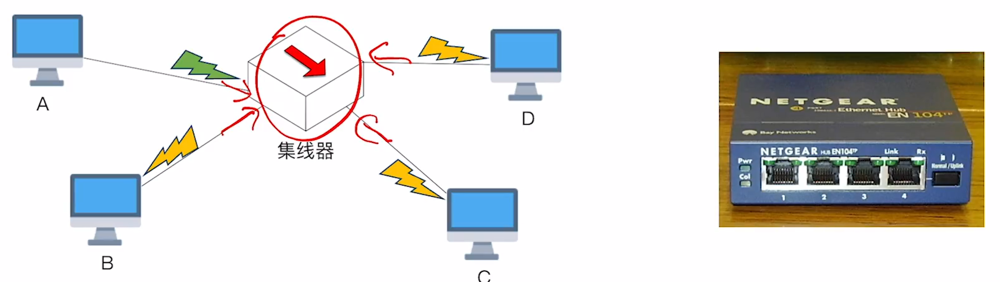
>
> ### 集线器（Hub）——冲突域
>
> > 冲突域：如果两台主机同时发送数据会导致”冲突“，则这两台主机处于同一个”冲突域“。处于同一冲突域的主机在发送数据前需要进行”信道争用“。
> >
> > 
> >
> > 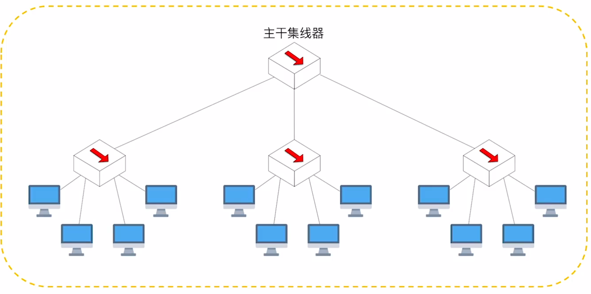
> >
> > 

#### 3)集线器、中继器的一些特性

> #### 集线器、中继器不能”无限串联“——10如Base5的5-4-3原则
>
> 5-4-3原则：使用集线器（或中继器）连接10Base5网段时，最多只能串联4个网段，使用4台集线器（或中继器），只有3个网段可以接挂计算机
>
> 
>
> ####  集线器连接的网络，物理上是星形拓扑，逻辑上是总线型拓扑
>
> 
>
> #### 集线器连接的各网段”共享带宽“
>
> 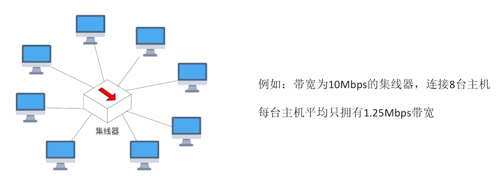

## 第三章 数据链路层

### 1、数据链路层概述 

> ### 数据链路层基本概念
>
> > **结点：**主机、路由器
> > **链路：**网络中两个结点之间的物理通道，链路的传输介质主要是双绞线、光纤和微波。分为有线链路、无线链路。
> > **数据链路：**网络中两个结点之间的逻辑通道，把实现控制数据传输协议的硬件和软件加到链路上就构成数据链路
> > **帧：**链路层的协议数据单元，封装网络层数据报
> >
> > ==数据链路层==负责通过一条链路从一个结点向另一个物理链路直接相连的相邻结点传送数据报。
>
> ### 数据链路层功能概述
>
> > 数据链路层在物理层提供服务的基础上向网络层提供服务，其最基本的服务是将源自网络层来的数据可靠地传输道相邻节点的目标机网络层。其主要作用是加强物理层传输原始比特流的功能，将物理层提供的可能出错的物理连接改造成为逻辑上无差错的数据链路，使之对于网络层表现为一条无差错的链路
>
> #### 功能一：为网络层提供服务。无确认无连接服务，有确认无连接服务，有确认面向连接服务。
>
> #### 功能二：链路管理，即连接的建立、维持、释放（用于面向连接的服务）
>
> #### 功能三：组帧
>
> #### 功能四：流量控制。限制发送方
>
> #### 功能五：差错控制（帧错/位错）

### 2、封装成帧&透明传输

#### 1）封装成帧

> 

#### 2）透明传输

> 

#### 1.字符计数法

> 

#### 2.字符填充法

>   
>
> 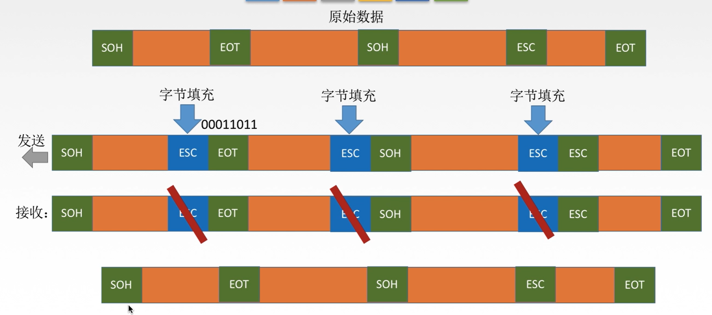

#### 3.零比特填充法

> 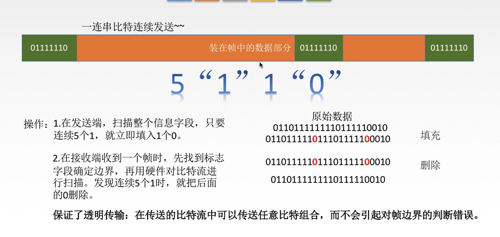

#### 4.违规编码法

> 
>
>  

### 3、差错控制（检错编码）

#### 1）差错从何而来 

>  

#### 2）数据链路层的差错控制

> 

#### 3）检错编码——奇偶校验码

> 
>
> ### 特点
>
> 只能检查出奇数个比特错误，检错能力为50%

#### 4）检错编码——CRC循环冗余码

> 
>
> 
>
> 
>
>  

### 4、差错控制（纠错编码）

#### 1）海明距离

> 

#### 2）海明编码

> ### 1、确定校验码位数
>
> >  
>
> ### 2、确定校验码和数据的位置
>
> > 
>
> ### 3、求出校验码的值
>
> > 
>
> ### 4、检查并纠错
>
> > 
> >
> > 

### 5、流量控制与可靠传输机制

> ## 数据链路层的流量控制
>
> > **较高的发送速度**和**较低的接收能力**的不匹配，会造成传输出错，因此流量控制也是数据链路层的一项重要工作
> >
> > 数据链路层的流量控制是点对点的，而传输层的流量控制是端到端的。
> >
> > ==数据链路层==流量控制手段：接收方收不下就不回复确认
> >
> > ==传输层==流量控制手段：接收端给发送端一个窗口公告
>
> ## 流量控制的方法
>
> > ### 停止等待协议
> >
> > 每发送完一个帧就停止发送，等待对方的确认，在收到确认后再发送下一个帧。
> >
> > 
> >
> > ### 滑动窗口协议
> >
> > > #### 后退N帧协议（GBN）
> > >
> > > 
> > >
> > > #### 选择重传协议（SR）
> >
> >  
>
> ## 可靠传输、滑动窗口、流量控制
>
> > 可靠传输：发送端发啥，接收端收啥
> > 流量控制：控制发送速率，使接收方有足够的缓冲空间来接受每一个帧
> >
> >  

### 6、停止-等待协议

> ### 1.为什么要有停止-等待协议？
>
> > 除了比特出差错，底层信道还会出现丢包问题。为了实现流量控制。（丢包：物理线路故障、设备故障、病毒攻击、路由信息错误等原因，会导致数据包的丢失）
>
> ### 2.研究停等协议的前提
>
> > 虽然现在常用全双工通信方式，但为了讨论问题方便，仅考虑一方发送数据（发送发），一方接受数据（接收方）。
> >
> > 因为是在讨论可靠传输的原理，所以并不考虑是在哪一个层次上传送的。
> >
> > ”停止-等待“就是每发送完一个分组就停止发送，等待对方确认，在收到确认后再发送下一个分组。
>
> ### 3.停等协议有几种应用情况？
>
> > 无差错情况&有差错情况
>
> ## 停等协议——无差错情况
>
> > 
>
> ## 停等协议——无差错情况
>
> > ### 1.数据帧丢失或检测到帧出错
> >
> >   
> >
> > ### 2.ACK丢失
> >
> >  
> >
> > ### 3.ACK迟到
> >
> >  
>
> ## 停等协议性能分析
>
> >  
>
> ## 信道利用率
>
> > > 发送方在一个发送周期内，有效地发送率，据所需要地时间占整个发送周期地比率
> > >
> > >  
> > >
> > > 信道吞吐率=信道利用率*发送方地发送速率
> >
> > ### 例题
> >
> > >  

### 7、后退N帧协议（GBN）

#### 1）停等协议的弊端

> ### 利用率太低
>
> >  

#### 2）后退N帧协议中的滑动窗口

>  

####  3）GBN发送方必须响应的三件事

> ### 1、上层的调用
>
> > 上层要发送数据时，发送方先检查发送窗口是否已满，如果未满，则产生一个帧并将其发送；如果窗口已满，发送方只需将数据返回给上层，按时上层窗口已满。上层等一会再发送。（实际视线中，发送方可以缓存这些数据，窗口不满时再发送帧）。
>
> ### 2、收到了一个ACK
>
> > GBN协议种，对n号帧的确认采用累计确认的方式，标明接收方已经收到n号帧和它之前的全部帧数。
>
> ### 3、超时事件
>
> > 协议的名字为后退N帧/回退N帧，来源于出现丢失和时延过长帧时发送方的行为。就像在停等协议中一样，定时器将再次用于恢复数据帧或确认帧的丢失。如果出现超时，发送方重传所有已发出但未被确认的帧。

#### 4）GBN接收方要做的事

> 如果正确收到n号帧，并且按序，那么接受方为n帧发送一个ACK，并将该帧中的数据部分交付给上层。
>
> 其余情况都丢弃帧数，并为最近按序接受的帧重新发送ACK。接收方无需缓存任何失序帧，只需要维护一个信息：expectedseqnum（下一个按序接受的帧序号）

#### 5）运行中的GBN

> 

#### 6）滑动窗口长度

> ### 滑动窗口长度可以无限长吗？
>
> 若采用n个比特对帧编号，那么发送窗口的尺寸W~T~应满足：1<= W~T~<=2^n-1^，因为发送窗口尺寸过大，就会使得发送发无法区分新帧和旧帧

#### 7）GBN协议重点总结

> ### 1、累计确认（偶尔捎带确认）
>
> ### 2、接收方只按序接收帧，不按序无情丢弃
>
> ### 3、确认序列号最大的、按序到达的帧
>

### 8、选择重传协议（SR）

#### 1）GBN协议的弊端

> 

#### 2）选择重传协议中的滑动窗口

> 

#### 3)SR发送方必须响应的三件事

> 

#### 4）运行中的SR

> 

#### 5）滑动窗口长度

> 

#### 5）SR协议重点总结

> 1、对数据帧逐一确认，收一个确认一个
> 2、只重传出错帧数
> 3、接收方有缓存

#### 6）习题1

> 

### 9、信道划分介质访问控制

#### 1）传输数据使用的两种链路

> ### 点对点链路
>
> > 两个相邻节点通过一个链路相连，没有第三者
> >
> > **应用：**ppp协议，常用于广域网
>
> ### 广播式链路
>
> > 所有主机共享通信介质
> >
> > **应用：**早期的总线以太网、无线局域网，常用于局域网

#### 2）介质访问控制

> 介质访问控制的内容就是，采取一定的措施，使得两对节点之间的通信不会发生互相干扰的情况。
>
> 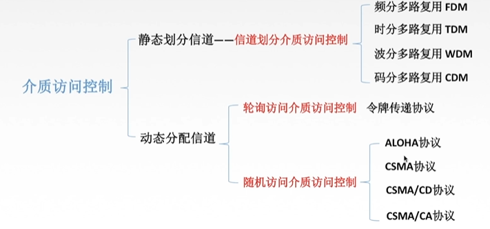

#### 3）信道划分介质访问控制

> 

#### 1.频分多路复用FDM

> 

#### 2.时分多路复用TDM

> 

#### 3.改进的时分复用——统计时分复用

> 

#### 4、波分多路复用

> 

#### 5、码分多路复用CDM

> 

### 10、ALOHA协议

> ### 纯ALOHA协议
>
> > 纯ALOHA协议思想不监听信道，不按事件槽发送，随机重发。想发就发
> >
> > 
>
> 
>
> ### 时隙ALOHA协议

## 第四章 网络层

### 1、概述

> 主要任务是把分组从源端传送到目的端，为分组交换网上的不同主机提供通信服务。网络层传输单位是数据报
>
> ### 功能一：路由选择与分组转发
>
> > 
>
> ### 功能二：异构网络互联
>
> > 
>
> ### 功能三：拥塞控制
>
> > 若所有结点都来不及接受分组，而要丢弃大量分组的话，网络就处于拥塞状态。因此要采取一定措施，缓解这种拥塞。
> >
> > #### WAY1：开环控制（静）
> >
> > #### WAY2：闭环控制（动）

### 2、SDN基本概念

#### 1）路由器功能：转发&路由选择

> 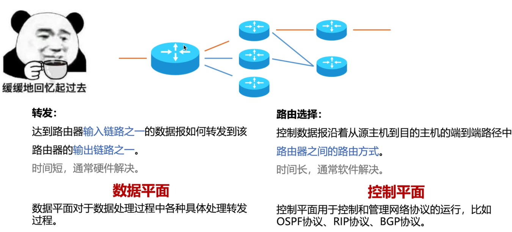

#### 2）数据平面

> 数据平面执行的主要功能是根据转发表进行转发，这是路由器的本地动作
>
> 

#### 3）控制平面（传统方法/每路由器法）

> ### 控制平面（传统方法）
>
> > 路由选择算法运行在每台路由器中，并且在每台路由器中都包含转发和路由选择两种功能
>
> ### 具体方法
>
> > 在一台路由器中的路由选择算法与其他路由器中的路由选择算法通信（通过交换路由选择报文），计算出路由表和转发表
> >
> > 

#### 4）控制平面（SDN方法：Software-Defined Networking）

> 控制平面从路由器物理上分离。路由器仅实现转发，远程控制器计算和分发转发表以供每台路由器所使用。
>
> ### 具体方法
>
> 路由器通过交换包含转发表和其他路由选择信息的报文与远程控制器通信。因为计算转发并与路由器交互的控制器是用软件实现的，所以网络是“软件定义的”。
>
> 

### 3、IP数据报格式

#### 1）TCP/IP协议栈

> 

#### 2）IP数据报格式

> 
>
> 

### 4、IP数据报分片

#### 1）最大传送单元MTU

> 链路层数据帧可分装数据的上限。
> 以太网的MTU是1500字节
>
> 
>
> 

#### 2）IP数据报格式

> 

#### 3）IP数据报分片例题

> 

#### 4）比较容易混淆的单位

> 

### 5、IPv4地址

#### 1）IP地址

> 

#### 2）IP编址的历史阶段

> 分类的IP地址
>
> 子网的划分
>
> 构成超网（无分类编址方法）

#### 3）分类的IP地址

> IP地址：全世界唯一的32位/4字节标识符，标识路由器主机的接口。
> IP地址::={<网络号><主机号>}
>
> 

#### 4）互联网中的IP地址

> 

#### 5）分类的IP地址

> 
>
> 

#### 6）特殊IP地址

> 

#### 7）私有IP地址

> 

### 6、网络地址转换（NAT）

> 路由器对目的地址是私有IP地址的数据报一律不进行转发
>
> ### 网络地址转换NAT（Network Address Translation）
>
> 在专用网连接到英特网的路由器上安装NAT软件，安装了NAT软件的路由器叫NAT路由器，它至少有一个有效的外部全球IP地址。
>
> 

### 7、子网划分与子网掩码

#### 1）子网划分

> 
>
> 

####  2）子网掩码

> 

#### 3）子网掩码习题

> 

#### 4）使用子网时分组转发

> 

### 8、无分类编址CIDR

#### 1）无分类编制CIDR

> 
>
> 

#### 例题

> 

#### 2）构成超网

> 

#### 例题

> 

#### 3）最长前缀匹配

> 
>
> 

### 9、ARP协议

#### 1）发送数据的过程

>  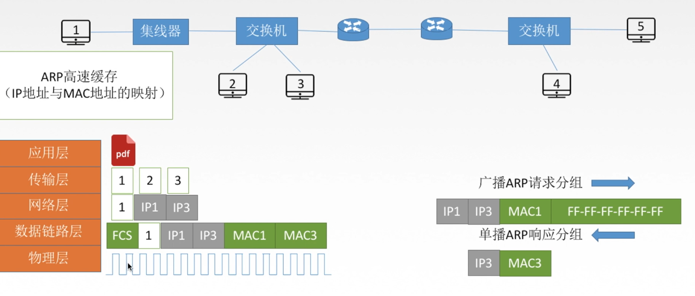
>
> 

#### 2）ARP协议

> 
>
> 

### 10、DHCP协议

#### 1）主机如何获得IP地址

> 

#### 2）DHCP协议

> 

### 11、ICMP协议

####  1）网际控制报文协议ICMP

> 

#### 2）ICMP差错报告报文（5种）

> 

#### 3）ICMP差错报告报文数据字段

> 

#### 4）不应发送ICMP差错报告报文

> 

#### 5）ICMP询问报文

> 

#### 6）ICMP的应用

> 

### 12、IPv6

#### 1）IPv6数据报格式

> 

#### 2）IPv6和IPv4

> 

#### 3）IPv6地址表示形式

> 

#### 4）IPv6基本地址类型

> 

#### 5）IPv6向IPv4过渡的策略

> 

### 13、路由算法与路由协议概述

#### 1）路由算法

> 

#### 2）路由算法的分类

> 

#### 3）分层次的路由选择协议

> 

### 14、RIP协议及距离向量算法

#### 1）RIP协议

> **RIP是一种分布式的基于距离向量的路由选择协议**，是因特网的协议标准，最大优点是简单。
> RIP协议要求网络中每一个路由器都维护从它到其他每一个目的网络的唯一最佳距离记录（即一组距离）。
>
> ### 距离
>
> 通常为“跳数”，即从源端口到目的端口所经过的路由器个数，经过一个路由器跳数+1，特别的，从一路由器到直接连接的网络距离为1.RIP允许一条路最多只能包含15个路由器，因此距离为16标识网络不可达。

#### 2、RIP协议和谁交换？多久交换一次？交换什么？

> 

#### 3、距离向量算法

> 

#### 4、距离向量算法练习1

> 

#### 5、距离向量算法练习2

> 

#### 6、RIP协议的报文格式

> 

#### 7、RIP协议号消息传得快，坏消息传的慢

> RIP的特点：当网络出现故障时，要经过比较长的时间（例如数分钟）才能将此信息传送到所有路由器，“慢收敛”。
>
> 
>
> 

### 15、OSPF协议及链路状态算法

#### 1）OSPF协议

> ## 开放最短路径优先OSPF协议：
>
> > “开放”表明OSPF协议不是受到某一家厂商控制，而是公开发表的；“最短路径优先”是因为使用了Dijkstra提出的最短路径算法SPF
>
> **OSPF最主要的特征就是使用分布式的链路状态协议。**
>
> ## OSPF的特点
>
> > ### 和谁交换
> >
> > 使用泛洪法向自治系统内所有路由器发送信息，即路由器通过输出端口向所有相邻的路由器发送信息，而每一个相邻路由器又再次将此信息发往其所有的相邻路由器。
> >
> > ### 交换什么
> >
> > 发送的信息就是与本路由器相邻的所有路由器的链路状态（本里尤其和哪些路由器相邻，以及该链路的度量/代价——费用、距离、时延、带宽等）。
> >
> > ### 多久交换
> >
> > 只有链路状态发生变化时，路由器才向所有路由器洪泛发送此信息。
>
> 最后，所有路由器都能建立一个链路状态数据库，即全网拓扑图。

#### 2）链路状态路由算法

> 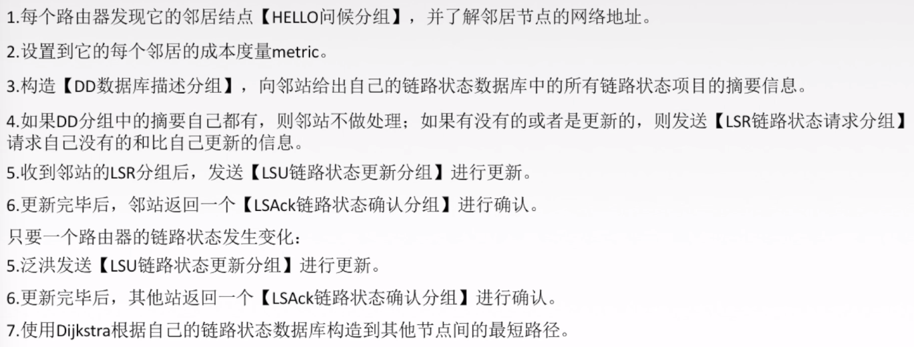

#### 3）OSPF的区域

> 为了使OSPF能够用于规模很大的网络，OSPF将一个自治系统再划分为若干个更小的范围，叫做区域。每一个区域都有一个32位的区域标识符（用点分十进制表示）。
> 区域也不能太大，在一个区域内的路由器最好不超过200个。
>
> 

#### 4）OSPF分组

> 

#### 5）OSPF其他特点

>  

### 16、BGP协议

#### 1）BGP协议

> ### 和谁交换？
>
> 与其他AS的临站BGP发言人交换信息
>
> ### 交换什么？
>
> 交换的网络可达性的信息，即要到达某个网络
>
> ### 多久交换？
>
> 发生变化时更新有变化的部分。
>
> 

#### 2）BGP协议交换信息的过程

> BGP所交换的网络可达性的信息就是要到达某个网络所要经过的一系列AS。当BGP发言人互相交换了网络可达信息后，各BGP发言人就根据所采用的策略从收到的路由信息中找出到达各AS的较好路由。
>
> 
>
> 
>
> 

#### 3）BGP协议报文格式

> 一个BGP发言人与其他自治系统中的BGP发言人要交换路由信息，就要先建立TCP连接，即通过TCP传送，然后在此连接上交换BGP报文以建立BGP会话（session），利用BGP会话交换路由信息。
>
> 

#### 4）BGP协议特点

> BGP支持DICR，因此BGP的路由表也就应当包括目的网络前缀、下一跳路由器，以及到达该目的网络所要经过的各个自治系统序列。
> 在BGP刚刚运行时，BGP的邻站时交换整个的BGP路由表。但以后只需要在发生变化时更新有变化的部分。这样做对节省网络带宽和减少路由器的处理开销都有好处。

#### 5）BGP-4的四种报文

> 1、OPEN（打开）报文：用来与相邻的另一个BGP发言人建立关系，并认证发送方。
> 2、UPDATE（更新）报文：通告新路径或撤销原路径。
> 3、KEEPALIVE（保活）报文：在无UPDATE时，周期性证实邻站的连通性；也作为OPEN的确认。
> 4、NOTIFICATION（通告）报文：报告先前报文的差错；也被用于关闭连接。

#### 6）三种路由协议比较

> RIP是一种分布式的基于距离向量的内部网关路由选择协议，通过广播UDP报文来交换路由信息。
>  OSPF是一个内部网关协议，要交换的信息量较大，应使报文长度尽量短，所以不使用传输层协议（如UDP或TCP），而是直接采用IP。
> BGP是一个外部网关协议，在不同的自治系统之间交换路由信息，由于网络环境复杂，需要保证可靠传输，所以采用TCP。
>
> 

### 17、IP组播

#### 1、IP数据报的三种传输方式

> 

#### 2、IP数据报的三种传输方式

> 

#### 3、IP组播地址

>  

#### 4）硬件组播

> 

#### 5）IGMP协议与组播路由选择协议

> 
>
> 

#### 6）网际组管理协议IGMP

> 

#### 7）组播路由选择协议

> 
>
> 

#### 8）组播路由选择协议

> 

### 18、移动IP

#### 1）移动IP相关概念

> 

#### 2）移动IP通信过程

> 

### 19、网络层设备

#### 1）路由器

> 路由器是一种具有多个输入端口和多个输出端口的专用计算机，其任务是转发分组。
>
>  

#### 2）输入端口对线路上收到的分组的处理

> 

#### 3）输出端口将交换结构传送来的分组发送到线路

> 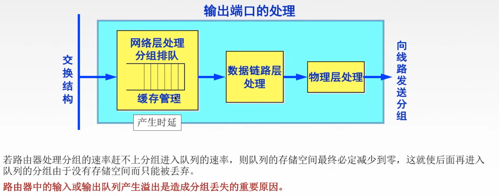

#### 4）三层设备的区别

> ### 路由器
>
> 可以互联两个不同网络层协议的网段。
>
> ### 网桥
>
> 可以互联两个物理层和链路层不同的网段。
>
> ### 集线器
>
> 不能互联两个物理层不同的网段
>
> 

#### 5）路由表与路由转发

> 

## 第五章 传输层

### 1、传输层概述

#### 1）传输层

> **只有主机才有的层次**
>
> 
>
> ### 传输层的功能
>
> #### 1、传输层提供进程和进程之间的逻辑通信
>
> #### 2、复用和分用
>
> #### 3、传输层对收到的报文进行差错检验
>
> #### 4、传输层的两种协议。

#### 2）传输层的两个协议

> 

#### 3）传输层的寻址与端口

> #### 复用：应用层所有的应用进程都可以通过传输层再传输到网络层
>
> #### 分用：传输层从网络层收到数据后交付指明的应用进程。
>
> 
>
> 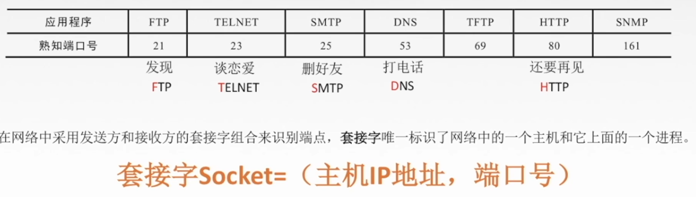

### 2、UDP协议

#### 1、用户数据报协议UDP概述

> UDP只在IP数据报服务之上增加了很少功能，即复用分永和差错检测功能。
>
> UDP的主要特点：
>
> 1. UDP是无连接的，减少开销和发送数据之前的时延。
> 2. UDP使用最大努力交付，即不保证可靠交付。
> 3. UDP是面向报文的，适合一次性传输少量数据的网络应用。
> 4. UDP无拥塞控制。适合很多实时应用。
> 5. UDP首部开销小，8B，TCP20B
>
> 

#### 2、UDP首部格式

> 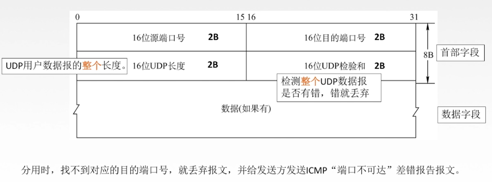

#### 3、UDP校验

> 
>
> 

### 3、TCP协议的特点和TCP报文段

#### 1）TCP协议的特点

> 1. TCP是面向连接（虚连接）的传输层协议。打call
> 2. 每一条TCP连接只能有两个端点每一条TCP连接只能是点对点的。
> 3. TCP提供可靠交付的服务，无差错、不丢失、不重复、按序到达。可靠有序，不丢不重。
> 4. TCP提供全双工通信。（发送缓存 、接收缓存）
> 5. TCP面向字节流。（TCP把应用程序交下来的数据看成仅仅是一连串的无结构的字节流。
>
> 

#### 2）TCP报文段首部格式

> 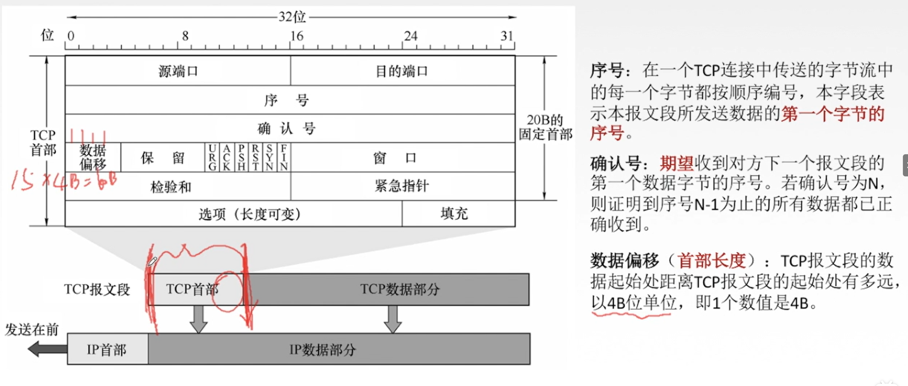
>
> 
>
> 

### 4、TCP连接管理

#### 1）TCP连接管理

> ### TCP连接传输三个阶段
>
> 
>
> **TCP连接的建立采用客户服务器方式，主动发起连接建立的应用进程叫做客户，而被动等待连接建立的应用进程叫服务器**
>
> 

#### 2）TCP连接的建立

> 

#### 3）SYN洪泛攻击

> 

#### 4）TCP的连接释放

> 
>
> 

### 5、TCP可靠传输

> 

#### 1）序号/重传

> 

#### 2）重传

> ### 超时重传 
>
>  
>
> ### 快速重传
>
> 

### 6、TCP流量控制

> ### 流量控制：让发送方慢点，要让接受方来得及接收
>
> TCP采用滑动窗口机制实现流量控制
>
> 
>
> 

###  7、TCP拥塞控制

> ### 出现拥塞的条件
>
> 对资源需求的总和>可用资源
>
> 
>
> ### 拥塞控制
>
> 防止过多的数据注入到网络中。全局性
>
> 

#### 1）拥塞控制四种算法

> 
>
> ## 慢开始和拥塞避免
>
>  
>
> ## 快重传和快恢复
>
> 

## 第六章  应用层

### 1、应用层概述

> 

#### 1）客户服务器（c/s）模型

> 

#### 2）P2P模型

> 

### 2、DNS系统

> 

#### 1)域名

> 

#### 2）域名服务器

> 

#### 3）域名解析过程

> 
>
>   

### 3、文件传送协议FTP（File Transfer Protocol）

提供不同种类主机系统（硬软件系统等都可以不同）之间的文件传输能力。

#### 1）FTP服务器和用户端

> FTP是基于客户/服务器（c/s）的协议
> 用户通过一个客户机程序连接至在远程计算机上运行的服务器程序
> 依照FTP协议提供服务，进行文件传送的计算机就是FTP服务器
> 连接FTP服务器 ，遵循FTP协议与服务器传送文件的电脑就是FTP客户端
>
> 

#### 2）FTP工作原理

>   
>
> 
>
> 

### 4、电子邮件

#### 1）电子邮件系统概述

> ### 电子邮件的信息格式
>
> 
>
> ### 组成结构
>
> 
>
> 

#### 2）简单邮件传送协议SMTP

> 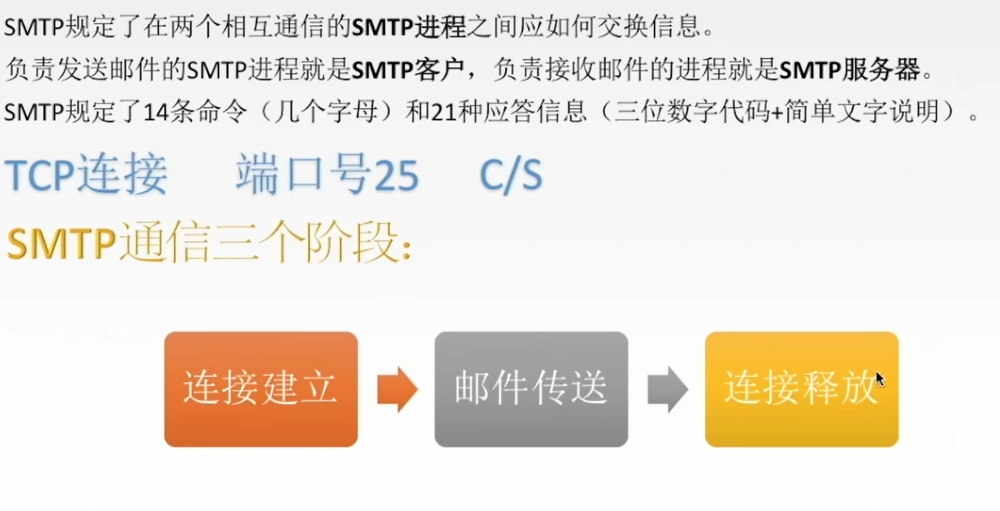
>
> ### 1.连接建立
>
>  
>
> ### 2.邮件发送
>
> 
>
> ### 3.连接释放
>
> 

#### 3）MIME通用因特网邮件扩充

> ### SMTP的缺点
>
> 

#### 4）邮局协议

> 

#### 5）网际报文存取协议IMAP

> 

#### 6）基于万维网的电子邮件

> 

### 5、万维网和HTTP协议

#### 1）万维网概述

> 

#### 2）超文本传输协议HTTP

> 

#### 3）HTTP协议的特点

> 

#### 4）HTTP协议的连接方式

> 
>
> ****

#### 5）HTTP的报文结构

> 